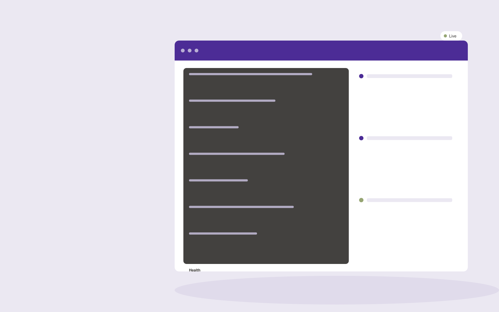

# Automation monitoring subscription

**Operations** · Also fits: Finance; Management; IT and Development

> For businesses with critical no-code workflows, turn approved workflows, execution logs and expected outcomes into monitored automations and reliability reports. Address the recurring problem: failed automations silently create missing or duplicate work. The value hypothesis is a more complete, reviewable deliverable with less repeated preparation; the pilot must establish whether that benefit is real.

| | |
|---|---|
| **Buyer** | Businesses with critical no-code workflows |
| **Problem** | Failed automations silently create missing or duplicate work. |
| **Format** | Technical delivery workspace with managed implementation |
| **USP** | Checks business outcomes as well as technical execution status. |

## The product
Key screens: Workflow health, failure detail, recovery queue. Show a work backlog, proposed changes and verification results. Link each item to its source configuration, code or data mapping. Provide execution logs and an owner-facing health view. Keep environments and approval states clearly separated so a draft cannot be mistaken for a live change. In this product, the first view is workflow health, followed by failure detail and recovery queue.

## Core functionality
1. Monitor execution status.
2. Reconcile expected outputs.
3. Detect duplicates.
4. Retry safe steps.
5. Notify owners.
6. Maintain recovery procedures.

## Customer workflow
Scope one technical task, inspect authorized material, propose an implementation, build in a controlled environment, run relevant checks, obtain the required change approval, deliver with recovery instructions, and monitor the agreed operating scope. Start with approved workflows, execution logs and expected outcomes and finish with monitored automations and reliability reports.

## AI and human review
Explain code or configuration, draft transformations and propose technical changes. Execute deterministic validation and meaningful tests. Engineers review correctness, access handling and failure behavior before deployment.

## Customer inputs
Approved workflows, execution logs and expected outcomes

## Customer deliverables
Monitored automations and reliability reports

## Accounts and administration
Project access, environment separation, versioned changes, test evidence, owner approvals, execution logs, rollback instructions and incident handling.

## MVP scope
Begin with businesses with critical no-code workflows and one recurring use case. Build the first two modules: monitor execution status; reconcile expected outputs. Provide operator assistance for the third module: detect duplicates. Deliver monitored automations and reliability reports through a manual review queue. Perform other necessary full-scope functions manually during the pilot. Include all applicable access, accuracy and professional-review controls from the start.

## After MVP validation
After paid pilots establish value, automate the remaining modules: retry safe steps; notify owners; maintain recovery procedures. Add one validated source integration, reusable customer configuration and recurring delivery. Expand to additional teams, document formats or languages only after testing the new scope.

## Build dependencies
Authorized technical access, suitable test environments, documented APIs or schemas, secrets management, meaningful checks and recovery procedures.

## Integrations and data access
Orders, inventory, supplier files, process documents and workflow records. Approved repositories, application APIs, execution platforms and monitoring systems. Validate current API access and behavior during discovery before promising compatibility. These are candidate integration categories, not verified supported connectors.

## Defensibility
Reliable niche implementations, integration knowledge, representative tests and ongoing operational responsibility. For this idea, build around checks business outcomes as well as technical execution status. This advantage requires execution and accumulated customer trust; the base model alone is not a defensible asset.

## Alternatives and positioning
Developers, system integrators, existing automation products and internal engineering work. Differentiate on this specific proposed advantage: checks business outcomes as well as technical execution status. Test it against the buyer's current method on the same task. Competitor coverage and uniqueness have not been established.

## Revenue model and test pricing (USD)
Test USD 1,000-4,000 for one bounded implementation or technical review, then USD 200-1,000 monthly for defined maintenance. Hosting, vendor fees and major feature changes are separate. Prices are hypotheses.

## Main delivery costs
Engineering, testing, cloud execution, third-party API fees, monitoring, incident response and vendor-change maintenance.

## Marketing message to test
> Automation monitoring subscription for businesses with critical no-code workflows. Checks business outcomes as well as technical execution status. Demonstrate the claim through a workflow health audit with outcome reconciliation.

## Acquisition channels
No-code implementation agencies

## Lead magnet
A workflow health audit with outcome reconciliation

## First 30 days of marketing
- Week 1: interview five prospective buyers in this segment: businesses with critical no-code workflows. Ask to see a recent example of the problem and their current process.
- Week 2: prepare this demonstration using authorized or synthetic material: a workflow health audit with outcome reconciliation.
- Week 3: present it through no-code implementation agencies and seek one narrowly scoped paid pilot.
- Week 4: review detected silent failures, recovery time, total delivery effort and a concrete renewal decision before increasing scope.

## Paid pilot and validation
Implement one bounded task in a safe test environment. Demonstrate normal operation, failure handling and recovery with representative inputs. Have the responsible technical owner review the results. For this idea, use approved workflows, execution logs and expected outcomes and evaluate monitored automations and reliability reports. Agree success thresholds with the buyer before starting; collect a baseline for detected silent failures, recovery time. A positive signal is payment and repeat use with acceptable quality and delivery cost, not a favorable demo reaction alone.

## Success metrics
Detected silent failures, recovery time

## Retention and expansion
Maintain agreed integrations or technical assets, review failures and upstream changes, and sell additional scoped work only after the first implementation is stable.

## Operating controls and limitations
Make operational states and ownership explicit. Validate data and require appropriate approval before purchases, scheduling commitments or external system writes. Validate source access and reviewer availability during the pilot. Maintain customer-level access, data deletion controls and a record of final approvals.

## Brand style (concept)

- Colors: `#4c2791` primary · `#95c954` accent · `#e9e4f1` surface · `#22201e` ink
- Type: Fraunces for headings, Inter for text
- Voice: Calm, reliable, step-by-step
- Demo site: [https://nexibeo.com/solutions/automation-monitoring-subscription/demo/](https://nexibeo.com/solutions/automation-monitoring-subscription/demo/)

## Investment indication

Indicative build budget, from MVP to full product. This is a planning range, not a quote; it excludes running costs such as model usage, hosting and reviewer hours. Built with Nexibeo's AI software development factory, most implementations take days to a few weeks of creation time, depending on availability.

| Phase | Scope | Creation time | Indicative budget |
|---|---|---|---|
| MVP | One buyer segment, one recurring use case; first modules: monitor execution status; reconcile expected outputs. Manual review in the loop. | 5 days | $9,500 |
| Paid pilot | Accounts, roles, review states, audit trail and the first integration, hardened for two to three paying pilot customers. | 6 days | $12,000 |
| Full product | Remaining modules: retry safe steps; notify owners; maintain recovery procedures. Self-serve onboarding, billing, monitoring and the wider integration set. | 2 weeks | $16,500 |
| **Total** | | about 5 weeks | **$38,000** |

### Running costs per month (rough indication, untested)

| Stage | Hosting and infrastructure | AI usage | Total per month |
|---|---|---|---|
| MVP and paid pilot (about 3 customers) | $30–$60 | $60–$120 | **$90–$180** |
| Full product (about 50 customers) | $110–$210 | $530–$1,050 | **$640–$1,260** |

**Get this built:** [contact Nexibeo](https://nexibeo.com/solutions/automation-monitoring-subscription/#apply). We build it with our AI software factory, usually in days to a few weeks, for you to run internally or offer to your clients.

## Research status
Concept proposal expanded from the 315-idea conversation. Demand, pricing, differentiation, build scope and integration feasibility are hypotheses, not verified market findings. Category link is inspiration rather than evidence of business viability.

## Credits and next steps

- **Estimation and having it built:** see the full solution page on [nexibeo.com](https://nexibeo.com/solutions/automation-monitoring-subscription/) for more detail on estimation. Nexibeo builds it for you as a custom AI implementation, to run internally or to offer to your own clients.
- **Become an AI-optimized specialist for Operations:** [Complete AI Training](https://completeaitraining.com/tag/operations/?contentType=ai-certification).
- Field news: [AI news for Operations](https://completeaitraining.com/all-ai-news-for-operations/).
