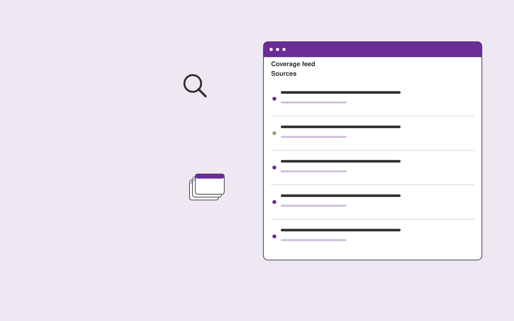

# Media monitoring briefs

**PR and Communications** · Also fits: Writers; Executives and Strategy

> For communications managers at niche B2B companies, turn licensed or permitted media sources and monitoring topics into source-linked media briefing. Address the recurring problem: broad media alerts bury relevant coverage. The value hypothesis is a more complete, reviewable deliverable with less repeated preparation; the pilot must establish whether that benefit is real.

| | |
|---|---|
| **Buyer** | Communications managers at niche B2B companies |
| **Problem** | Broad media alerts bury relevant coverage. |
| **Format** | Watchlist, change detection and briefing subscription |
| **USP** | Small, relevant coverage sets with original sources and context. |

## The product
Key screens: Coverage feed, topic clusters, briefing editor. Use a watchlist with source health and last-checked dates, a chronological change feed, and a reviewable briefing editor. Display original evidence beside each alert. Let users mute irrelevant topics and record whether a change led to action. In this product, the first view is coverage feed, followed by topic clusters and briefing editor.

## Core functionality
1. Track defined topics.
2. Deduplicate coverage.
3. Identify quoted sources.
4. Preserve context.
5. Flag relevant developments.
6. Produce reviewed briefs.

## Customer workflow
Agree a narrow watchlist, confirm lawful source access, collect dated snapshots, detect candidate changes, review relevance and accuracy, deliver a concise digest, and refine the watchlist from buyer feedback. Start with licensed or permitted media sources and monitoring topics and finish with source-linked media briefing.

## AI and human review
Classify source material, group related developments and summarize verified changes. Use deterministic snapshot comparison for factual changes where possible. Distinguish observed publication content from analyst interpretation and uncertain implications.

## Customer inputs
Licensed or permitted media sources and monitoring topics

## Customer deliverables
Source-linked media briefing

## Accounts and administration
Watchlist ownership, source health, dated evidence, deduplication, topic filters, editorial review, delivery preferences and alert feedback.

## MVP scope
Begin with communications managers at niche B2B companies and one recurring use case. Build the first two modules: track defined topics; deduplicate coverage. Provide operator assistance for the third module: identify quoted sources. Deliver source-linked media briefing through a manual review queue. Perform other necessary full-scope functions manually during the pilot. Include all applicable access, accuracy and professional-review controls from the start.

## After MVP validation
After paid pilots establish value, automate the remaining modules: preserve context; flag relevant developments; produce reviewed briefs. Add one validated source integration, reusable customer configuration and recurring delivery. Expand to additional teams, document formats or languages only after testing the new scope.

## Build dependencies
Reliable permitted source access, change history, publication dates, deduplication and editorial QA. Coverage limits and inaccessible sources must be visible.

## Integrations and data access
Approved company facts, permitted media sources and publication workflows. Permitted feeds, published document sources, email digests and internal briefing channels. Verify collection rights and source reliability before selling coverage commitments. These are candidate integration categories, not verified supported connectors.

## Defensibility
A curated source network, historical change archive and buyer-specific relevance judgments within a narrow topic. For this idea, build around small, relevant coverage sets with original sources and context. This advantage requires execution and accumulated customer trust; the base model alone is not a defensible asset.

## Alternatives and positioning
Newsletters, search alerts, analysts and general media or website monitoring tools. Differentiate on this specific proposed advantage: small, relevant coverage sets with original sources and context. Test it against the buyer's current method on the same task. Competitor coverage and uniqueness have not been established.

## Revenue model and test pricing (USD)
Test USD 100-500 monthly for a narrow shared briefing, or USD 750-2,500 monthly for bespoke analyst coverage. Licensed source access and unusual collection requirements are extra. Prices require validation.

## Main delivery costs
Source licensing, collection reliability, change processing, analyst verification, missed-signal review and digest production.

## Marketing message to test
> Media monitoring briefs for communications managers at niche B2B companies. Small, relevant coverage sets with original sources and context. Demonstrate the claim through a one-week industry coverage digest.

## Acquisition channels
Specialist PR agency partners

## Lead magnet
A one-week industry coverage digest

## First 30 days of marketing
- Week 1: interview five prospective buyers in this segment: communications managers at niche B2B companies. Ask to see a recent example of the problem and their current process.
- Week 2: prepare this demonstration using authorized or synthetic material: a one-week industry coverage digest.
- Week 3: present it through specialist PR agency partners and seek one narrowly scoped paid pilot.
- Week 4: review relevant inclusions, source accuracy, total delivery effort and a concrete renewal decision before increasing scope.

## Paid pilot and validation
Deliver several scheduled digests for a small watchlist. Have the buyer label useful and irrelevant items, independently check important missed developments and assess whether the briefing changes a decision. For this idea, use licensed or permitted media sources and monitoring topics and evaluate source-linked media briefing. Agree success thresholds with the buyer before starting; collect a baseline for relevant inclusions, source accuracy. A positive signal is payment and repeat use with acceptable quality and delivery cost, not a favorable demo reaction alone.

## Success metrics
Relevant inclusions, source accuracy

## Retention and expansion
Tune relevance from buyer feedback, preserve historical changes and offer deeper analyst review for selected topics. Add sources only when they improve useful coverage.

## Operating controls and limitations
Verify public facts and quotations. Keep publication authority explicit and preserve the original context behind media and reputation findings. Validate source access and reviewer availability during the pilot. Maintain customer-level access, data deletion controls and a record of final approvals.

## Brand style (concept)

- Colors: `#752791` primary · `#6ac954` accent · `#ede4f1` surface · `#22201e` ink
- Type: Playfair Display for headings, Source Sans 3 for text
- Voice: Articulate, timely, composed
- Demo site: [https://nexibeo.com/ideas/media-monitoring-briefs/demo/](https://nexibeo.com/ideas/media-monitoring-briefs/demo/)

## Investment indication

Indicative build budget, from MVP to full product. This is a planning range, not a quote; it excludes running costs such as model usage, hosting and reviewer hours.

| Phase | Scope | Timeline | Indicative budget |
|---|---|---|---|
| MVP | One buyer segment, one recurring use case; first modules: track defined topics; deduplicate coverage. Manual review in the loop. | 3 weeks | $5,500 |
| Paid pilot | Accounts, roles, review states, audit trail and the first integration, hardened for two to three paying pilot customers. | 4 weeks | $4,500 |
| Full product | Remaining modules: preserve context; flag relevant developments; produce reviewed briefs. Self-serve onboarding, billing, monitoring and the wider integration set. | 6 weeks | $6,500 |
| **Total** | | 13 weeks | **$16,500** |

### Running costs per month (rough indication, untested)

| Stage | Hosting and infrastructure | AI usage | Total per month |
|---|---|---|---|
| MVP and paid pilot (about 3 customers) | $30–$60 | $50–$100 | **$80–$160** |
| Full product (about 50 customers) | $110–$210 | $350–$700 | **$460–$910** |

**Co-create this project with us:** [contact Nexibeo](https://nexibeo.com/ideas/media-monitoring-briefs/#apply) and we build it with you.

## Research status
Concept proposal expanded from the 315-idea conversation. Demand, pricing, differentiation, build scope and integration feasibility are hypotheses, not verified market findings. Category link is inspiration rather than evidence of business viability.

## Credits and next steps

- **Estimation and building this idea:** see the full idea page on [nexibeo.com](https://nexibeo.com/ideas/media-monitoring-briefs/) for more detail on estimation, and to co-create and build this idea with Nexibeo.
- **Become an AI-optimized specialist for PR and Communications:** [Complete AI Training](https://completeaitraining.com/certification/12b-ai-certification-for-pr-and-communications-specialists/).
- Field news: [AI news for PR and Communications](https://completeaitraining.com/all-ai-news-for-pr-and-communications/).
