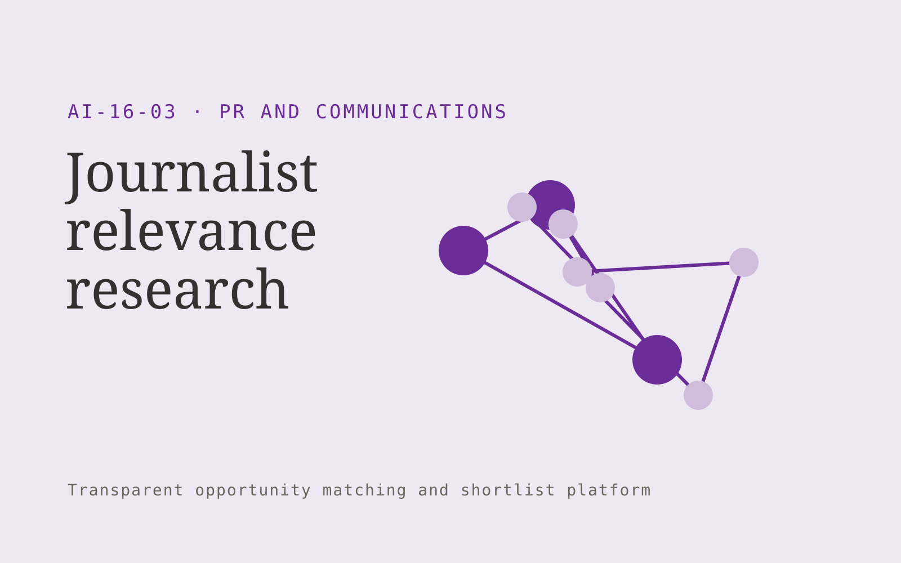

# Journalist relevance research

**PR and Communications** · Also fits: Writers; Executives and Strategy; Sales

> For small PR agencies planning specialist announcements, turn recent published work and client announcement brief into evidence-backed media research list. Address the recurring problem: media lists contain reporters with little topical relevance. The value hypothesis is a more complete, reviewable deliverable with less repeated preparation; the pilot must establish whether that benefit is real.

| | |
|---|---|
| **Buyer** | Small PR agencies planning specialist announcements |
| **Problem** | Media lists contain reporters with little topical relevance. |
| **Format** | Transparent opportunity matching and shortlist platform |
| **USP** | Recent article evidence supports every proposed media match. |

## The product
Key screens: Reporter shortlist, article evidence, pitch notes. Open with a filterable opportunity feed and clear fit explanations. Each profile shows source evidence, eligibility conditions and missing information. Keep saved, rejected and needs-review states. Include a deadline or next-action view without hiding the basis of recommendations. In this product, the first view is reporter shortlist, followed by article evidence and pitch notes.

## Core functionality
1. Define announcement themes.
2. Review published coverage.
3. Explain relevance.
4. Record publication dates.
5. Flag weak matches.
6. Draft contextual pitch angles.

## Customer workflow
Define buyer-selected criteria, gather authorized opportunity information, apply explicit eligibility rules, propose matches with evidence, let the user review uncertain conditions, save a shortlist and track the resulting conversations or applications. Start with recent published work and client announcement brief and finish with evidence-backed media research list.

## AI and human review
Extract criteria, normalize opportunity descriptions and explain possible fit. Use explicit rules for hard requirements. Do not invent missing eligibility facts or represent a suggested match as a verified qualification.

## Customer inputs
Recent published work and client announcement brief

## Customer deliverables
Evidence-backed media research list

## Accounts and administration
Editable criteria, dated sources, eligibility evidence, missing-data flags, saved shortlists, rejection reasons, deadline alerts and owner follow-up.

## MVP scope
Begin with small PR agencies planning specialist announcements and one recurring use case. Build the first two modules: define announcement themes; review published coverage. Provide operator assistance for the third module: explain relevance. Deliver evidence-backed media research list through a manual review queue. Perform other necessary full-scope functions manually during the pilot. Include all applicable access, accuracy and professional-review controls from the start.

## After MVP validation
After paid pilots establish value, automate the remaining modules: record publication dates; flag weak matches; draft contextual pitch angles. Add one validated source integration, reusable customer configuration and recurring delivery. Expand to additional teams, document formats or languages only after testing the new scope.

## Build dependencies
Current source information, explicit eligibility rules, entity identity checks and inspectable fit reasoning. Sparse evidence limits match quality.

## Integrations and data access
Approved company facts, permitted media sources and publication workflows. Permitted opportunity feeds, customer profiles, calendars and CRM exports. Keep initial outreach or applications as user-reviewed drafts. These are candidate integration categories, not verified supported connectors.

## Defensibility
A maintained niche opportunity dataset and documented relevance feedback, supported by relationships with the intended buyer community. For this idea, build around recent article evidence supports every proposed media match. This advantage requires execution and accumulated customer trust; the base model alone is not a defensible asset.

## Alternatives and positioning
Manual research, directories, generic databases, referrals and existing opportunity marketplaces. Differentiate on this specific proposed advantage: recent article evidence supports every proposed media match. Test it against the buyer's current method on the same task. Competitor coverage and uniqueness have not been established.

## Revenue model and test pricing (USD)
Test USD 150-600 monthly for one narrow opportunity feed, or USD 750-2,500 for a bespoke researched shortlist. Price manual verification and custom research explicitly. These are pricing hypotheses.

## Main delivery costs
Source collection, profile updates, entity resolution, eligibility verification, analyst research and customer feedback review.

## Marketing message to test
> Journalist relevance research for small PR agencies planning specialist announcements. Recent article evidence supports every proposed media match. Demonstrate the claim through a small journalist shortlist with article-level justification.

## Acquisition channels
PR practitioner communities

## Lead magnet
A small journalist shortlist with article-level justification

## First 30 days of marketing
- Week 1: interview five prospective buyers in this segment: small PR agencies planning specialist announcements. Ask to see a recent example of the problem and their current process.
- Week 2: prepare this demonstration using authorized or synthetic material: a small journalist shortlist with article-level justification.
- Week 3: present it through PR practitioner communities and seek one narrowly scoped paid pilot.
- Week 4: review verified relevance, useful pitch conversations, total delivery effort and a concrete renewal decision before increasing scope.

## Paid pilot and validation
Produce a small shortlist and ask the buyer to verify fit independently. Record why each option is accepted or rejected and whether it leads to a useful next step. Review missed eligible options too. For this idea, use recent published work and client announcement brief and evaluate evidence-backed media research list. Agree success thresholds with the buyer before starting; collect a baseline for verified relevance, useful pitch conversations. A positive signal is payment and repeat use with acceptable quality and delivery cost, not a favorable demo reaction alone.

## Success metrics
Verified relevance, useful pitch conversations

## Retention and expansion
Refresh opportunity profiles, improve criteria from accepted and rejected matches, and offer deeper verification for shortlisted options.

## Operating controls and limitations
Verify public facts and quotations. Keep publication authority explicit and preserve the original context behind media and reputation findings. Validate source access and reviewer availability during the pilot. Maintain customer-level access, data deletion controls and a record of final approvals.

## Brand style (concept)

- Colors: `#6a2791` primary · `#5cc954` accent · `#ece4f1` surface · `#22201e` ink
- Type: Playfair Display for headings, Source Sans 3 for text
- Voice: Articulate, timely, composed
- Demo site: [https://nexibeo.com/ideas/journalist-relevance-research/demo/](https://nexibeo.com/ideas/journalist-relevance-research/demo/)

## Investment indication

Indicative build budget, from MVP to full product. This is a planning range, not a quote; it excludes running costs such as model usage, hosting and reviewer hours.

| Phase | Scope | Timeline | Indicative budget |
|---|---|---|---|
| MVP | One buyer segment, one recurring use case; first modules: define announcement themes; review published coverage. Manual review in the loop. | 4 weeks | $7,500 |
| Paid pilot | Accounts, roles, review states, audit trail and the first integration, hardened for two to three paying pilot customers. | 5 weeks | $8,000 |
| Full product | Remaining modules: record publication dates; flag weak matches; draft contextual pitch angles. Self-serve onboarding, billing, monitoring and the wider integration set. | 9 weeks | $11,500 |
| **Total** | | 18 weeks | **$27,000** |

### Running costs per month (rough indication, untested)

| Stage | Hosting and infrastructure | AI usage | Total per month |
|---|---|---|---|
| MVP and paid pilot (about 3 customers) | $30–$60 | $40–$90 | **$70–$150** |
| Full product (about 50 customers) | $110–$210 | $280–$560 | **$390–$770** |

**Co-create this project with us:** [contact Nexibeo](https://nexibeo.com/ideas/journalist-relevance-research/#apply) and we build it with you.

## Research status
Concept proposal expanded from the 315-idea conversation. Demand, pricing, differentiation, build scope and integration feasibility are hypotheses, not verified market findings. Category link is inspiration rather than evidence of business viability.

## Credits and next steps

- **Estimation and building this idea:** see the full idea page on [nexibeo.com](https://nexibeo.com/ideas/journalist-relevance-research/) for more detail on estimation, and to co-create and build this idea with Nexibeo.
- **Become an AI-optimized specialist for PR and Communications:** [Complete AI Training](https://completeaitraining.com/certification/12b-ai-certification-for-pr-and-communications-specialists/).
- Field news: [AI news for PR and Communications](https://completeaitraining.com/all-ai-news-for-pr-and-communications/).
