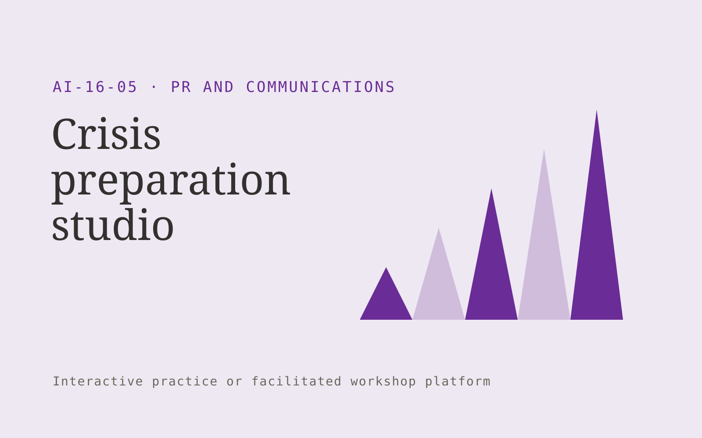

# Crisis preparation studio

**PR and Communications** · Also fits: Writers; Executives and Strategy; Education

> For communications teams at consumer-facing businesses, turn approved escalation policies and realistic incident scenarios into crisis exercise pack and revised response templates. Address the recurring problem: crisis plans are untested and hard to use under pressure. The value hypothesis is a more complete, reviewable deliverable with less repeated preparation; the pilot must establish whether that benefit is real.

| | |
|---|---|
| **Buyer** | Communications teams at consumer-facing businesses |
| **Problem** | Crisis plans are untested and hard to use under pressure. |
| **Format** | Interactive practice or facilitated workshop platform |
| **USP** | Facilitated exercises reveal operational communication gaps before an incident. |

## The product
Key screens: Scenario timeline, response room, debrief board. Use a scenario catalog with clear goals and difficulty settings. The main session area supports text, optional voice and visible context. Follow it with a replay or decision map, annotated feedback and a next-practice plan. Facilitators can author scenarios and review participant-selected sessions. In this product, the first view is scenario timeline, followed by response room and debrief board.

## Core functionality
1. Develop scenarios.
2. Assign response roles.
3. Inject new facts.
4. Draft holding statements.
5. Test escalation timing.
6. Document lessons.

## Customer workflow
Set the participant’s goal, choose or customize a scenario, conduct an interactive session, record choices or dialogue, review evidence-based feedback with a facilitator when needed, and repeat selected parts with changed constraints. Start with approved escalation policies and realistic incident scenarios and finish with crisis exercise pack and revised response templates.

## AI and human review
Generate responsive dialogue, alternative situations and structured reflection prompts. Ground feedback in agreed goals or rubrics. Treat creative choices and facilitator judgment as authoritative. Evaluate specific actions rather than infer personality or hidden traits.

## Customer inputs
Approved escalation policies and realistic incident scenarios

## Customer deliverables
Crisis exercise pack and revised response templates

## Accounts and administration
Participant-controlled session sharing, scenario versions, facilitator tools, replay history, rubric calibration, practice goals and exportable feedback.

## MVP scope
Begin with communications teams at consumer-facing businesses and one recurring use case. Build the first two modules: develop scenarios; assign response roles. Provide operator assistance for the third module: inject new facts. Deliver crisis exercise pack and revised response templates through a manual review queue. Perform other necessary full-scope functions manually during the pilot. Include all applicable access, accuracy and professional-review controls from the start.

## After MVP validation
After paid pilots establish value, automate the remaining modules: draft holding statements; test escalation timing; document lessons. Add one validated source integration, reusable customer configuration and recurring delivery. Expand to additional teams, document formats or languages only after testing the new scope.

## Build dependencies
Scenario state management, coherent dialogue, explicit rubrics, session replay and reviewer feedback. Voice interaction adds latency and audio QA requirements.

## Integrations and data access
Approved company facts, permitted media sources and publication workflows. Learning portals, calendar scheduling and authorized session exports. Make recording, sharing and retention controls explicit in the product. These are candidate integration categories, not verified supported connectors.

## Defensibility
Realistic domain scenarios, qualified facilitator relationships and reviewed examples of useful feedback and successful practice. For this idea, build around facilitated exercises reveal operational communication gaps before an incident. This advantage requires execution and accumulated customer trust; the base model alone is not a defensible asset.

## Alternatives and positioning
Human coaching, workshops, static courses, roleplay with colleagues and general chat tools. Differentiate on this specific proposed advantage: facilitated exercises reveal operational communication gaps before an incident. Test it against the buyer's current method on the same task. Competitor coverage and uniqueness have not been established.

## Revenue model and test pricing (USD)
Test USD 300-1,500 for a facilitated team pilot, or USD 20-80 per participant monthly for self-serve practice with limited usage. Bespoke workshops and expert coaching are separately scoped. Pricing is hypothetical.

## Main delivery costs
Scenario design, voice processing if used, model interaction length, facilitator review, rubric calibration and learner support.

## Marketing message to test
> Crisis preparation studio for communications teams at consumer-facing businesses. Facilitated exercises reveal operational communication gaps before an incident. Demonstrate the claim through a tabletop exercise for one credible incident.

## Acquisition channels
Crisis communication advisers

## Lead magnet
A tabletop exercise for one credible incident

## First 30 days of marketing
- Week 1: interview five prospective buyers in this segment: communications teams at consumer-facing businesses. Ask to see a recent example of the problem and their current process.
- Week 2: prepare this demonstration using authorized or synthetic material: a tabletop exercise for one credible incident.
- Week 3: present it through crisis communication advisers and seek one narrowly scoped paid pilot.
- Week 4: review escalation clarity, completed improvement actions, total delivery effort and a concrete renewal decision before increasing scope.

## Paid pilot and validation
Run a short scenario with representative participants, then repeat with a different case. Ask a qualified coach or facilitator to assess usefulness and observable improvement independently of the AI feedback. For this idea, use approved escalation policies and realistic incident scenarios and evaluate crisis exercise pack and revised response templates. Agree success thresholds with the buyer before starting; collect a baseline for escalation clarity, completed improvement actions. A positive signal is payment and repeat use with acceptable quality and delivery cost, not a favorable demo reaction alone.

## Success metrics
Escalation clarity, completed improvement actions

## Retention and expansion
Release relevant new scenarios, support repeat practice and offer facilitator review. Expand to another role only with appropriate scenarios and calibrated feedback.

## Operating controls and limitations
Verify public facts and quotations. Keep publication authority explicit and preserve the original context behind media and reputation findings. Validate source access and reviewer availability during the pilot. Maintain customer-level access, data deletion controls and a record of final approvals.

## Brand style (concept)

- Colors: `#5f2791` primary · `#9cc954` accent · `#ebe4f1` surface · `#22201e` ink
- Type: Playfair Display for headings, Source Sans 3 for text
- Voice: Articulate, timely, composed
- Demo site: [https://nexibeo.com/ideas/crisis-preparation-studio/demo/](https://nexibeo.com/ideas/crisis-preparation-studio/demo/)

## Investment indication

Indicative build budget, from MVP to full product. This is a planning range, not a quote; it excludes running costs such as model usage, hosting and reviewer hours. Built with Nexibeo's AI software development factory, most implementations take days to a few weeks of creation time, depending on availability.

| Phase | Scope | Creation time | Indicative budget |
|---|---|---|---|
| MVP | One buyer segment, one recurring use case; first modules: develop scenarios; assign response roles. Manual review in the loop. | 4 days | $7,500 |
| Paid pilot | Accounts, roles, review states, audit trail and the first integration, hardened for two to three paying pilot customers. | 5 days | $8,500 |
| Full product | Remaining modules: draft holding statements; test escalation timing; document lessons. Self-serve onboarding, billing, monitoring and the wider integration set. | 9 days | $11,500 |
| **Total** | | about 4 weeks | **$27,500** |

### Running costs per month (rough indication, untested)

| Stage | Hosting and infrastructure | AI usage | Total per month |
|---|---|---|---|
| MVP and paid pilot (about 3 customers) | $30–$60 | $50–$110 | **$80–$170** |
| Full product (about 50 customers) | $110–$210 | $420–$840 | **$530–$1,050** |

**Co-create this project with us:** [contact Nexibeo](https://nexibeo.com/ideas/crisis-preparation-studio/#apply) and we build it with you.

## Research status
Concept proposal expanded from the 315-idea conversation. Demand, pricing, differentiation, build scope and integration feasibility are hypotheses, not verified market findings. Category link is inspiration rather than evidence of business viability.

## Credits and next steps

- **Estimation and building this idea:** see the full idea page on [nexibeo.com](https://nexibeo.com/ideas/crisis-preparation-studio/) for more detail on estimation, and to co-create and build this idea with Nexibeo.
- **Become an AI-optimized specialist for PR and Communications:** [Complete AI Training](https://completeaitraining.com/certification/12b-ai-certification-for-pr-and-communications-specialists/).
- Field news: [AI news for PR and Communications](https://completeaitraining.com/all-ai-news-for-pr-and-communications/).
