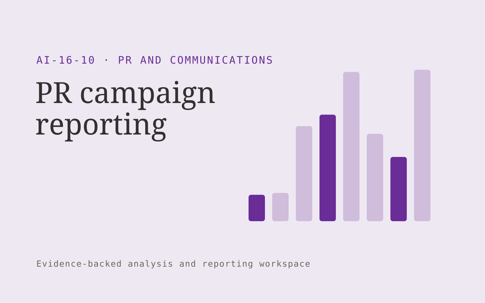

# PR campaign reporting

**PR and Communications** · Also fits: Writers; Executives and Strategy; Science and Research

> For boutique PR agencies producing client reports, turn verified coverage records and agreed campaign measures into reviewed PR campaign report. Address the recurring problem: reporting takes time and overstates what coverage proves. The value hypothesis is a more complete, reviewable deliverable with less repeated preparation; the pilot must establish whether that benefit is real.

| | |
|---|---|
| **Buyer** | Boutique PR agencies producing client reports |
| **Problem** | Reporting takes time and overstates what coverage proves. |
| **Format** | Evidence-backed analysis and reporting workspace |
| **USP** | Transparent measurement definitions and traceable coverage evidence. |

## The product
Key screens: Campaign overview, coverage evidence, client narrative. Open with a compact overview and filters for the relevant period or segment. Let users drill from each theme or metric into underlying records. Keep source definitions and missing-data notes near the result. Use an action panel to assign investigations and record what was learned. In this product, the first view is campaign overview, followed by coverage evidence and client narrative.

## Core functionality
1. Deduplicate coverage.
2. Classify publication types.
3. Reconcile agreed metrics.
4. Distinguish reach estimates.
5. Draft commentary.
6. Export branded reports.

## Customer workflow
Agree definitions, import authorized data, validate coverage and identifiers, compute transparent measures, group relevant evidence, review findings, assign investigations or improvements, and repeat on a comparable period. Start with verified coverage records and agreed campaign measures and finish with reviewed PR campaign report.

## AI and human review
Classify text, summarize evidence and propose explanations to investigate. Compute financial or operational measures with deterministic code. Separate observed patterns from causal claims and preserve examples that contradict the summary.

## Customer inputs
Verified coverage records and agreed campaign measures

## Customer deliverables
Reviewed PR campaign report

## Accounts and administration
Dataset permissions, field mappings, metric definitions, source drill-down, saved filters, reviewer annotations, recurring reports and action ownership.

## MVP scope
Begin with boutique PR agencies producing client reports and one recurring use case. Build the first two modules: deduplicate coverage; classify publication types. Provide operator assistance for the third module: reconcile agreed metrics. Deliver reviewed PR campaign report through a manual review queue. Perform other necessary full-scope functions manually during the pilot. Include all applicable access, accuracy and professional-review controls from the start.

## After MVP validation
After paid pilots establish value, automate the remaining modules: distinguish reach estimates; draft commentary; export branded reports. Add one validated source integration, reusable customer configuration and recurring delivery. Expand to additional teams, document formats or languages only after testing the new scope.

## Build dependencies
Stable identifiers, consistent metric definitions, deterministic calculations, source lineage and representative review samples. Poor coverage must remain visible.

## Integrations and data access
Approved company facts, permitted media sources and publication workflows. Read-only business data exports, reporting databases and task trackers. Reconcile source totals before scheduling recurring data refreshes. These are candidate integration categories, not verified supported connectors.

## Defensibility
Domain-specific definitions, trusted source mappings and a history connecting findings to actions and observed results. For this idea, build around transparent measurement definitions and traceable coverage evidence. This advantage requires execution and accumulated customer trust; the base model alone is not a defensible asset.

## Alternatives and positioning
Analysts, business intelligence dashboards, spreadsheets and general text summarization tools. Differentiate on this specific proposed advantage: transparent measurement definitions and traceable coverage evidence. Test it against the buyer's current method on the same task. Competitor coverage and uniqueness have not been established.

## Revenue model and test pricing (USD)
Test USD 500-2,000 for an initial analysis of one bounded dataset. Offer USD 250-1,000 monthly for repeat reporting at agreed volume. Data cleanup and specialist analysis are separately priced. These are test ranges.

## Main delivery costs
Data preparation, reconciliation, classification, expert interpretation, customer-specific definitions and recurring reporting support.

## Marketing message to test
> PR campaign reporting for boutique PR agencies producing client reports. Transparent measurement definitions and traceable coverage evidence. Demonstrate the claim through a clean campaign report from sample coverage.

## Acquisition channels
PR agency owner networks

## Lead magnet
A clean campaign report from sample coverage

## First 30 days of marketing
- Week 1: interview five prospective buyers in this segment: boutique PR agencies producing client reports. Ask to see a recent example of the problem and their current process.
- Week 2: prepare this demonstration using authorized or synthetic material: a clean campaign report from sample coverage.
- Week 3: present it through PR agency owner networks and seek one narrowly scoped paid pilot.
- Week 4: review reconciled measures, reporting hours, total delivery effort and a concrete renewal decision before increasing scope.

## Paid pilot and validation
Analyze one historical period and review findings with the responsible domain owner. Reconcile headline measures, inspect counterexamples and ask the buyer to choose a concrete follow-up action. For this idea, use verified coverage records and agreed campaign measures and evaluate reviewed PR campaign report. Agree success thresholds with the buyer before starting; collect a baseline for reconciled measures, reporting hours. A positive signal is payment and repeat use with acceptable quality and delivery cost, not a favorable demo reaction alone.

## Success metrics
Reconciled measures, reporting hours

## Retention and expansion
Repeat the same definitions each reporting period and track whether findings lead to useful action. Expand data sources without breaking historical comparability.

## Operating controls and limitations
Verify public facts and quotations. Keep publication authority explicit and preserve the original context behind media and reputation findings. Validate source access and reviewer availability during the pilot. Maintain customer-level access, data deletion controls and a record of final approvals.

## Brand style (concept)

- Colors: `#512791` primary · `#93c954` accent · `#e9e4f1` surface · `#22201e` ink
- Type: Sora for headings, Work Sans for text
- Voice: Articulate, timely, composed
- Demo site: [https://nexibeo.com/ideas/pr-campaign-reporting/demo/](https://nexibeo.com/ideas/pr-campaign-reporting/demo/)

## Investment indication

Indicative build budget, from MVP to full product. This is a planning range, not a quote; it excludes running costs such as model usage, hosting and reviewer hours.

| Phase | Scope | Timeline | Indicative budget |
|---|---|---|---|
| MVP | One buyer segment, one recurring use case; first modules: deduplicate coverage; classify publication types. Manual review in the loop. | 4 weeks | $6,500 |
| Paid pilot | Accounts, roles, review states, audit trail and the first integration, hardened for two to three paying pilot customers. | 5 weeks | $7,000 |
| Full product | Remaining modules: distinguish reach estimates; draft commentary; export branded reports. Self-serve onboarding, billing, monitoring and the wider integration set. | 8 weeks | $10,000 |
| **Total** | | 17 weeks | **$23,500** |

### Running costs per month (rough indication, untested)

| Stage | Hosting and infrastructure | AI usage | Total per month |
|---|---|---|---|
| MVP and paid pilot (about 3 customers) | $30–$60 | $80–$160 | **$110–$220** |
| Full product (about 50 customers) | $110–$210 | $880–$1,750 | **$990–$1,960** |

**Co-create this project with us:** [contact Nexibeo](https://nexibeo.com/ideas/pr-campaign-reporting/#apply) and we build it with you.

## Research status
Concept proposal expanded from the 315-idea conversation. Demand, pricing, differentiation, build scope and integration feasibility are hypotheses, not verified market findings. Category link is inspiration rather than evidence of business viability.

## Credits and next steps

- **Estimation and building this idea:** see the full idea page on [nexibeo.com](https://nexibeo.com/ideas/pr-campaign-reporting/) for more detail on estimation, and to co-create and build this idea with Nexibeo.
- **Become an AI-optimized specialist for PR and Communications:** [Complete AI Training](https://completeaitraining.com/certification/12b-ai-certification-for-pr-and-communications-specialists/).
- Field news: [AI news for PR and Communications](https://completeaitraining.com/all-ai-news-for-pr-and-communications/).
