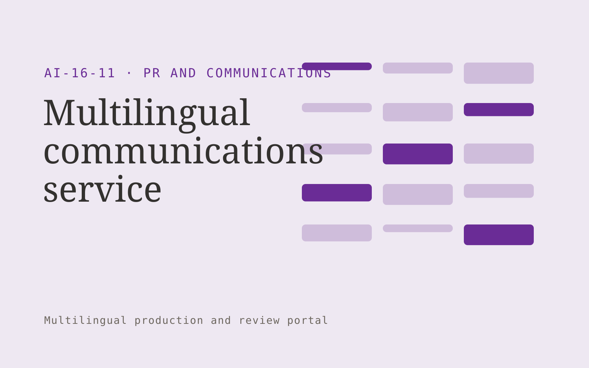

# Multilingual communications service

**PR and Communications** · Also fits: Writers; Executives and Strategy

> For organizations announcing changes across languages, turn approved announcements and regional language guidance into approved multilingual announcements. Address the recurring problem: announcement versions diverge in tone and factual detail. The value hypothesis is a more complete, reviewable deliverable with less repeated preparation; the pilot must establish whether that benefit is real.

| | |
|---|---|
| **Buyer** | Organizations announcing changes across languages |
| **Problem** | Announcement versions diverge in tone and factual detail. |
| **Format** | Multilingual production and review portal |
| **USP** | Coordinated publication versions with consistent facts and terminology. |

## The product
Key screens: Language versions, shared glossary, editorial approval. Use aligned source and target language panes with shared terminology highlights. Include a language status grid, reviewer assignment queue, and layout or timeline preview. Show unresolved ambiguities next to the affected passage. Keep approvals separate for each language and version. In this product, the first view is language versions, followed by shared glossary and editorial approval.

## Core functionality
1. Translate core statements.
2. Preserve dates and names.
3. Adapt phrasing.
4. Flag cultural ambiguity.
5. Coordinate reviewers.
6. Synchronize corrections.

## Customer workflow
Upload authorized source content, confirm target languages and terminology, create translation drafts, assign qualified reviewers, reconcile source changes, check layout or timing, and deliver approved language versions. Start with approved announcements and regional language guidance and finish with approved multilingual announcements.

## AI and human review
Draft translations, transcribe media when applicable, suggest terminology and detect inconsistencies. Deterministic checks compare dates, numbers and identifiers. Qualified language reviewers decide idiomatic phrasing and specialist meaning. Voice work requires explicit permissions for the intended use.

## Customer inputs
Approved announcements and regional language guidance

## Customer deliverables
Approved multilingual announcements

## Accounts and administration
Language permissions, glossary versions, reviewer assignments, segment comments, source-change alerts, per-language approvals and delivery history.

## MVP scope
Begin with organizations announcing changes across languages and one recurring use case. Build the first two modules: translate core statements; preserve dates and names. Provide operator assistance for the third module: adapt phrasing. Deliver approved multilingual announcements through a manual review queue. Perform other necessary full-scope functions manually during the pilot. Include all applicable access, accuracy and professional-review controls from the start.

## After MVP validation
After paid pilots establish value, automate the remaining modules: flag cultural ambiguity; coordinate reviewers; synchronize corrections. Add one validated source integration, reusable customer configuration and recurring delivery. Expand to additional teams, document formats or languages only after testing the new scope.

## Build dependencies
Segment alignment, glossary enforcement, multilingual text handling, comparison views and qualified reviewers. Media projects also need timing and audio/video QA.

## Integrations and data access
Approved company facts, permitted media sources and publication workflows. Document formats, subtitle formats, media storage and publishing systems. Confirm language, font and layout support for each requested output. These are candidate integration categories, not verified supported connectors.

## Defensibility
Customer-controlled approved terminology, reviewed translation examples and dependable specialist reviewer relationships. For this idea, build around coordinated publication versions with consistent facts and terminology. This advantage requires execution and accumulated customer trust; the base model alone is not a defensible asset.

## Alternatives and positioning
Translation agencies, freelance linguists, generic machine translation and internal bilingual staff. Differentiate on this specific proposed advantage: coordinated publication versions with consistent facts and terminology. Test it against the buyer's current method on the same task. Competitor coverage and uniqueness have not been established.

## Revenue model and test pricing (USD)
Quote an initial USD 300-1,200 batch for a defined word count or media duration and one target language. Charge separately for extra languages, specialist review and dubbing. Test recurring volume agreements after the pilot; prices are hypotheses.

## Main delivery costs
Source preparation, translation volume, transcription or dubbing, qualified reviewers, glossary maintenance and changed-source rework.

## Marketing message to test
> Multilingual communications service for organizations announcing changes across languages. Coordinated publication versions with consistent facts and terminology. Demonstrate the claim through an announcement in two reviewed language versions.

## Acquisition channels
International communication agencies

## Lead magnet
An announcement in two reviewed language versions

## First 30 days of marketing
- Week 1: interview five prospective buyers in this segment: organizations announcing changes across languages. Ask to see a recent example of the problem and their current process.
- Week 2: prepare this demonstration using authorized or synthetic material: an announcement in two reviewed language versions.
- Week 3: present it through international communication agencies and seek one narrowly scoped paid pilot.
- Week 4: review reviewer acceptance, factual consistency, total delivery effort and a concrete renewal decision before increasing scope.

## Paid pilot and validation
Translate a representative sample and have an independent qualified reviewer assess it. Include a source revision to measure update handling. Track corrections, meaning preservation and total delivery effort. For this idea, use approved announcements and regional language guidance and evaluate approved multilingual announcements. Agree success thresholds with the buyer before starting; collect a baseline for reviewer acceptance, factual consistency. A positive signal is payment and repeat use with acceptable quality and delivery cost, not a favorable demo reaction alone.

## Success metrics
Reviewer acceptance, factual consistency

## Retention and expansion
Maintain approved terminology and reviewer continuity. Charge for ongoing source updates and add languages only when the buyer has a real publishing need.

## Operating controls and limitations
Verify public facts and quotations. Keep publication authority explicit and preserve the original context behind media and reputation findings. Validate source access and reviewer availability during the pilot. Maintain customer-level access, data deletion controls and a record of final approvals.

## Brand style (concept)

- Colors: `#612791` primary · `#74c954` accent · `#ebe4f1` surface · `#22201e` ink
- Type: Sora for headings, Work Sans for text
- Voice: Articulate, timely, composed
- Demo site: [https://nexibeo.com/ideas/multilingual-communications-service/demo/](https://nexibeo.com/ideas/multilingual-communications-service/demo/)

## Investment indication

Indicative build budget, from MVP to full product. This is a planning range, not a quote; it excludes running costs such as model usage, hosting and reviewer hours. Built with Nexibeo's AI software development factory, most implementations take days to a few weeks of creation time, depending on availability.

| Phase | Scope | Creation time | Indicative budget |
|---|---|---|---|
| MVP | One buyer segment, one recurring use case; first modules: translate core statements; preserve dates and names. Manual review in the loop. | 6 days | $10,000 |
| Paid pilot | Accounts, roles, review states, audit trail and the first integration, hardened for two to three paying pilot customers. | 7 days | $13,000 |
| Full product | Remaining modules: flag cultural ambiguity; coordinate reviewers; synchronize corrections. Self-serve onboarding, billing, monitoring and the wider integration set. | 2 weeks | $18,000 |
| **Total** | | about 5 weeks | **$41,000** |

### Running costs per month (rough indication, untested)

| Stage | Hosting and infrastructure | AI usage | Total per month |
|---|---|---|---|
| MVP and paid pilot (about 3 customers) | $40–$80 | $100–$200 | **$140–$280** |
| Full product (about 50 customers) | $160–$320 | $1,230–$2,450 | **$1,390–$2,770** |

**Co-create this project with us:** [contact Nexibeo](https://nexibeo.com/ideas/multilingual-communications-service/#apply) and we build it with you.

## Research status
Concept proposal expanded from the 315-idea conversation. Demand, pricing, differentiation, build scope and integration feasibility are hypotheses, not verified market findings. Category link is inspiration rather than evidence of business viability.

## Credits and next steps

- **Estimation and building this idea:** see the full idea page on [nexibeo.com](https://nexibeo.com/ideas/multilingual-communications-service/) for more detail on estimation, and to co-create and build this idea with Nexibeo.
- **Become an AI-optimized specialist for PR and Communications:** [Complete AI Training](https://completeaitraining.com/certification/12b-ai-certification-for-pr-and-communications-specialists/).
- Field news: [AI news for PR and Communications](https://completeaitraining.com/all-ai-news-for-pr-and-communications/).
