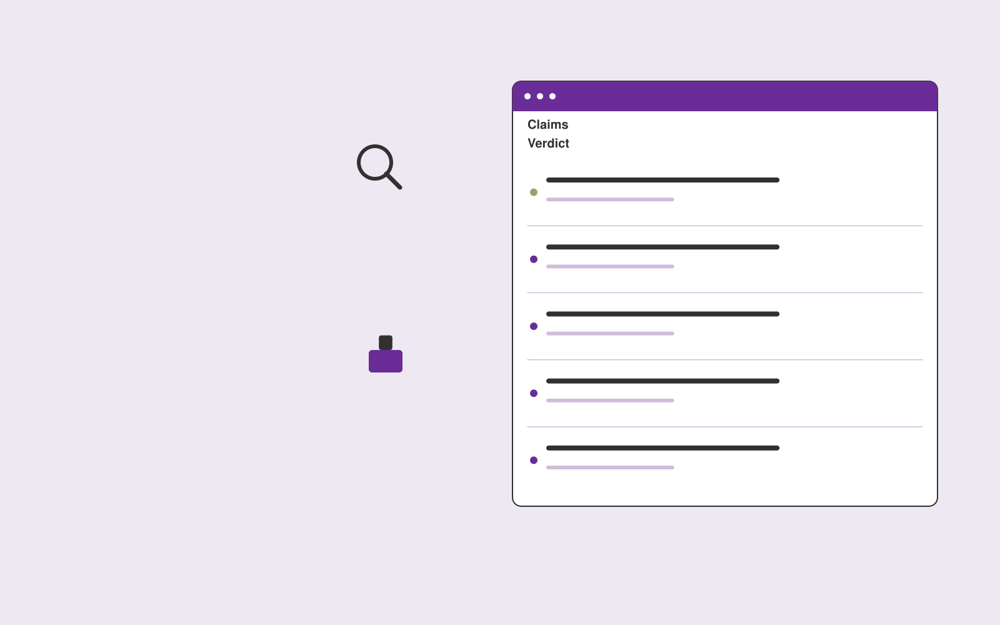

# Public statement evidence checker

**PR and Communications** · Also fits: Writers; Executives and Strategy; Operations

> For communications teams publishing factual statements, turn draft statements and approved evidence sources into statement evidence verification report. Address the recurring problem: unsupported claims survive normal copy editing. The value hypothesis is a more complete, reviewable deliverable with less repeated preparation; the pilot must establish whether that benefit is real.

| | |
|---|---|
| **Buyer** | Communications teams publishing factual statements |
| **Problem** | Unsupported claims survive normal copy editing. |
| **Format** | Evidence review and quality assurance workspace |
| **USP** | Claim-level review that exposes the evidence behind public wording. |

## The product
Key screens: Claim list, supporting passages, reviewer verdict. Open on a review queue ordered by reviewer-selected priorities. Show each finding beside the original evidence and applicable rule. Provide accept, dismiss and needs-information controls with reasons. A separate report view summarizes confirmed findings and unresolved items, not raw AI flags. In this product, the first view is claim list, followed by supporting passages and reviewer verdict.

## Core functionality
1. Extract factual claims.
2. Locate supplied evidence.
3. Flag overstatement.
4. Check dates and quantities.
5. Distinguish opinion.
6. Record reviewer decisions.

## Customer workflow
Agree review criteria, ingest a sample, generate candidate findings, inspect supporting evidence, let reviewers confirm or dismiss each item, assign corrections, and recheck the affected material. Start with draft statements and approved evidence sources and finish with statement evidence verification report.

## AI and human review
Propose possible inconsistencies, omissions and rubric matches. Combine extraction with deterministic checks where rules are explicit. Reviewers make the final judgment. Keep false positives and missed cases visible during evaluation.

## Customer inputs
Draft statements and approved evidence sources

## Customer deliverables
Statement evidence verification report

## Accounts and administration
Versioned review criteria, evidence links, reviewer decisions, disagreement handling, correction assignments, recheck status and exportable review history.

## MVP scope
Begin with communications teams publishing factual statements and one recurring use case. Build the first two modules: extract factual claims; locate supplied evidence. Provide operator assistance for the third module: flag overstatement. Deliver statement evidence verification report through a manual review queue. Perform other necessary full-scope functions manually during the pilot. Include all applicable access, accuracy and professional-review controls from the start.

## After MVP validation
After paid pilots establish value, automate the remaining modules: check dates and quantities; distinguish opinion; record reviewer decisions. Add one validated source integration, reusable customer configuration and recurring delivery. Expand to additional teams, document formats or languages only after testing the new scope.

## Build dependencies
Evidence coordinates, versioned rules, reviewer decisions and a representative reference set. Measure misses as well as confirmed findings before scaling.

## Integrations and data access
Approved company facts, permitted media sources and publication workflows. Source repositories, task trackers and report exports. Keep findings as review proposals until authorized owners accept the resulting actions. These are candidate integration categories, not verified supported connectors.

## Defensibility
A domain-specific review rubric and rights-cleared examples of confirmed defects, false alarms and reviewer reasoning. For this idea, build around claim-level review that exposes the evidence behind public wording. This advantage requires execution and accumulated customer trust; the base model alone is not a defensible asset.

## Alternatives and positioning
Manual reviewers, checklists, generic scanning tools and specialist audit services. Differentiate on this specific proposed advantage: claim-level review that exposes the evidence behind public wording. Test it against the buyer's current method on the same task. Competitor coverage and uniqueness have not been established.

## Revenue model and test pricing (USD)
Test USD 500-2,000 for a defined audit sample and report. Offer recurring review priced by reviewed items and specialist hours. Software-only access can follow a reliable reviewed service. All prices require validation.

## Main delivery costs
Document or media processing, model evaluation, expert review, false-positive handling, rechecks and customer-specific rubric calibration.

## Marketing message to test
> Public statement evidence checker for communications teams publishing factual statements. Claim-level review that exposes the evidence behind public wording. Demonstrate the claim through an annotated factual-claim review.

## Acquisition channels
PR legal review partners

## Lead magnet
An annotated factual-claim review

## First 30 days of marketing
- Week 1: interview five prospective buyers in this segment: communications teams publishing factual statements. Ask to see a recent example of the problem and their current process.
- Week 2: prepare this demonstration using authorized or synthetic material: an annotated factual-claim review.
- Week 3: present it through PR legal review partners and seek one narrowly scoped paid pilot.
- Week 4: review confirmed unsupported claims, false alarms, total delivery effort and a concrete renewal decision before increasing scope.

## Paid pilot and validation
Have a qualified reviewer independently assess the same sample. Compare confirmed findings, false alarms and omissions. Repeat on unseen material before agreeing recurring volume. For this idea, use draft statements and approved evidence sources and evaluate statement evidence verification report. Agree success thresholds with the buyer before starting; collect a baseline for confirmed unsupported claims, false alarms. A positive signal is payment and repeat use with acceptable quality and delivery cost, not a favorable demo reaction alone.

## Success metrics
Confirmed unsupported claims, false alarms

## Retention and expansion
Offer recurring reviews and rechecks of previously confirmed issues. Expand document or case types after validating the new rubric with qualified reviewers.

## Operating controls and limitations
Verify public facts and quotations. Keep publication authority explicit and preserve the original context behind media and reputation findings. Validate source access and reviewer availability during the pilot. Maintain customer-level access, data deletion controls and a record of final approvals.

## Brand style (concept)

- Colors: `#562791` primary · `#b4c954` accent · `#eae4f1` surface · `#22201e` ink
- Type: Sora for headings, Work Sans for text
- Voice: Articulate, timely, composed
- Demo site: [https://nexibeo.com/solutions/public-statement-evidence-checker/demo/](https://nexibeo.com/solutions/public-statement-evidence-checker/demo/)

## Investment indication

Indicative build budget, from MVP to full product. This is a planning range, not a quote; it excludes running costs such as model usage, hosting and reviewer hours. Built with Nexibeo's AI software development factory, most implementations take days to a few weeks of creation time, depending on availability.

| Phase | Scope | Creation time | Indicative budget |
|---|---|---|---|
| MVP | One buyer segment, one recurring use case; first modules: extract factual claims; locate supplied evidence. Manual review in the loop. | 3 days | $6,500 |
| Paid pilot | Accounts, roles, review states, audit trail and the first integration, hardened for two to three paying pilot customers. | 4 days | $7,000 |
| Full product | Remaining modules: check dates and quantities; distinguish opinion; record reviewer decisions. Self-serve onboarding, billing, monitoring and the wider integration set. | 7 days | $10,000 |
| **Total** | | about 3 weeks | **$23,500** |

### Running costs per month (rough indication, untested)

| Stage | Hosting and infrastructure | AI usage | Total per month |
|---|---|---|---|
| MVP and paid pilot (about 3 customers) | $30–$60 | $80–$160 | **$110–$220** |
| Full product (about 50 customers) | $110–$210 | $880–$1,750 | **$990–$1,960** |

**Get this built:** [contact Nexibeo](https://nexibeo.com/solutions/public-statement-evidence-checker/#apply). We build it with our AI software factory, usually in days to a few weeks, for you to run internally or offer to your clients.

## Research status
Concept proposal expanded from the 315-idea conversation. Demand, pricing, differentiation, build scope and integration feasibility are hypotheses, not verified market findings. Category link is inspiration rather than evidence of business viability.

## Credits and next steps

- **Estimation and having it built:** see the full solution page on [nexibeo.com](https://nexibeo.com/solutions/public-statement-evidence-checker/) for more detail on estimation. Nexibeo builds it for you as a custom AI implementation, to run internally or to offer to your own clients.
- **Become an AI-optimized specialist for PR and Communications:** [Complete AI Training](https://completeaitraining.com/certification/12b-ai-certification-for-pr-and-communications-specialists/).
- Field news: [AI news for PR and Communications](https://completeaitraining.com/all-ai-news-for-pr-and-communications/).
