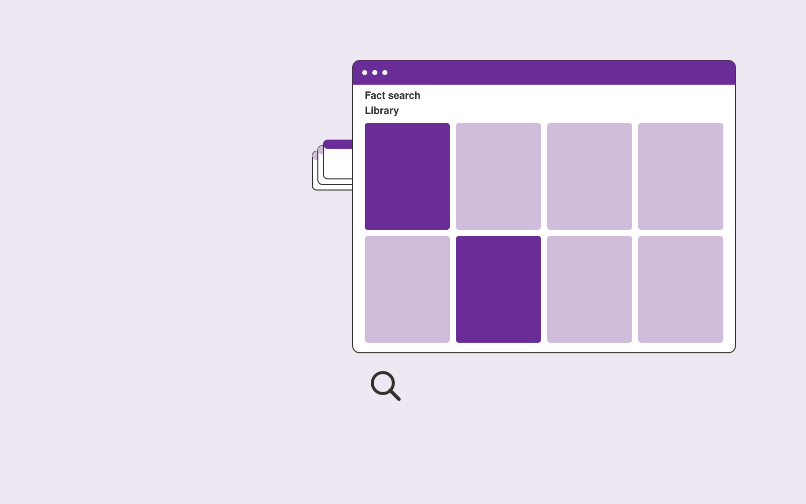

# Communications knowledge library

**PR and Communications** · Also fits: Writers; Executives and Strategy; IT and Development

> For communication teams at growing organizations, turn approved company materials and ownership metadata into controlled communications resource library. Address the recurring problem: approved bios, facts and messaging are scattered. The value hypothesis is a more complete, reviewable deliverable with less repeated preparation; the pilot must establish whether that benefit is real.

| | |
|---|---|
| **Buyer** | Communication teams at growing organizations |
| **Problem** | Approved bios, facts and messaging are scattered. |
| **Format** | Searchable structured library and data stewardship console |
| **USP** | Search results prioritize approved current facts and show responsible owners. |

## The product
Key screens: Fact search, asset record, review calendar. Use a searchable table or visual gallery with filters for the domain’s important attributes. Open each item into a detail drawer containing source records, ownership and history. Put proposed merges and field changes in a separate review queue. Provide a preview before any bulk export. In this product, the first view is fact search, followed by asset record and review calendar.

## Core functionality
1. Index approved materials.
2. Track ownership.
3. Record validity dates.
4. Identify duplicates.
5. Restrict outdated versions.
6. Request periodic reviews.

## Customer workflow
Import a limited collection, define canonical fields, suggest tags or mappings, review uncertain records, publish approved items, search and reuse them, and request periodic owner updates. Start with approved company materials and ownership metadata and finish with controlled communications resource library.

## AI and human review
Suggest classifications, semantic tags, duplicate candidates and field mappings. Preserve original values. Use explicit validation for identifiers and units. Human stewards approve ambiguous merges and factual changes.

## Customer inputs
Approved company materials and ownership metadata

## Customer deliverables
Controlled communications resource library

## Accounts and administration
Record ownership, access permissions, change proposals, original-value retention, version history, review dates, bulk import/export and duplicate resolution.

## MVP scope
Begin with communication teams at growing organizations and one recurring use case. Build the first two modules: index approved materials; track ownership. Provide operator assistance for the third module: record validity dates. Deliver controlled communications resource library through a manual review queue. Perform other necessary full-scope functions manually during the pilot. Include all applicable access, accuracy and professional-review controls from the start.

## After MVP validation
After paid pilots establish value, automate the remaining modules: identify duplicates; restrict outdated versions; request periodic reviews. Add one validated source integration, reusable customer configuration and recurring delivery. Expand to additional teams, document formats or languages only after testing the new scope.

## Build dependencies
Stable identifiers, an agreed data schema, reversible imports, mapping review and source ownership. Data quality work can exceed model development effort.

## Integrations and data access
Approved company facts, permitted media sources and publication workflows. Source systems, catalog exports and cloud file storage. Start with reversible CSV or file imports and validate identifiers before any direct writes. These are candidate integration categories, not verified supported connectors.

## Defensibility
A useful niche taxonomy, customer-approved mappings and accumulated correction history that improve retrieval and reduce repeated cleanup. For this idea, build around search results prioritize approved current facts and show responsible owners. This advantage requires execution and accumulated customer trust; the base model alone is not a defensible asset.

## Alternatives and positioning
Spreadsheets, shared folders, existing asset or information management systems and manual data cleanup. Differentiate on this specific proposed advantage: search results prioritize approved current facts and show responsible owners. Test it against the buyer's current method on the same task. Competitor coverage and uniqueness have not been established.

## Revenue model and test pricing (USD)
Test USD 500-2,500 for one collection cleanup and launch, followed by USD 100-500 monthly for maintenance within agreed record limits. Larger migrations and complex rights management are separately scoped. Prices are hypotheses.

## Main delivery costs
Import cleanup, extraction, storage, indexing, steward review, duplicate investigation and recurring source updates.

## Marketing message to test
> Communications knowledge library for communication teams at growing organizations. Search results prioritize approved current facts and show responsible owners. Demonstrate the claim through a searchable company fact library.

## Acquisition channels
Communication operations consultants

## Lead magnet
A searchable company fact library

## First 30 days of marketing
- Week 1: interview five prospective buyers in this segment: communication teams at growing organizations. Ask to see a recent example of the problem and their current process.
- Week 2: prepare this demonstration using authorized or synthetic material: a searchable company fact library.
- Week 3: present it through communication operations consultants and seek one narrowly scoped paid pilot.
- Week 4: review correct retrieval, stale fact incidents, total delivery effort and a concrete renewal decision before increasing scope.

## Paid pilot and validation
Clean and organize one representative collection. Have users perform real search or mapping tasks. Check every proposed merge in the sample and compare search success with the existing system. For this idea, use approved company materials and ownership metadata and evaluate controlled communications resource library. Agree success thresholds with the buyer before starting; collect a baseline for correct retrieval, stale fact incidents. A positive signal is payment and repeat use with acceptable quality and delivery cost, not a favorable demo reaction alone.

## Success metrics
Correct retrieval, stale fact incidents

## Retention and expansion
Provide owner reminders and periodic cleanup. Add another collection only after record quality and retrieval are stable in the initial one.

## Operating controls and limitations
Verify public facts and quotations. Keep publication authority explicit and preserve the original context behind media and reputation findings. Validate source access and reviewer availability during the pilot. Maintain customer-level access, data deletion controls and a record of final approvals.

## Brand style (concept)

- Colors: `#762791` primary · `#77c954` accent · `#eee4f1` surface · `#22201e` ink
- Type: Sora for headings, Work Sans for text
- Voice: Articulate, timely, composed
- Demo site: [https://nexibeo.com/ideas/communications-knowledge-library/demo/](https://nexibeo.com/ideas/communications-knowledge-library/demo/)

## Investment indication

Indicative build budget, from MVP to full product. This is a planning range, not a quote; it excludes running costs such as model usage, hosting and reviewer hours.

| Phase | Scope | Timeline | Indicative budget |
|---|---|---|---|
| MVP | One buyer segment, one recurring use case; first modules: index approved materials; track ownership. Manual review in the loop. | 4 weeks | $6,500 |
| Paid pilot | Accounts, roles, review states, audit trail and the first integration, hardened for two to three paying pilot customers. | 5 weeks | $7,000 |
| Full product | Remaining modules: identify duplicates; restrict outdated versions; request periodic reviews. Self-serve onboarding, billing, monitoring and the wider integration set. | 8 weeks | $10,000 |
| **Total** | | 17 weeks | **$23,500** |

**Co-create this project with us:** [contact Nexibeo](https://nexibeo.com/ideas/communications-knowledge-library/#apply) and we build it with you.

## Research status
Concept proposal expanded from the 315-idea conversation. Demand, pricing, differentiation, build scope and integration feasibility are hypotheses, not verified market findings. Category link is inspiration rather than evidence of business viability.

## Credits and next steps

- **Estimation and building this idea:** see the full idea page on [nexibeo.com](https://nexibeo.com/ideas/communications-knowledge-library/) for more detail on estimation, and to co-create and build this idea with Nexibeo.
- **Become an AI-optimized specialist for PR and Communications:** [Complete AI Training](https://completeaitraining.com/certification/12b-ai-certification-for-pr-and-communications-specialists/).
- Field news: [AI news for PR and Communications](https://completeaitraining.com/all-ai-news-for-pr-and-communications/).
