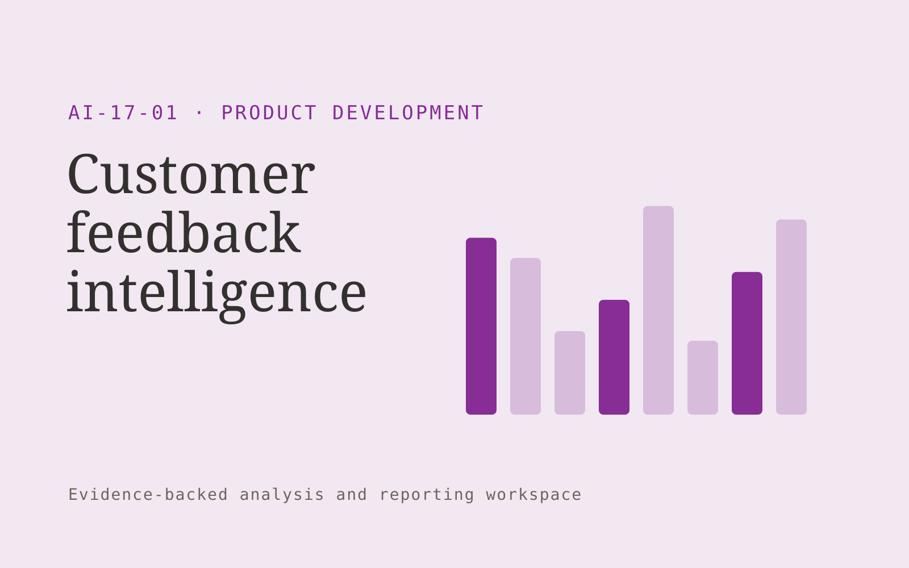

# Customer feedback intelligence

**Product Development** · Also fits: Customer Support; Science and Research

> For product managers at vertical software companies, turn authorized feedback, account context and product taxonomy into product feedback intelligence report. Address the recurring problem: customer feedback is dispersed across disconnected systems. The value hypothesis is a more complete, reviewable deliverable with less repeated preparation; the pilot must establish whether that benefit is real.

| | |
|---|---|
| **Buyer** | Product managers at vertical software companies |
| **Problem** | Customer feedback is dispersed across disconnected systems. |
| **Format** | Evidence-backed analysis and reporting workspace |
| **USP** | Problem-level evidence organized across sources and customer segments. |

## The product
Key screens: Problem themes, evidence explorer, action board. Open with a compact overview and filters for the relevant period or segment. Let users drill from each theme or metric into underlying records. Keep source definitions and missing-data notes near the result. Use an action panel to assign investigations and record what was learned. In this product, the first view is problem themes, followed by evidence explorer and action board.

## Core functionality
1. Group customer problems.
2. Retain original language.
3. Link account context.
4. Identify duplicates.
5. Preserve minority needs.
6. Track product responses.

## Customer workflow
Agree definitions, import authorized data, validate coverage and identifiers, compute transparent measures, group relevant evidence, review findings, assign investigations or improvements, and repeat on a comparable period. Start with authorized feedback, account context and product taxonomy and finish with product feedback intelligence report.

## AI and human review
Classify text, summarize evidence and propose explanations to investigate. Compute financial or operational measures with deterministic code. Separate observed patterns from causal claims and preserve examples that contradict the summary.

## Customer inputs
Authorized feedback, account context and product taxonomy

## Customer deliverables
Product feedback intelligence report

## Accounts and administration
Dataset permissions, field mappings, metric definitions, source drill-down, saved filters, reviewer annotations, recurring reports and action ownership.

## MVP scope
Begin with product managers at vertical software companies and one recurring use case. Build the first two modules: group customer problems; retain original language. Provide operator assistance for the third module: link account context. Deliver product feedback intelligence report through a manual review queue. Perform other necessary full-scope functions manually during the pilot. Include all applicable access, accuracy and professional-review controls from the start.

## After MVP validation
After paid pilots establish value, automate the remaining modules: identify duplicates; preserve minority needs; track product responses. Add one validated source integration, reusable customer configuration and recurring delivery. Expand to additional teams, document formats or languages only after testing the new scope.

## Build dependencies
Stable identifiers, consistent metric definitions, deterministic calculations, source lineage and representative review samples. Poor coverage must remain visible.

## Integrations and data access
Product feedback, authorized interviews, usage exports and requirement records. Read-only business data exports, reporting databases and task trackers. Reconcile source totals before scheduling recurring data refreshes. These are candidate integration categories, not verified supported connectors.

## Defensibility
Domain-specific definitions, trusted source mappings and a history connecting findings to actions and observed results. For this idea, build around problem-level evidence organized across sources and customer segments. This advantage requires execution and accumulated customer trust; the base model alone is not a defensible asset.

## Alternatives and positioning
Analysts, business intelligence dashboards, spreadsheets and general text summarization tools. Differentiate on this specific proposed advantage: problem-level evidence organized across sources and customer segments. Test it against the buyer's current method on the same task. Competitor coverage and uniqueness have not been established.

## Revenue model and test pricing (USD)
Test USD 500-2,000 for an initial analysis of one bounded dataset. Offer USD 250-1,000 monthly for repeat reporting at agreed volume. Data cleanup and specialist analysis are separately priced. These are test ranges.

## Main delivery costs
Data preparation, reconciliation, classification, expert interpretation, customer-specific definitions and recurring reporting support.

## Marketing message to test
> Customer feedback intelligence for product managers at vertical software companies. Problem-level evidence organized across sources and customer segments. Demonstrate the claim through a customer problem map from sample feedback.

## Acquisition channels
Product discovery consultants

## Lead magnet
A customer problem map from sample feedback

## First 30 days of marketing
- Week 1: interview five prospective buyers in this segment: product managers at vertical software companies. Ask to see a recent example of the problem and their current process.
- Week 2: prepare this demonstration using authorized or synthetic material: a customer problem map from sample feedback.
- Week 3: present it through product discovery consultants and seek one narrowly scoped paid pilot.
- Week 4: review theme accuracy, evidence-backed decisions, total delivery effort and a concrete renewal decision before increasing scope.

## Paid pilot and validation
Analyze one historical period and review findings with the responsible domain owner. Reconcile headline measures, inspect counterexamples and ask the buyer to choose a concrete follow-up action. For this idea, use authorized feedback, account context and product taxonomy and evaluate product feedback intelligence report. Agree success thresholds with the buyer before starting; collect a baseline for theme accuracy, evidence-backed decisions. A positive signal is payment and repeat use with acceptable quality and delivery cost, not a favorable demo reaction alone.

## Success metrics
Theme accuracy, evidence-backed decisions

## Retention and expansion
Repeat the same definitions each reporting period and track whether findings lead to useful action. Expand data sources without breaking historical comparability.

## Operating controls and limitations
Use consented research and preserve contradictory evidence. Separate observed user behavior, proposed explanations and untested product assumptions. Validate source access and reviewer availability during the pilot. Maintain customer-level access, data deletion controls and a record of final approvals.

## Brand style (concept)

- Colors: `#752791` primary · `#7bc954` accent · `#ede4f1` surface · `#22201e` ink
- Type: Archivo for headings, Lora for text
- Voice: Curious, rigorous, user-led
- Demo site: [https://nexibeo.com/ideas/customer-feedback-intelligence/demo/](https://nexibeo.com/ideas/customer-feedback-intelligence/demo/)

## Investment indication

Indicative build budget, from MVP to full product. This is a planning range, not a quote; it excludes running costs such as model usage, hosting and reviewer hours.

| Phase | Scope | Timeline | Indicative budget |
|---|---|---|---|
| MVP | One buyer segment, one recurring use case; first modules: group customer problems; retain original language. Manual review in the loop. | 3 weeks | $6,000 |
| Paid pilot | Accounts, roles, review states, audit trail and the first integration, hardened for two to three paying pilot customers. | 4 weeks | $5,500 |
| Full product | Remaining modules: identify duplicates; preserve minority needs; track product responses. Self-serve onboarding, billing, monitoring and the wider integration set. | 7 weeks | $7,500 |
| **Total** | | 14 weeks | **$19,000** |

### Running costs per month (rough indication, untested)

| Stage | Hosting and infrastructure | AI usage | Total per month |
|---|---|---|---|
| MVP and paid pilot (about 3 customers) | $30–$60 | $80–$160 | **$110–$220** |
| Full product (about 50 customers) | $110–$210 | $880–$1,750 | **$990–$1,960** |

**Co-create this project with us:** [contact Nexibeo](https://nexibeo.com/ideas/customer-feedback-intelligence/#apply) and we build it with you.

## Research status
Concept proposal expanded from the 315-idea conversation. Demand, pricing, differentiation, build scope and integration feasibility are hypotheses, not verified market findings. Category link is inspiration rather than evidence of business viability.

## Credits and next steps

- **Estimation and building this idea:** see the full idea page on [nexibeo.com](https://nexibeo.com/ideas/customer-feedback-intelligence/) for more detail on estimation, and to co-create and build this idea with Nexibeo.
- **Become an AI-optimized specialist for Product Development:** [Complete AI Training](https://completeaitraining.com/tag/product-development/?contentType=ai-certification).
- Field news: [AI news for Product Development](https://completeaitraining.com/all-ai-news-for-product-development/).
