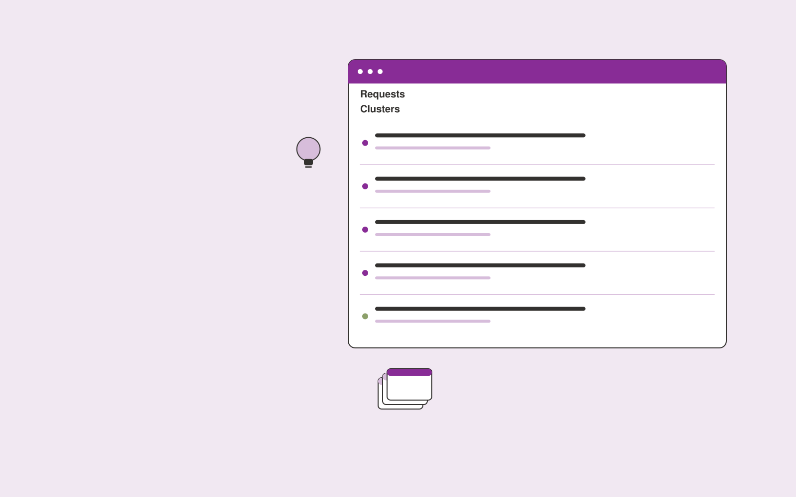

# Feature request organizer

**Product Development** · Also fits: Customer Support; Science and Research; IT and Development

> For product operations teams at B2B software companies, turn support requests, sales notes and existing feature catalog into structured feature request register. Address the recurring problem: duplicate requests obscure underlying customer demand. The value hypothesis is a more complete, reviewable deliverable with less repeated preparation; the pilot must establish whether that benefit is real.

| | |
|---|---|
| **Buyer** | Product operations teams at B2B software companies |
| **Problem** | Duplicate requests obscure underlying customer demand. |
| **Format** | Searchable structured library and data stewardship console |
| **USP** | Separates duplicate requests, existing features and unresolved customer problems. |

## The product
Key screens: Request inbox, feature clusters, account links. Use a searchable table or visual gallery with filters for the domain’s important attributes. Open each item into a detail drawer containing source records, ownership and history. Put proposed merges and field changes in a separate review queue. Provide a preview before any bulk export. In this product, the first view is request inbox, followed by feature clusters and account links.

## Core functionality
1. Normalize request wording.
2. Merge reviewed duplicates.
3. Identify existing functionality.
4. Retain account links.
5. Flag unclear needs.
6. Export product review queues.

## Customer workflow
Import a limited collection, define canonical fields, suggest tags or mappings, review uncertain records, publish approved items, search and reuse them, and request periodic owner updates. Start with support requests, sales notes and existing feature catalog and finish with structured feature request register.

## AI and human review
Suggest classifications, semantic tags, duplicate candidates and field mappings. Preserve original values. Use explicit validation for identifiers and units. Human stewards approve ambiguous merges and factual changes.

## Customer inputs
Support requests, sales notes and existing feature catalog

## Customer deliverables
Structured feature request register

## Accounts and administration
Record ownership, access permissions, change proposals, original-value retention, version history, review dates, bulk import/export and duplicate resolution.

## MVP scope
Begin with product operations teams at B2B software companies and one recurring use case. Build the first two modules: normalize request wording; merge reviewed duplicates. Provide operator assistance for the third module: identify existing functionality. Deliver structured feature request register through a manual review queue. Perform other necessary full-scope functions manually during the pilot. Include all applicable access, accuracy and professional-review controls from the start.

## After MVP validation
After paid pilots establish value, automate the remaining modules: retain account links; flag unclear needs; export product review queues. Add one validated source integration, reusable customer configuration and recurring delivery. Expand to additional teams, document formats or languages only after testing the new scope.

## Build dependencies
Stable identifiers, an agreed data schema, reversible imports, mapping review and source ownership. Data quality work can exceed model development effort.

## Integrations and data access
Product feedback, authorized interviews, usage exports and requirement records. Source systems, catalog exports and cloud file storage. Start with reversible CSV or file imports and validate identifiers before any direct writes. These are candidate integration categories, not verified supported connectors.

## Defensibility
A useful niche taxonomy, customer-approved mappings and accumulated correction history that improve retrieval and reduce repeated cleanup. For this idea, build around separates duplicate requests, existing features and unresolved customer problems. This advantage requires execution and accumulated customer trust; the base model alone is not a defensible asset.

## Alternatives and positioning
Spreadsheets, shared folders, existing asset or information management systems and manual data cleanup. Differentiate on this specific proposed advantage: separates duplicate requests, existing features and unresolved customer problems. Test it against the buyer's current method on the same task. Competitor coverage and uniqueness have not been established.

## Revenue model and test pricing (USD)
Test USD 500-2,500 for one collection cleanup and launch, followed by USD 100-500 monthly for maintenance within agreed record limits. Larger migrations and complex rights management are separately scoped. Prices are hypotheses.

## Main delivery costs
Import cleanup, extraction, storage, indexing, steward review, duplicate investigation and recurring source updates.

## Marketing message to test
> Feature request organizer for product operations teams at B2B software companies. Separates duplicate requests, existing features and unresolved customer problems. Demonstrate the claim through a deduplicated feature request sample.

## Acquisition channels
Customer success operations partners

## Lead magnet
A deduplicated feature request sample

## First 30 days of marketing
- Week 1: interview five prospective buyers in this segment: product operations teams at B2B software companies. Ask to see a recent example of the problem and their current process.
- Week 2: prepare this demonstration using authorized or synthetic material: a deduplicated feature request sample.
- Week 3: present it through customer success operations partners and seek one narrowly scoped paid pilot.
- Week 4: review merge accuracy, review queue usefulness, total delivery effort and a concrete renewal decision before increasing scope.

## Paid pilot and validation
Clean and organize one representative collection. Have users perform real search or mapping tasks. Check every proposed merge in the sample and compare search success with the existing system. For this idea, use support requests, sales notes and existing feature catalog and evaluate structured feature request register. Agree success thresholds with the buyer before starting; collect a baseline for merge accuracy, review queue usefulness. A positive signal is payment and repeat use with acceptable quality and delivery cost, not a favorable demo reaction alone.

## Success metrics
Merge accuracy, review queue usefulness

## Retention and expansion
Provide owner reminders and periodic cleanup. Add another collection only after record quality and retrieval are stable in the initial one.

## Operating controls and limitations
Use consented research and preserve contradictory evidence. Separate observed user behavior, proposed explanations and untested product assumptions. Validate source access and reviewer availability during the pilot. Maintain customer-level access, data deletion controls and a record of final approvals.

## Brand style (concept)

- Colors: `#91278d` primary · `#54c96a` accent · `#f1e4f0` surface · `#22201e` ink
- Type: Archivo for headings, Lora for text
- Voice: Curious, rigorous, user-led
- Demo site: [https://nexibeo.com/ideas/feature-request-organizer/demo/](https://nexibeo.com/ideas/feature-request-organizer/demo/)

## Investment indication

Indicative build budget, from MVP to full product. This is a planning range, not a quote; it excludes running costs such as model usage, hosting and reviewer hours.

| Phase | Scope | Timeline | Indicative budget |
|---|---|---|---|
| MVP | One buyer segment, one recurring use case; first modules: normalize request wording; merge reviewed duplicates. Manual review in the loop. | 3 weeks | $6,000 |
| Paid pilot | Accounts, roles, review states, audit trail and the first integration, hardened for two to three paying pilot customers. | 4 weeks | $5,500 |
| Full product | Remaining modules: retain account links; flag unclear needs; export product review queues. Self-serve onboarding, billing, monitoring and the wider integration set. | 7 weeks | $7,500 |
| **Total** | | 14 weeks | **$19,000** |

### Running costs per month (rough indication, untested)

| Stage | Hosting and infrastructure | AI usage | Total per month |
|---|---|---|---|
| MVP and paid pilot (about 3 customers) | $30–$60 | $50–$100 | **$80–$160** |
| Full product (about 50 customers) | $110–$210 | $350–$700 | **$460–$910** |

**Co-create this project with us:** [contact Nexibeo](https://nexibeo.com/ideas/feature-request-organizer/#apply) and we build it with you.

## Research status
Concept proposal expanded from the 315-idea conversation. Demand, pricing, differentiation, build scope and integration feasibility are hypotheses, not verified market findings. Category link is inspiration rather than evidence of business viability.

## Credits and next steps

- **Estimation and building this idea:** see the full idea page on [nexibeo.com](https://nexibeo.com/ideas/feature-request-organizer/) for more detail on estimation, and to co-create and build this idea with Nexibeo.
- **Become an AI-optimized specialist for Product Development:** [Complete AI Training](https://completeaitraining.com/tag/product-development/?contentType=ai-certification).
- Field news: [AI news for Product Development](https://completeaitraining.com/all-ai-news-for-product-development/).
