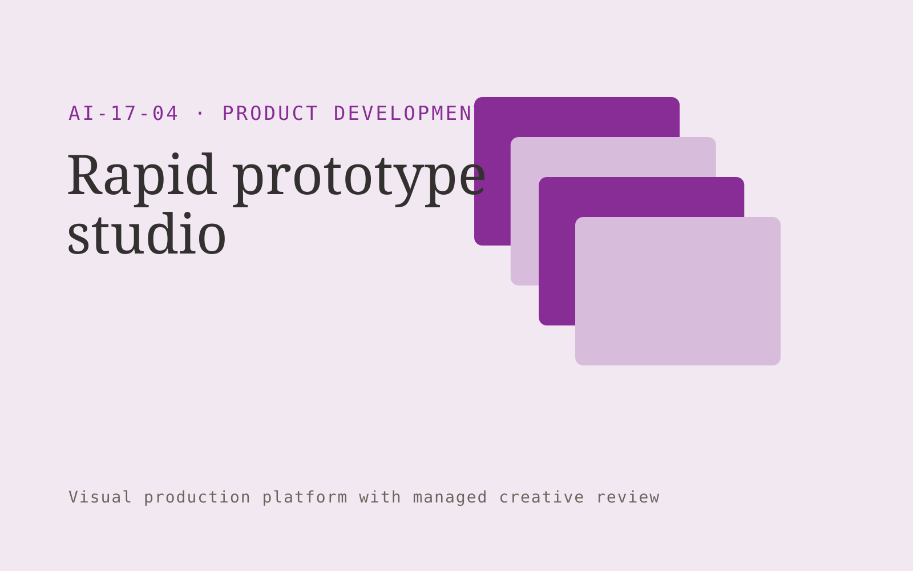

# Rapid prototype studio

**AI-17-04 · Product Development** · Also fits: Customer Support; Science and Research; Creatives

> For founders validating specialist software concepts, turn approved product brief and target user tasks into interactive prototype and testing notes. Address the recurring problem: product ideas remain abstract before customer testing. The value hypothesis is a more complete, reviewable deliverable with less repeated preparation; the pilot must establish whether that benefit is real.

| | |
|---|---|
| **Buyer** | Founders validating specialist software concepts |
| **Problem** | Product ideas remain abstract before customer testing. |
| **Format** | Visual production platform with managed creative review |
| **USP** | Prototypes center on a testable customer task and realistic content. |

## The product
Key screens: Flow map, interactive canvas, feedback board. Use a thumbnail gallery for projects, a large central editing canvas, and a right-hand panel for references, constraints and comments. Let users compare versions side by side. Display draft, changes requested and approved states. Provide a client preview link with comments anchored to the relevant asset. In this product, the first view is flow map, followed by interactive canvas and feedback board.

## Core functionality
1. Map core journeys.
2. Generate screen alternatives.
3. Assemble clickable flows.
4. Add realistic sample data.
5. Capture tester feedback.
6. Export design handoffs.

## Customer workflow
Create a brief, upload reference material, choose constraints, review a small set of directions, refine the selected direction, request client approval, and export a versioned delivery pack. Start with approved product brief and target user tasks and finish with interactive prototype and testing notes.

## AI and human review
Use language models to interpret briefs and visual models where appropriate to generate or adapt assets. Keep factual attributes in structured fields. Validate dimensions and export formats through deterministic checks. A creative reviewer confirms visual quality and fidelity before delivery.

## Customer inputs
Approved product brief and target user tasks

## Customer deliverables
Interactive prototype and testing notes

## Accounts and administration
Project ownership, asset versions, client comments, approval states, usage allowances, revision limits, download history and a rights record for supplied material.

## MVP scope
Begin with founders validating specialist software concepts and one recurring use case. Build the first two modules: map core journeys; generate screen alternatives. Provide operator assistance for the third module: assemble clickable flows. Deliver interactive prototype and testing notes through a manual review queue. Perform other necessary full-scope functions manually during the pilot. Include all applicable access, accuracy and professional-review controls from the start.

## After MVP validation
After paid pilots establish value, automate the remaining modules: add realistic sample data; capture tester feedback; export design handoffs. Add one validated source integration, reusable customer configuration and recurring delivery. Expand to additional teams, document formats or languages only after testing the new scope.

## Build dependencies
Asset upload and preview, asynchronous generation jobs, editable version history, reviewer access and tested export formats. High-fidelity production requires specialist creative QA.

## Integrations and data access
Product feedback, authorized interviews, usage exports and requirement records. Cloud asset storage, design-file import/export and publishing destinations. Start with file exchange and validate destination specifications before promising direct publishing. These are candidate integration categories, not verified supported connectors.

## Defensibility
A reusable library of approved styles, production constraints and review examples, together with reliable delivery for a narrow creative niche. For this idea, build around prototypes center on a testable customer task and realistic content. This advantage requires execution and accumulated customer trust; the base model alone is not a defensible asset.

## Alternatives and positioning
Freelancers, creative agencies, generic generation tools and existing design applications. Differentiate on this specific proposed advantage: prototypes center on a testable customer task and realistic content. Test it against the buyer's current method on the same task. Competitor coverage and uniqueness have not been established.

## Revenue model and test pricing (USD)
Test a USD 300-1,500 fixed pilot for one defined asset package. Offer a monthly production allowance after repeat demand. Quote complex video, 3D or specialist design separately. These are test prices, not market benchmarks.

## Main delivery costs
Generation attempts, video or image processing, storage, reviewer hours, client revision rounds and licensed source assets.

## Marketing message to test
> Rapid prototype studio for founders validating specialist software concepts. Prototypes center on a testable customer task and realistic content. Demonstrate the claim through a clickable prototype of one critical workflow.

## Acquisition channels
Startup incubators and product consultants

## Lead magnet
A clickable prototype of one critical workflow

## First 30 days of marketing
- Week 1: interview five prospective buyers in this segment: founders validating specialist software concepts. Ask to see a recent example of the problem and their current process.
- Week 2: prepare this demonstration using authorized or synthetic material: a clickable prototype of one critical workflow.
- Week 3: present it through startup incubators and product consultants and seek one narrowly scoped paid pilot.
- Week 4: review task completion in tests, validated assumptions, total delivery effort and a concrete renewal decision before increasing scope.

## Paid pilot and validation
Deliver one real creative brief with a capped asset count and revision allowance. Compare usable deliverables, reviewer time and client acceptance with the existing production method. For this idea, use approved product brief and target user tasks and evaluate interactive prototype and testing notes. Agree success thresholds with the buyer before starting; collect a baseline for task completion in tests, validated assumptions. A positive signal is payment and repeat use with acceptable quality and delivery cost, not a favorable demo reaction alone.

## Success metrics
Task completion in tests, validated assumptions

## Retention and expansion
Save approved styles and constraints, offer repeat production batches, and expand only into adjacent asset formats the same buyer already commissions.

## Operating controls and limitations
Use consented research and preserve contradictory evidence. Separate observed user behavior, proposed explanations and untested product assumptions. Validate source access and reviewer availability during the pilot. Maintain customer-level access, data deletion controls and a record of final approvals.

## Brand style (concept)

- Colors: `#7a2791` primary · `#54c95a` accent · `#eee4f1` surface · `#22201e` ink
- Type: Archivo for headings, Lora for text
- Voice: Curious, rigorous, user-led
- Demo site: [https://nexibeo.com/ideas/rapid-prototype-studio/demo/](https://nexibeo.com/ideas/rapid-prototype-studio/demo/)

## Investment indication

Indicative build budget, from MVP to full product. This is a planning range, not a quote; it excludes running costs such as model usage, hosting and reviewer hours.

| Phase | Scope | Timeline | Indicative budget |
|---|---|---|---|
| MVP | One buyer segment, one recurring use case; first modules: map core journeys; generate screen alternatives. Manual review in the loop. | 6 weeks | $11,000 |
| Paid pilot | Accounts, roles, review states, audit trail and the first integration, hardened for two to three paying pilot customers. | 7 weeks | $14,500 |
| Full product | Remaining modules: add realistic sample data; capture tester feedback; export design handoffs. Self-serve onboarding, billing, monitoring and the wider integration set. | 13 weeks | $19,500 |
| **Total** | | 26 weeks | **$45,000** |

**Co-create this project with us:** [contact Nexibeo](https://nexibeo.com/ideas/rapid-prototype-studio/#apply) and we build it with you.

## Research status
Concept proposal expanded from the 315-idea conversation. Demand, pricing, differentiation, build scope and integration feasibility are hypotheses, not verified market findings. Category link is inspiration rather than evidence of business viability.

## Credits and next steps

- **Estimation and building this idea:** see the full idea page on [nexibeo.com](https://nexibeo.com/ideas/rapid-prototype-studio/) for more detail on estimation, and to co-create and build this idea with Nexibeo.
- **Become an AI-optimized specialist for Product Development:** [Complete AI Training](https://completeaitraining.com/tag/product-development/?contentType=ai-certification).
- Field news: [AI news for Product Development](https://completeaitraining.com/all-ai-news-for-product-development/).
