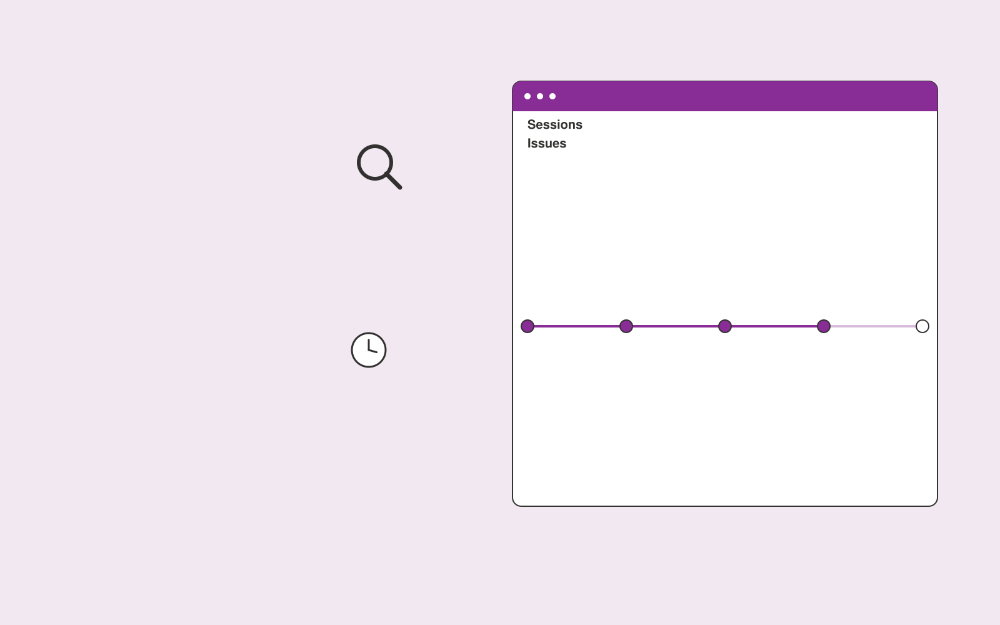

# Usability research assistant

**Product Development** · Also fits: Customer Support; Science and Research

> For design teams running frequent user tests, turn consented test recordings and task definitions into evidence-linked usability findings. Address the recurring problem: session evidence is difficult to turn into actionable findings. The value hypothesis is a more complete, reviewable deliverable with less repeated preparation; the pilot must establish whether that benefit is real.

| | |
|---|---|
| **Buyer** | Design teams running frequent user tests |
| **Problem** | Session evidence is difficult to turn into actionable findings. |
| **Format** | Research evidence workspace with reviewed deliverables |
| **USP** | Observed behavior and source clips remain attached to every usability finding. |

## The product
Key screens: Session timeline, issue evidence, findings board. Organize work by research question. Show a source library, an evidence matrix and a draft findings panel with linked quotations. Keep contradictory findings and unanswered questions visible. Allow reviewers to inspect the original context before accepting an interpretation. In this product, the first view is session timeline, followed by issue evidence and findings board.

## Core functionality
1. Tag observed struggles.
2. Link clips to tasks.
3. Separate observation from inference.
4. Group issues.
5. Capture researcher judgments.
6. Export findings.

## Customer workflow
Agree the decision and research questions, define permitted sources or participants, collect evidence, code findings, compare supporting and contradictory material, review interpretations, and deliver a cited brief with next questions. Start with consented test recordings and task definitions and finish with evidence-linked usability findings.

## AI and human review
Assist with retrieval, transcription, structured extraction and thematic synthesis. Preserve source passages and methodological context. Human researchers validate inclusion, quotations and conclusions. Use real participants when customer research is required.

## Customer inputs
Consented test recordings and task definitions

## Customer deliverables
Evidence-linked usability findings

## Accounts and administration
Source provenance, participant consent where applicable, research questions, coding definitions, reviewer disagreements, citations and versioned conclusions.

## MVP scope
Begin with design teams running frequent user tests and one recurring use case. Build the first two modules: tag observed struggles; link clips to tasks. Provide operator assistance for the third module: separate observation from inference. Deliver evidence-linked usability findings through a manual review queue. Perform other necessary full-scope functions manually during the pilot. Include all applicable access, accuracy and professional-review controls from the start.

## After MVP validation
After paid pilots establish value, automate the remaining modules: group issues; capture researcher judgments; export findings. Add one validated source integration, reusable customer configuration and recurring delivery. Expand to additional teams, document formats or languages only after testing the new scope.

## Build dependencies
A clear research protocol, source access, citation tracking and qualified interpretation. Interview work also needs relevant participants and consent management.

## Integrations and data access
Product feedback, authorized interviews, usage exports and requirement records. Permitted research libraries, interview recording imports, citation exports and document editors. Preserve original source metadata throughout the workflow. These are candidate integration categories, not verified supported connectors.

## Defensibility
Niche research protocols, credible researcher relationships and a rights-cleared evidence archive with consistent interpretation methods. For this idea, build around observed behavior and source clips remain attached to every usability finding. This advantage requires execution and accumulated customer trust; the base model alone is not a defensible asset.

## Alternatives and positioning
Research consultants, internal analysts, literature databases and general search or summarization tools. Differentiate on this specific proposed advantage: observed behavior and source clips remain attached to every usability finding. Test it against the buyer's current method on the same task. Competitor coverage and uniqueness have not been established.

## Revenue model and test pricing (USD)
Test USD 750-3,000 for one tightly bounded research question and evidence pack. Participant recruitment, specialist review and licensed data are separately scoped. Repeat tracking can become a retainer. Prices are hypotheses.

## Main delivery costs
Researcher time, source access, participant recruitment, transcription, evidence coding, expert review and report revisions.

## Marketing message to test
> Usability research assistant for design teams running frequent user tests. Observed behavior and source clips remain attached to every usability finding. Demonstrate the claim through an annotated task-based usability report.

## Acquisition channels
User research agencies

## Lead magnet
An annotated task-based usability report

## First 30 days of marketing
- Week 1: interview five prospective buyers in this segment: design teams running frequent user tests. Ask to see a recent example of the problem and their current process.
- Week 2: prepare this demonstration using authorized or synthetic material: an annotated task-based usability report.
- Week 3: present it through user research agencies and seek one narrowly scoped paid pilot.
- Week 4: review reviewer agreement, issues reproduced, total delivery effort and a concrete renewal decision before increasing scope.

## Paid pilot and validation
Answer one practical question using a bounded evidence set. Ask a domain expert to review citations and reasoning, identify contrary evidence and assess whether the deliverable supports the intended decision. For this idea, use consented test recordings and task definitions and evaluate evidence-linked usability findings. Agree success thresholds with the buyer before starting; collect a baseline for reviewer agreement, issues reproduced. A positive signal is payment and repeat use with acceptable quality and delivery cost, not a favorable demo reaction alone.

## Success metrics
Reviewer agreement, issues reproduced

## Retention and expansion
Maintain the research question and evidence archive, offer follow-up studies and refresh important sources. Build repeat work around the buyer’s decision cycle.

## Operating controls and limitations
Use consented research and preserve contradictory evidence. Separate observed user behavior, proposed explanations and untested product assumptions. Validate source access and reviewer availability during the pilot. Maintain customer-level access, data deletion controls and a record of final approvals.

## Brand style (concept)

- Colors: `#8a2791` primary · `#7dc954` accent · `#f0e4f1` surface · `#22201e` ink
- Type: Archivo for headings, Lora for text
- Voice: Curious, rigorous, user-led
- Demo site: [https://nexibeo.com/ideas/usability-research-assistant/demo/](https://nexibeo.com/ideas/usability-research-assistant/demo/)

## Investment indication

Indicative build budget, from MVP to full product. This is a planning range, not a quote; it excludes running costs such as model usage, hosting and reviewer hours. Built with Nexibeo's AI software development factory, most implementations take days to a few weeks of creation time, depending on availability.

| Phase | Scope | Creation time | Indicative budget |
|---|---|---|---|
| MVP | One buyer segment, one recurring use case; first modules: tag observed struggles; link clips to tasks. Manual review in the loop. | 3 days | $6,500 |
| Paid pilot | Accounts, roles, review states, audit trail and the first integration, hardened for two to three paying pilot customers. | 4 days | $6,500 |
| Full product | Remaining modules: group issues; capture researcher judgments; export findings. Self-serve onboarding, billing, monitoring and the wider integration set. | 7 days | $8,500 |
| **Total** | | about 3 weeks | **$21,500** |

### Running costs per month (rough indication, untested)

| Stage | Hosting and infrastructure | AI usage | Total per month |
|---|---|---|---|
| MVP and paid pilot (about 3 customers) | $30–$60 | $80–$160 | **$110–$220** |
| Full product (about 50 customers) | $110–$210 | $880–$1,750 | **$990–$1,960** |

**Co-create this project with us:** [contact Nexibeo](https://nexibeo.com/ideas/usability-research-assistant/#apply) and we build it with you.

## Research status
Concept proposal expanded from the 315-idea conversation. Demand, pricing, differentiation, build scope and integration feasibility are hypotheses, not verified market findings. Category link is inspiration rather than evidence of business viability.

## Credits and next steps

- **Estimation and building this idea:** see the full idea page on [nexibeo.com](https://nexibeo.com/ideas/usability-research-assistant/) for more detail on estimation, and to co-create and build this idea with Nexibeo.
- **Become an AI-optimized specialist for Product Development:** [Complete AI Training](https://completeaitraining.com/tag/product-development/?contentType=ai-certification).
- Field news: [AI news for Product Development](https://completeaitraining.com/all-ai-news-for-product-development/).
