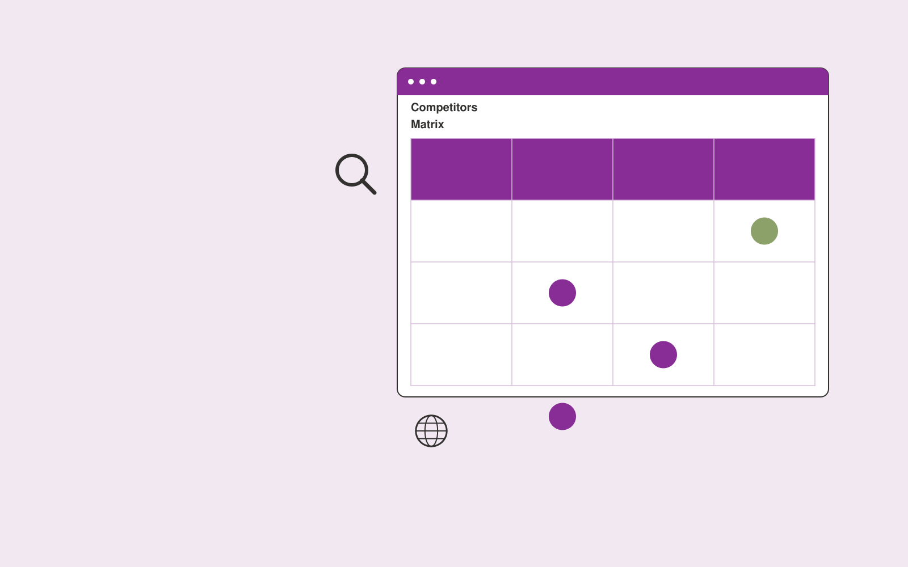

# Competitive product monitor

**Product Development** · Also fits: Customer Support; Science and Research; Executives and Strategy

> For product marketers at specialist software firms, turn permitted public product pages and change announcements into competitive product intelligence digest. Address the recurring problem: competitor changes are scattered across product surfaces. The value hypothesis is a more complete, reviewable deliverable with less repeated preparation; the pilot must establish whether that benefit is real.

| | |
|---|---|
| **Buyer** | Product marketers at specialist software firms |
| **Problem** | Competitor changes are scattered across product surfaces. |
| **Format** | Watchlist, change detection and briefing subscription |
| **USP** | Historical product evidence separated from inferred capabilities. |

## The product
Key screens: Competitor timeline, feature matrix, evidence viewer. Use a watchlist with source health and last-checked dates, a chronological change feed, and a reviewable briefing editor. Display original evidence beside each alert. Let users mute irrelevant topics and record whether a change led to action. In this product, the first view is competitor timeline, followed by feature matrix and evidence viewer.

## Core functionality
1. Capture public changes.
2. Compare feature descriptions.
3. Track onboarding claims.
4. Record packaging shifts.
5. Preserve dated evidence.
6. Produce relevance briefs.

## Customer workflow
Agree a narrow watchlist, confirm lawful source access, collect dated snapshots, detect candidate changes, review relevance and accuracy, deliver a concise digest, and refine the watchlist from buyer feedback. Start with permitted public product pages and change announcements and finish with competitive product intelligence digest.

## AI and human review
Classify source material, group related developments and summarize verified changes. Use deterministic snapshot comparison for factual changes where possible. Distinguish observed publication content from analyst interpretation and uncertain implications.

## Customer inputs
Permitted public product pages and change announcements

## Customer deliverables
Competitive product intelligence digest

## Accounts and administration
Watchlist ownership, source health, dated evidence, deduplication, topic filters, editorial review, delivery preferences and alert feedback.

## MVP scope
Begin with product marketers at specialist software firms and one recurring use case. Build the first two modules: capture public changes; compare feature descriptions. Provide operator assistance for the third module: track onboarding claims. Deliver competitive product intelligence digest through a manual review queue. Perform other necessary full-scope functions manually during the pilot. Include all applicable access, accuracy and professional-review controls from the start.

## After MVP validation
After paid pilots establish value, automate the remaining modules: record packaging shifts; preserve dated evidence; produce relevance briefs. Add one validated source integration, reusable customer configuration and recurring delivery. Expand to additional teams, document formats or languages only after testing the new scope.

## Build dependencies
Reliable permitted source access, change history, publication dates, deduplication and editorial QA. Coverage limits and inaccessible sources must be visible.

## Integrations and data access
Product feedback, authorized interviews, usage exports and requirement records. Permitted feeds, published document sources, email digests and internal briefing channels. Verify collection rights and source reliability before selling coverage commitments. These are candidate integration categories, not verified supported connectors.

## Defensibility
A curated source network, historical change archive and buyer-specific relevance judgments within a narrow topic. For this idea, build around historical product evidence separated from inferred capabilities. This advantage requires execution and accumulated customer trust; the base model alone is not a defensible asset.

## Alternatives and positioning
Newsletters, search alerts, analysts and general media or website monitoring tools. Differentiate on this specific proposed advantage: historical product evidence separated from inferred capabilities. Test it against the buyer's current method on the same task. Competitor coverage and uniqueness have not been established.

## Revenue model and test pricing (USD)
Test USD 100-500 monthly for a narrow shared briefing, or USD 750-2,500 monthly for bespoke analyst coverage. Licensed source access and unusual collection requirements are extra. Prices require validation.

## Main delivery costs
Source licensing, collection reliability, change processing, analyst verification, missed-signal review and digest production.

## Marketing message to test
> Competitive product monitor for product marketers at specialist software firms. Historical product evidence separated from inferred capabilities. Demonstrate the claim through a dated competitive feature-change brief.

## Acquisition channels
Product marketing communities

## Lead magnet
A dated competitive feature-change brief

## First 30 days of marketing
- Week 1: interview five prospective buyers in this segment: product marketers at specialist software firms. Ask to see a recent example of the problem and their current process.
- Week 2: prepare this demonstration using authorized or synthetic material: a dated competitive feature-change brief.
- Week 3: present it through product marketing communities and seek one narrowly scoped paid pilot.
- Week 4: review verified relevant changes, false assumptions, total delivery effort and a concrete renewal decision before increasing scope.

## Paid pilot and validation
Deliver several scheduled digests for a small watchlist. Have the buyer label useful and irrelevant items, independently check important missed developments and assess whether the briefing changes a decision. For this idea, use permitted public product pages and change announcements and evaluate competitive product intelligence digest. Agree success thresholds with the buyer before starting; collect a baseline for verified relevant changes, false assumptions. A positive signal is payment and repeat use with acceptable quality and delivery cost, not a favorable demo reaction alone.

## Success metrics
Verified relevant changes, false assumptions

## Retention and expansion
Tune relevance from buyer feedback, preserve historical changes and offer deeper analyst review for selected topics. Add sources only when they improve useful coverage.

## Operating controls and limitations
Use consented research and preserve contradictory evidence. Separate observed user behavior, proposed explanations and untested product assumptions. Validate source access and reviewer availability during the pilot. Maintain customer-level access, data deletion controls and a record of final approvals.

## Brand style (concept)

- Colors: `#7f2791` primary · `#70c954` accent · `#efe4f1` surface · `#22201e` ink
- Type: Archivo for headings, Lora for text
- Voice: Curious, rigorous, user-led
- Demo site: [https://nexibeo.com/ideas/competitive-product-monitor/demo/](https://nexibeo.com/ideas/competitive-product-monitor/demo/)

## Investment indication

Indicative build budget, from MVP to full product. This is a planning range, not a quote; it excludes running costs such as model usage, hosting and reviewer hours. Built with Nexibeo's AI software development factory, most implementations take days to a few weeks of creation time, depending on availability.

| Phase | Scope | Creation time | Indicative budget |
|---|---|---|---|
| MVP | One buyer segment, one recurring use case; first modules: capture public changes; compare feature descriptions. Manual review in the loop. | 2 days | $5,000 |
| Paid pilot | Accounts, roles, review states, audit trail and the first integration, hardened for two to three paying pilot customers. | 3 days | $4,500 |
| Full product | Remaining modules: record packaging shifts; preserve dated evidence; produce relevance briefs. Self-serve onboarding, billing, monitoring and the wider integration set. | 5 days | $6,000 |
| **Total** | | 10 days | **$15,500** |

### Running costs per month (rough indication, untested)

| Stage | Hosting and infrastructure | AI usage | Total per month |
|---|---|---|---|
| MVP and paid pilot (about 3 customers) | $30–$60 | $50–$100 | **$80–$160** |
| Full product (about 50 customers) | $110–$210 | $350–$700 | **$460–$910** |

**Co-create this project with us:** [contact Nexibeo](https://nexibeo.com/ideas/competitive-product-monitor/#apply) and we build it with you.

## Research status
Concept proposal expanded from the 315-idea conversation. Demand, pricing, differentiation, build scope and integration feasibility are hypotheses, not verified market findings. Category link is inspiration rather than evidence of business viability.

## Credits and next steps

- **Estimation and building this idea:** see the full idea page on [nexibeo.com](https://nexibeo.com/ideas/competitive-product-monitor/) for more detail on estimation, and to co-create and build this idea with Nexibeo.
- **Become an AI-optimized specialist for Product Development:** [Complete AI Training](https://completeaitraining.com/tag/product-development/?contentType=ai-certification).
- Field news: [AI news for Product Development](https://completeaitraining.com/all-ai-news-for-product-development/).
