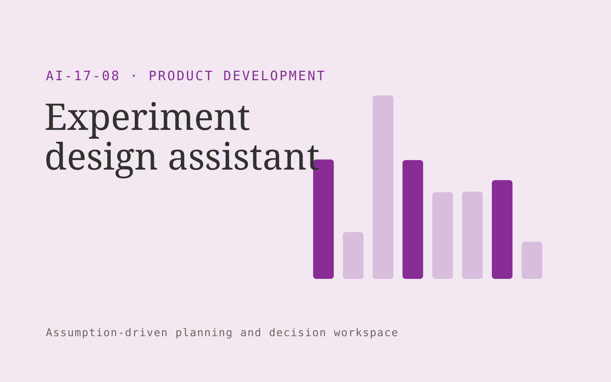

# Experiment design assistant

**Product Development** · Also fits: Customer Support; Science and Research; Finance

> For growth and product teams testing new features, turn business hypothesis, baseline metrics and testing constraints into reviewed experiment design brief. Address the recurring problem: experiments begin without clear success and stopping criteria. The value hypothesis is a more complete, reviewable deliverable with less repeated preparation; the pilot must establish whether that benefit is real.

| | |
|---|---|
| **Buyer** | Growth and product teams testing new features |
| **Problem** | Experiments begin without clear success and stopping criteria. |
| **Format** | Assumption-driven planning and decision workspace |
| **USP** | Pre-registered decision logic with explicit assumptions and measurement limits. |

## The product
Key screens: Hypothesis canvas, measure definitions, decision rules. Place editable drivers and constraints beside a clearly labeled scenario output. Include a baseline view, comparison chart or schedule, and an assumptions history. Let users trace a proposed quantity or date back to its inputs. Keep forecasts distinct from actual results. In this product, the first view is hypothesis canvas, followed by measure definitions and decision rules.

## Core functionality
1. Clarify proposed mechanism.
2. Define primary measures.
3. Specify guardrails.
4. Document assignment approach.
5. Flag measurement gaps.
6. Draft analysis plans.

## Customer workflow
Validate baseline inputs, confirm definitions and constraints, select editable assumptions, calculate feasible alternatives, inspect sensitivities, let the responsible person approve a plan, and compare later actuals with the recorded assumptions. Start with business hypothesis, baseline metrics and testing constraints and finish with reviewed experiment design brief.

## AI and human review
Extract input context and explain scenario differences. Use deterministic calculations or explicit optimization for quantities, compatibility, dates and prices. Show uncertain assumptions. Never let generated prose silently change the calculation rules.

## Customer inputs
Business hypothesis, baseline metrics and testing constraints

## Customer deliverables
Reviewed experiment design brief

## Accounts and administration
Scenario versions, baseline reconciliation, constraint checks, assumption ownership, reviewer approvals, plan exports and actual-versus-plan tracking.

## MVP scope
Begin with growth and product teams testing new features and one recurring use case. Build the first two modules: clarify proposed mechanism; define primary measures. Provide operator assistance for the third module: specify guardrails. Deliver reviewed experiment design brief through a manual review queue. Perform other necessary full-scope functions manually during the pilot. Include all applicable access, accuracy and professional-review controls from the start.

## After MVP validation
After paid pilots establish value, automate the remaining modules: document assignment approach; flag measurement gaps; draft analysis plans. Add one validated source integration, reusable customer configuration and recurring delivery. Expand to additional teams, document formats or languages only after testing the new scope.

## Build dependencies
A defensible calculation model, explicit units, constraint validation and representative boundary tests. Advanced forecasting or optimization needs adequate historical data.

## Integrations and data access
Product feedback, authorized interviews, usage exports and requirement records. Read-only operational exports, calendars and finance or inventory records as relevant. Start with plan exports and retain human approval for execution. These are candidate integration categories, not verified supported connectors.

## Defensibility
A validated domain model, customer-approved constraints and forecast or decision history that improves practical planning. For this idea, build around pre-registered decision logic with explicit assumptions and measurement limits. This advantage requires execution and accumulated customer trust; the base model alone is not a defensible asset.

## Alternatives and positioning
Spreadsheets, planners, specialist forecasting tools and existing scheduling or configuration software. Differentiate on this specific proposed advantage: pre-registered decision logic with explicit assumptions and measurement limits. Test it against the buyer's current method on the same task. Competitor coverage and uniqueness have not been established.

## Revenue model and test pricing (USD)
Test USD 750-3,000 for a scoped planning setup and review, then USD 200-900 monthly for refreshes within agreed complexity. Data integration and optimization are separately scoped. All ranges are hypotheses.

## Main delivery costs
Data preparation, domain modeling, validation, scenario computation, reviewer support and ongoing assumption maintenance.

## Marketing message to test
> Experiment design assistant for growth and product teams testing new features. Pre-registered decision logic with explicit assumptions and measurement limits. Demonstrate the claim through a complete experiment specification for one hypothesis.

## Acquisition channels
Product experimentation consultants

## Lead magnet
A complete experiment specification for one hypothesis

## First 30 days of marketing
- Week 1: interview five prospective buyers in this segment: growth and product teams testing new features. Ask to see a recent example of the problem and their current process.
- Week 2: prepare this demonstration using authorized or synthetic material: a complete experiment specification for one hypothesis.
- Week 3: present it through product experimentation consultants and seek one narrowly scoped paid pilot.
- Week 4: review protocol completeness, interpretable results, total delivery effort and a concrete renewal decision before increasing scope.

## Paid pilot and validation
Reproduce a known historical plan, test missing inputs and boundary constraints, then run a new scenario. Compare feasibility, reconciliation and observed error rather than judging the quality of the explanation alone. For this idea, use business hypothesis, baseline metrics and testing constraints and evaluate reviewed experiment design brief. Agree success thresholds with the buyer before starting; collect a baseline for protocol completeness, interpretable results. A positive signal is payment and repeat use with acceptable quality and delivery cost, not a favorable demo reaction alone.

## Success metrics
Protocol completeness, interpretable results

## Retention and expansion
Refresh inputs, compare recorded assumptions with actual outcomes and refine validated constraints. Expand scenario complexity only when the buyer uses it for a decision.

## Operating controls and limitations
Use consented research and preserve contradictory evidence. Separate observed user behavior, proposed explanations and untested product assumptions. Validate source access and reviewer availability during the pilot. Maintain customer-level access, data deletion controls and a record of final approvals.

## Brand style (concept)

- Colors: `#8d2791` primary · `#54c956` accent · `#f0e4f1` surface · `#22201e` ink
- Type: Archivo for headings, Lora for text
- Voice: Curious, rigorous, user-led
- Demo site: [https://nexibeo.com/ideas/experiment-design-assistant/demo/](https://nexibeo.com/ideas/experiment-design-assistant/demo/)

## Investment indication

Indicative build budget, from MVP to full product. This is a planning range, not a quote; it excludes running costs such as model usage, hosting and reviewer hours.

| Phase | Scope | Timeline | Indicative budget |
|---|---|---|---|
| MVP | One buyer segment, one recurring use case; first modules: clarify proposed mechanism; define primary measures. Manual review in the loop. | 3 weeks | $6,000 |
| Paid pilot | Accounts, roles, review states, audit trail and the first integration, hardened for two to three paying pilot customers. | 4 weeks | $5,500 |
| Full product | Remaining modules: document assignment approach; flag measurement gaps; draft analysis plans. Self-serve onboarding, billing, monitoring and the wider integration set. | 7 weeks | $7,500 |
| **Total** | | 14 weeks | **$19,000** |

### Running costs per month (rough indication, untested)

| Stage | Hosting and infrastructure | AI usage | Total per month |
|---|---|---|---|
| MVP and paid pilot (about 3 customers) | $30–$60 | $50–$100 | **$80–$160** |
| Full product (about 50 customers) | $110–$210 | $350–$700 | **$460–$910** |

**Co-create this project with us:** [contact Nexibeo](https://nexibeo.com/ideas/experiment-design-assistant/#apply) and we build it with you.

## Research status
Concept proposal expanded from the 315-idea conversation. Demand, pricing, differentiation, build scope and integration feasibility are hypotheses, not verified market findings. Category link is inspiration rather than evidence of business viability.

## Credits and next steps

- **Estimation and building this idea:** see the full idea page on [nexibeo.com](https://nexibeo.com/ideas/experiment-design-assistant/) for more detail on estimation, and to co-create and build this idea with Nexibeo.
- **Become an AI-optimized specialist for Product Development:** [Complete AI Training](https://completeaitraining.com/tag/product-development/?contentType=ai-certification).
- Field news: [AI news for Product Development](https://completeaitraining.com/all-ai-news-for-product-development/).
