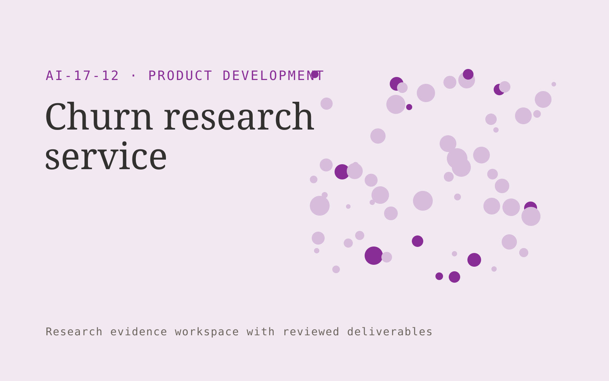

# Churn research service

**AI-17-12 · Product Development** · Also fits: Customer Support; Science and Research

> For customer success leaders at B2B subscription firms, turn authorized exit interviews and account history into churn evidence report and research backlog. Address the recurring problem: exit reasons are too shallow to inform product decisions. The value hypothesis is a more complete, reviewable deliverable with less repeated preparation; the pilot must establish whether that benefit is real.

| | |
|---|---|
| **Buyer** | Customer success leaders at B2B subscription firms |
| **Problem** | Exit reasons are too shallow to inform product decisions. |
| **Format** | Research evidence workspace with reviewed deliverables |
| **USP** | Combines customer explanations with account chronology without assuming causation. |

## The product
Key screens: Exit study, evidence themes, product questions. Organize work by research question. Show a source library, an evidence matrix and a draft findings panel with linked quotations. Keep contradictory findings and unanswered questions visible. Allow reviewers to inspect the original context before accepting an interpretation. In this product, the first view is exit study, followed by evidence themes and product questions.

## Core functionality
1. Plan exit interviews.
2. Preserve customer context.
3. Compare stated reasons.
4. Examine timeline evidence.
5. Flag alternative explanations.
6. Propose product questions.

## Customer workflow
Agree the decision and research questions, define permitted sources or participants, collect evidence, code findings, compare supporting and contradictory material, review interpretations, and deliver a cited brief with next questions. Start with authorized exit interviews and account history and finish with churn evidence report and research backlog.

## AI and human review
Assist with retrieval, transcription, structured extraction and thematic synthesis. Preserve source passages and methodological context. Human researchers validate inclusion, quotations and conclusions. Use real participants when customer research is required.

## Customer inputs
Authorized exit interviews and account history

## Customer deliverables
Churn evidence report and research backlog

## Accounts and administration
Source provenance, participant consent where applicable, research questions, coding definitions, reviewer disagreements, citations and versioned conclusions.

## MVP scope
Begin with customer success leaders at B2B subscription firms and one recurring use case. Build the first two modules: plan exit interviews; preserve customer context. Provide operator assistance for the third module: compare stated reasons. Deliver churn evidence report and research backlog through a manual review queue. Perform other necessary full-scope functions manually during the pilot. Include all applicable access, accuracy and professional-review controls from the start.

## After MVP validation
After paid pilots establish value, automate the remaining modules: examine timeline evidence; flag alternative explanations; propose product questions. Add one validated source integration, reusable customer configuration and recurring delivery. Expand to additional teams, document formats or languages only after testing the new scope.

## Build dependencies
A clear research protocol, source access, citation tracking and qualified interpretation. Interview work also needs relevant participants and consent management.

## Integrations and data access
Product feedback, authorized interviews, usage exports and requirement records. Permitted research libraries, interview recording imports, citation exports and document editors. Preserve original source metadata throughout the workflow. These are candidate integration categories, not verified supported connectors.

## Defensibility
Niche research protocols, credible researcher relationships and a rights-cleared evidence archive with consistent interpretation methods. For this idea, build around combines customer explanations with account chronology without assuming causation. This advantage requires execution and accumulated customer trust; the base model alone is not a defensible asset.

## Alternatives and positioning
Research consultants, internal analysts, literature databases and general search or summarization tools. Differentiate on this specific proposed advantage: combines customer explanations with account chronology without assuming causation. Test it against the buyer's current method on the same task. Competitor coverage and uniqueness have not been established.

## Revenue model and test pricing (USD)
Test USD 750-3,000 for one tightly bounded research question and evidence pack. Participant recruitment, specialist review and licensed data are separately scoped. Repeat tracking can become a retainer. Prices are hypotheses.

## Main delivery costs
Researcher time, source access, participant recruitment, transcription, evidence coding, expert review and report revisions.

## Marketing message to test
> Churn research service for customer success leaders at B2B subscription firms. Combines customer explanations with account chronology without assuming causation. Demonstrate the claim through an anonymized churn research brief.

## Acquisition channels
Customer success consultants

## Lead magnet
An anonymized churn research brief

## First 30 days of marketing
- Week 1: interview five prospective buyers in this segment: customer success leaders at B2B subscription firms. Ask to see a recent example of the problem and their current process.
- Week 2: prepare this demonstration using authorized or synthetic material: an anonymized churn research brief.
- Week 3: present it through customer success consultants and seek one narrowly scoped paid pilot.
- Week 4: review interview insight quality, tested improvements, total delivery effort and a concrete renewal decision before increasing scope.

## Paid pilot and validation
Answer one practical question using a bounded evidence set. Ask a domain expert to review citations and reasoning, identify contrary evidence and assess whether the deliverable supports the intended decision. For this idea, use authorized exit interviews and account history and evaluate churn evidence report and research backlog. Agree success thresholds with the buyer before starting; collect a baseline for interview insight quality, tested improvements. A positive signal is payment and repeat use with acceptable quality and delivery cost, not a favorable demo reaction alone.

## Success metrics
Interview insight quality, tested improvements

## Retention and expansion
Maintain the research question and evidence archive, offer follow-up studies and refresh important sources. Build repeat work around the buyer’s decision cycle.

## Operating controls and limitations
Use consented research and preserve contradictory evidence. Separate observed user behavior, proposed explanations and untested product assumptions. Validate source access and reviewer availability during the pilot. Maintain customer-level access, data deletion controls and a record of final approvals.

## Brand style (concept)

- Colors: `#712791` primary · `#66c954` accent · `#ede4f1` surface · `#22201e` ink
- Type: Fraunces for headings, Inter for text
- Voice: Curious, rigorous, user-led
- Demo site: [https://nexibeo.com/ideas/churn-research-service/demo/](https://nexibeo.com/ideas/churn-research-service/demo/)

## Investment indication

Indicative build budget, from MVP to full product. This is a planning range, not a quote; it excludes running costs such as model usage, hosting and reviewer hours.

| Phase | Scope | Timeline | Indicative budget |
|---|---|---|---|
| MVP | One buyer segment, one recurring use case; first modules: plan exit interviews; preserve customer context. Manual review in the loop. | 4 weeks | $6,500 |
| Paid pilot | Accounts, roles, review states, audit trail and the first integration, hardened for two to three paying pilot customers. | 5 weeks | $6,500 |
| Full product | Remaining modules: examine timeline evidence; flag alternative explanations; propose product questions. Self-serve onboarding, billing, monitoring and the wider integration set. | 8 weeks | $9,500 |
| **Total** | | 17 weeks | **$22,500** |

**Co-create this project with us:** [contact Nexibeo](https://nexibeo.com/ideas/churn-research-service/#apply) and we build it with you.

## Research status
Concept proposal expanded from the 315-idea conversation. Demand, pricing, differentiation, build scope and integration feasibility are hypotheses, not verified market findings. Category link is inspiration rather than evidence of business viability.

## Credits and next steps

- **Estimation and building this idea:** see the full idea page on [nexibeo.com](https://nexibeo.com/ideas/churn-research-service/) for more detail on estimation, and to co-create and build this idea with Nexibeo.
- **Become an AI-optimized specialist for Product Development:** [Complete AI Training](https://completeaitraining.com/tag/product-development/?contentType=ai-certification).
- Field news: [AI news for Product Development](https://completeaitraining.com/all-ai-news-for-product-development/).
