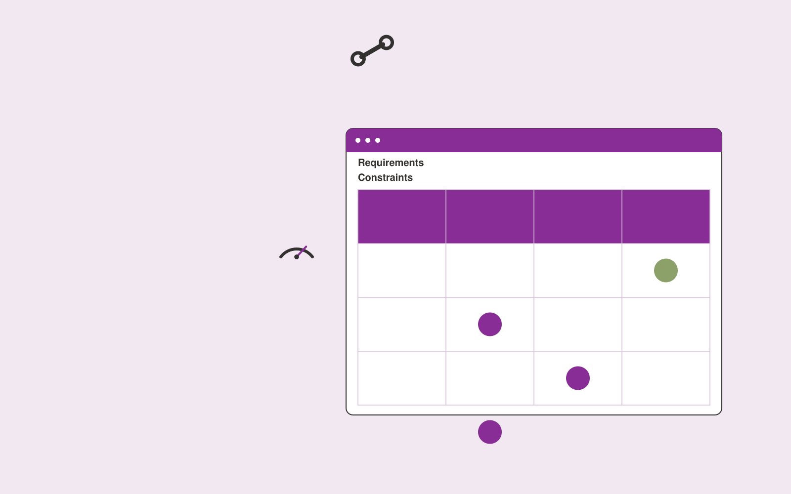

# Hardware requirements organizer

**AI-17-14 · Product Development** · Also fits: Customer Support; Science and Research; Writers

> For small hardware development teams, turn research notes, technical constraints and engineering decisions into reviewed hardware requirements register. Address the recurring problem: customer needs and supplier constraints become disconnected. The value hypothesis is a more complete, reviewable deliverable with less repeated preparation; the pilot must establish whether that benefit is real.

| | |
|---|---|
| **Buyer** | Small hardware development teams |
| **Problem** | Customer needs and supplier constraints become disconnected. |
| **Format** | Source-based content workspace with editorial delivery |
| **USP** | Traceability from customer need through engineering decision and supplier constraint. |

## The product
Key screens: Requirement matrix, constraint links, review history. Use a project list and editorial calendar beside a document editor. Keep original material and supporting passages in a collapsible side panel. Show outline, draft, review and approved stages. Provide tracked edits, comments, version comparisons and an export preview that reflects the final delivery format. In this product, the first view is requirement matrix, followed by constraint links and review history.

## Core functionality
1. Structure customer needs.
2. Attach engineering constraints.
3. Identify conflicts.
4. Record decisions.
5. Track requirement changes.
6. Export engineering briefs.

## Customer workflow
Collect a structured brief and source material, identify unanswered questions, approve an outline, generate a draft, verify claims, gather reviewer edits, approve a final version and export the agreed formats. Start with research notes, technical constraints and engineering decisions and finish with reviewed hardware requirements register.

## AI and human review
Extract and organize information, propose structure, draft prose and adapt approved content to audiences. Attach evidence to factual claims. Keep names, dates, amounts and quoted wording linked to their source. Editors resolve ambiguity and approve publication.

## Customer inputs
Research notes, technical constraints and engineering decisions

## Customer deliverables
Reviewed hardware requirements register

## Accounts and administration
Client workspaces, source permissions, editorial assignments, change history, reviewer comments, approval gates, revision allowances and export templates.

## MVP scope
Begin with small hardware development teams and one recurring use case. Build the first two modules: structure customer needs; attach engineering constraints. Provide operator assistance for the third module: identify conflicts. Deliver reviewed hardware requirements register through a manual review queue. Perform other necessary full-scope functions manually during the pilot. Include all applicable access, accuracy and professional-review controls from the start.

## After MVP validation
After paid pilots establish value, automate the remaining modules: record decisions; track requirement changes; export engineering briefs. Add one validated source integration, reusable customer configuration and recurring delivery. Expand to additional teams, document formats or languages only after testing the new scope.

## Build dependencies
Document parsing, a source-linked editor, tracked revisions, reviewer workflow and reliable document export. Rich presentation or print output needs format-specific QA.

## Integrations and data access
Product feedback, authorized interviews, usage exports and requirement records. Document storage, word processor export, content management systems and approved publishing channels. Pilot with uploads and downloadable drafts before adding write integrations. These are candidate integration categories, not verified supported connectors.

## Defensibility
Customer-approved terminology, reusable structures, source libraries and editorial feedback tied to a specific audience and recurring publishing workflow. For this idea, build around traceability from customer need through engineering decision and supplier constraint. This advantage requires execution and accumulated customer trust; the base model alone is not a defensible asset.

## Alternatives and positioning
Writers, editors, agencies, internal document templates and general-purpose chat tools. Differentiate on this specific proposed advantage: traceability from customer need through engineering decision and supplier constraint. Test it against the buyer's current method on the same task. Competitor coverage and uniqueness have not been established.

## Revenue model and test pricing (USD)
Test USD 400-1,500 for a tightly scoped initial content package. Convert repeated work to a monthly retainer with explicit deliverable and revision limits. Specialist review and substantial research are separately scoped. Prices are hypotheses.

## Main delivery costs
Research and interview time, transcription, model usage, factual verification, subject-matter review, editing and revisions.

## Marketing message to test
> Hardware requirements organizer for small hardware development teams. Traceability from customer need through engineering decision and supplier constraint. Demonstrate the claim through a requirement-to-constraint mapping exercise.

## Acquisition channels
Hardware accelerators and design consultancies

## Lead magnet
A requirement-to-constraint mapping exercise

## First 30 days of marketing
- Week 1: interview five prospective buyers in this segment: small hardware development teams. Ask to see a recent example of the problem and their current process.
- Week 2: prepare this demonstration using authorized or synthetic material: a requirement-to-constraint mapping exercise.
- Week 3: present it through hardware accelerators and design consultancies and seek one narrowly scoped paid pilot.
- Week 4: review traceability coverage, unresolved conflicts, total delivery effort and a concrete renewal decision before increasing scope.

## Paid pilot and validation
Complete one existing brief using the customer’s actual sources. Record reviewer edits, factual corrections and preparation time. Ask the same buyer to commission a second comparable deliverable. For this idea, use research notes, technical constraints and engineering decisions and evaluate reviewed hardware requirements register. Agree success thresholds with the buyer before starting; collect a baseline for traceability coverage, unresolved conflicts. A positive signal is payment and repeat use with acceptable quality and delivery cost, not a favorable demo reaction alone.

## Success metrics
Traceability coverage, unresolved conflicts

## Retention and expansion
Maintain the approved source and voice library, schedule recurring editorial work, and expand into additional formats only after the core deliverable is repeatedly accepted.

## Operating controls and limitations
Use consented research and preserve contradictory evidence. Separate observed user behavior, proposed explanations and untested product assumptions. Validate source access and reviewer availability during the pilot. Maintain customer-level access, data deletion controls and a record of final approvals.

## Brand style (concept)

- Colors: `#912791` primary · `#77c954` accent · `#f1e4f1` surface · `#22201e` ink
- Type: Fraunces for headings, Inter for text
- Voice: Curious, rigorous, user-led
- Demo site: [https://nexibeo.com/ideas/hardware-requirements-organizer/demo/](https://nexibeo.com/ideas/hardware-requirements-organizer/demo/)

## Investment indication

Indicative build budget, from MVP to full product. This is a planning range, not a quote; it excludes running costs such as model usage, hosting and reviewer hours.

| Phase | Scope | Timeline | Indicative budget |
|---|---|---|---|
| MVP | One buyer segment, one recurring use case; first modules: structure customer needs; attach engineering constraints. Manual review in the loop. | 4 weeks | $6,500 |
| Paid pilot | Accounts, roles, review states, audit trail and the first integration, hardened for two to three paying pilot customers. | 5 weeks | $7,000 |
| Full product | Remaining modules: record decisions; track requirement changes; export engineering briefs. Self-serve onboarding, billing, monitoring and the wider integration set. | 8 weeks | $9,500 |
| **Total** | | 17 weeks | **$23,000** |

**Co-create this project with us:** [contact Nexibeo](https://nexibeo.com/ideas/hardware-requirements-organizer/#apply) and we build it with you.

## Research status
Concept proposal expanded from the 315-idea conversation. Demand, pricing, differentiation, build scope and integration feasibility are hypotheses, not verified market findings. Category link is inspiration rather than evidence of business viability.

## Credits and next steps

- **Estimation and building this idea:** see the full idea page on [nexibeo.com](https://nexibeo.com/ideas/hardware-requirements-organizer/) for more detail on estimation, and to co-create and build this idea with Nexibeo.
- **Become an AI-optimized specialist for Product Development:** [Complete AI Training](https://completeaitraining.com/tag/product-development/?contentType=ai-certification).
- Field news: [AI news for Product Development](https://completeaitraining.com/all-ai-news-for-product-development/).
