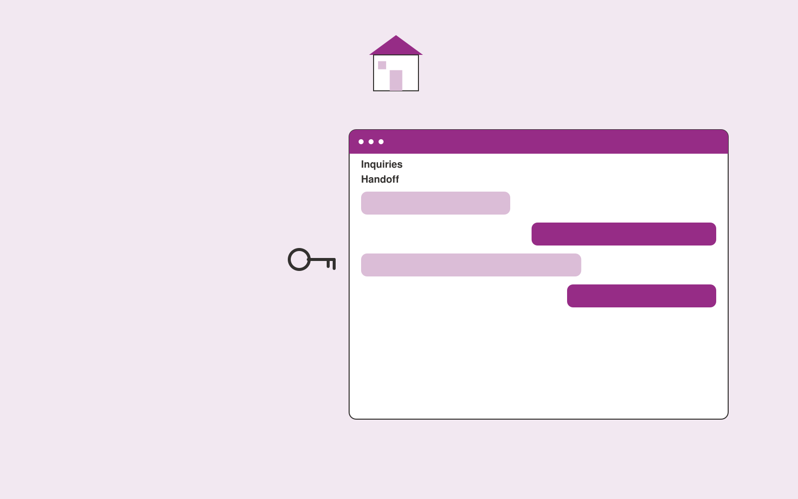

# Real estate inquiry assistant

**Real Estate and Construction** · Also fits: Operations; Sales; IT and Development

> For residential estate agency teams, turn verified listing data and viewing rules into cited listing answers and agent handoffs. Address the recurring problem: agents repeatedly answer basic listing questions. The value hypothesis is a more complete, reviewable deliverable with less repeated preparation; the pilot must establish whether that benefit is real.

| | |
|---|---|
| **Buyer** | Residential estate agency teams |
| **Problem** | Agents repeatedly answer basic listing questions. |
| **Format** | Source-linked assistant and administrator console |
| **USP** | Listing-specific answers without inferring buyer eligibility or neighborhood preferences. |

## The product
Key screens: Inquiry inbox, property context, viewing handoff. Give end users a simple search or conversation surface with short answers and expandable citations. Administrators get source status, unanswered questions and handoff queues. Show the source date beside relevant answers. Keep conversation context available to the staff member receiving an escalation. In this product, the first view is inquiry inbox, followed by property context and viewing handoff.

## Core functionality
1. Identify relevant listing.
2. Answer factual questions.
3. Collect viewing preferences.
4. Flag missing information.
5. Route agent requests.
6. Log inquiry context.

## Customer workflow
Add an approved collection, assign source owners and access rules, test representative questions, let users ask questions, retrieve supporting passages, answer or request clarification, and hand off unresolved cases with their context. Start with verified listing data and viewing rules and finish with cited listing answers and agent handoffs.

## AI and human review
Retrieve permitted passages and generate answers constrained to those sources. Use structured rules for transactional facts. Detect missing context and refuse to invent unsupported details. Store reviewer corrections for evaluation and controlled knowledge updates.

## Customer inputs
Verified listing data and viewing rules

## Customer deliverables
Cited listing answers and agent handoffs

## Accounts and administration
Source ownership, document permissions, freshness checks, conversation history, human handoff, feedback, test questions, usage limits and access logs.

## MVP scope
Begin with residential estate agency teams and one recurring use case. Build the first two modules: identify relevant listing; answer factual questions. Provide operator assistance for the third module: collect viewing preferences. Deliver cited listing answers and agent handoffs through a manual review queue. Perform other necessary full-scope functions manually during the pilot. Include all applicable access, accuracy and professional-review controls from the start.

## After MVP validation
After paid pilots establish value, automate the remaining modules: flag missing information; route agent requests; log inquiry context. Add one validated source integration, reusable customer configuration and recurring delivery. Expand to additional teams, document formats or languages only after testing the new scope.

## Build dependencies
Permission-filtered retrieval, document versioning, a question evaluation set, staff handoff and a source update process. Reliability depends on source quality and scope.

## Integrations and data access
Property records, construction documents, project photos and supplier quotes. Approved knowledge repositories, websites, service desks and staff messaging systems. Validate access inheritance and use read-only ingestion for the initial deployment. These are candidate integration categories, not verified supported connectors.

## Defensibility
A maintained domain knowledge collection, realistic evaluation questions, useful escalation paths and integrations in the customer’s daily work. For this idea, build around listing-specific answers without inferring buyer eligibility or neighborhood preferences. This advantage requires execution and accumulated customer trust; the base model alone is not a defensible asset.

## Alternatives and positioning
Manual search, static FAQs, general chat tools and support or intranet suites. Differentiate on this specific proposed advantage: listing-specific answers without inferring buyer eligibility or neighborhood preferences. Test it against the buyer's current method on the same task. Competitor coverage and uniqueness have not been established.

## Revenue model and test pricing (USD)
Test USD 500-2,000 setup plus USD 150-600 monthly for one defined source collection and usage allowance. Price multi-location deployments and specialist support separately. Validate willingness to pay; these are hypotheses.

## Main delivery costs
Document ingestion, retrieval and generation, source maintenance, support, evaluation and staff time handling unresolved cases.

## Marketing message to test
> Real estate inquiry assistant for residential estate agency teams. Listing-specific answers without inferring buyer eligibility or neighborhood preferences. Demonstrate the claim through a property inquiry-to-agent handoff demo.

## Acquisition channels
Real estate website agencies

## Lead magnet
A property inquiry-to-agent handoff demo

## First 30 days of marketing
- Week 1: interview five prospective buyers in this segment: residential estate agency teams. Ask to see a recent example of the problem and their current process.
- Week 2: prepare this demonstration using authorized or synthetic material: a property inquiry-to-agent handoff demo.
- Week 3: present it through real estate website agencies and seek one narrowly scoped paid pilot.
- Week 4: review correct answers, qualified viewing requests, total delivery effort and a concrete renewal decision before increasing scope.

## Paid pilot and validation
Restrict the assistant to one collection and test answered, ambiguous and unanswerable questions. Run supervised use before wider rollout. Measure correctness, escalation quality and staff effort. For this idea, use verified listing data and viewing rules and evaluate cited listing answers and agent handoffs. Agree success thresholds with the buyer before starting; collect a baseline for correct answers, qualified viewing requests. A positive signal is payment and repeat use with acceptable quality and delivery cost, not a favorable demo reaction alone.

## Success metrics
Correct answers, qualified viewing requests

## Retention and expansion
Review unanswered questions and source freshness monthly. Expand to another source collection or team only after the existing assistant meets its agreed accuracy and handoff criteria.

## Operating controls and limitations
Verify property facts and scope assumptions. Clearly label visual alterations. Professional reviewers retain responsibility for contracts, engineering and legal interpretations. Validate source access and reviewer availability during the pilot. Maintain customer-level access, data deletion controls and a record of final approvals.

## Brand style (concept)

- Colors: `#912773` primary · `#54c96a` accent · `#f1e4ed` surface · `#22201e` ink
- Type: Playfair Display for headings, Source Sans 3 for text
- Voice: Solid, practical, on-schedule
- Demo site: [https://nexibeo.com/ideas/real-estate-inquiry-assistant/demo/](https://nexibeo.com/ideas/real-estate-inquiry-assistant/demo/)

## Investment indication

Indicative build budget, from MVP to full product. This is a planning range, not a quote; it excludes running costs such as model usage, hosting and reviewer hours. Built with Nexibeo's AI software development factory, most implementations take days to a few weeks of creation time, depending on availability.

| Phase | Scope | Creation time | Indicative budget |
|---|---|---|---|
| MVP | One buyer segment, one recurring use case; first modules: identify relevant listing; answer factual questions. Manual review in the loop. | 3 days | $6,000 |
| Paid pilot | Accounts, roles, review states, audit trail and the first integration, hardened for two to three paying pilot customers. | 4 days | $6,500 |
| Full product | Remaining modules: flag missing information; route agent requests; log inquiry context. Self-serve onboarding, billing, monitoring and the wider integration set. | 7 days | $8,500 |
| **Total** | | about 3 weeks | **$21,000** |

### Running costs per month (rough indication, untested)

| Stage | Hosting and infrastructure | AI usage | Total per month |
|---|---|---|---|
| MVP and paid pilot (about 3 customers) | $30–$60 | $60–$120 | **$90–$180** |
| Full product (about 50 customers) | $110–$210 | $530–$1,050 | **$640–$1,260** |

**Co-create this project with us:** [contact Nexibeo](https://nexibeo.com/ideas/real-estate-inquiry-assistant/#apply) and we build it with you.

## Research status
Concept proposal expanded from the 315-idea conversation. Demand, pricing, differentiation, build scope and integration feasibility are hypotheses, not verified market findings. Category link is inspiration rather than evidence of business viability.

## Credits and next steps

- **Estimation and building this idea:** see the full idea page on [nexibeo.com](https://nexibeo.com/ideas/real-estate-inquiry-assistant/) for more detail on estimation, and to co-create and build this idea with Nexibeo.
- **Become an AI-optimized specialist for Real Estate and Construction:** [Complete AI Training](https://completeaitraining.com/certification/12b-ai-certification-for-real-estate-agents/).
- Field news: [AI news for Real Estate and Construction](https://completeaitraining.com/all-ai-news-for-real-estate-and-construction/).
