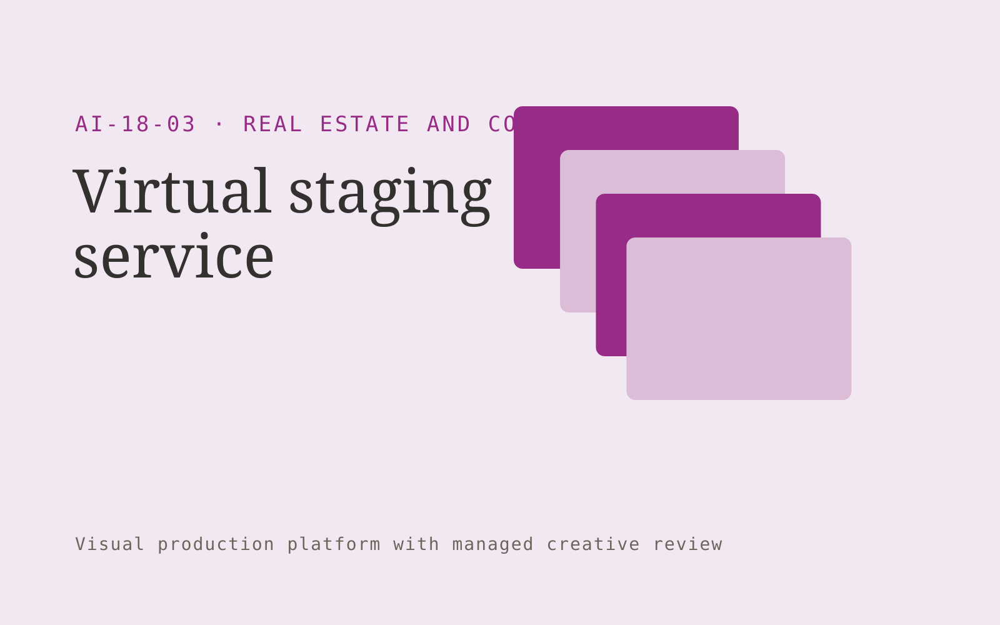

# Virtual staging service

**Real Estate and Construction** · Also fits: Operations; Sales; Creatives

> For estate agents marketing vacant properties, turn original photos, floor plans and styling brief into labeled virtual staging gallery. Address the recurring problem: empty property images lack useful furnishing context. The value hypothesis is a more complete, reviewable deliverable with less repeated preparation; the pilot must establish whether that benefit is real.

| | |
|---|---|
| **Buyer** | Estate agents marketing vacant properties |
| **Problem** | Empty property images lack useful furnishing context. |
| **Format** | Visual production platform with managed creative review |
| **USP** | Clearly disclosed staging with consistent fixed property features. |

## The product
Key screens: Property gallery, staging canvas, disclosure review. Use a thumbnail gallery for projects, a large central editing canvas, and a right-hand panel for references, constraints and comments. Let users compare versions side by side. Display draft, changes requested and approved states. Provide a client preview link with comments anchored to the relevant asset. In this product, the first view is property gallery, followed by staging canvas and disclosure review.

## Core functionality
1. Preserve fixed structures.
2. Stage matching room views.
3. Compare furnishing styles.
4. Check spatial consistency.
5. Label altered images.
6. Deliver original comparisons.

## Customer workflow
Create a brief, upload reference material, choose constraints, review a small set of directions, refine the selected direction, request client approval, and export a versioned delivery pack. Start with original photos, floor plans and styling brief and finish with labeled virtual staging gallery.

## AI and human review
Use language models to interpret briefs and visual models where appropriate to generate or adapt assets. Keep factual attributes in structured fields. Validate dimensions and export formats through deterministic checks. A creative reviewer confirms visual quality and fidelity before delivery.

## Customer inputs
Original photos, floor plans and styling brief

## Customer deliverables
Labeled virtual staging gallery

## Accounts and administration
Project ownership, asset versions, client comments, approval states, usage allowances, revision limits, download history and a rights record for supplied material.

## MVP scope
Begin with estate agents marketing vacant properties and one recurring use case. Build the first two modules: preserve fixed structures; stage matching room views. Provide operator assistance for the third module: compare furnishing styles. Deliver labeled virtual staging gallery through a manual review queue. Perform other necessary full-scope functions manually during the pilot. Include all applicable access, accuracy and professional-review controls from the start.

## After MVP validation
After paid pilots establish value, automate the remaining modules: check spatial consistency; label altered images; deliver original comparisons. Add one validated source integration, reusable customer configuration and recurring delivery. Expand to additional teams, document formats or languages only after testing the new scope.

## Build dependencies
Asset upload and preview, asynchronous generation jobs, editable version history, reviewer access and tested export formats. High-fidelity production requires specialist creative QA.

## Integrations and data access
Property records, construction documents, project photos and supplier quotes. Cloud asset storage, design-file import/export and publishing destinations. Start with file exchange and validate destination specifications before promising direct publishing. These are candidate integration categories, not verified supported connectors.

## Defensibility
A reusable library of approved styles, production constraints and review examples, together with reliable delivery for a narrow creative niche. For this idea, build around clearly disclosed staging with consistent fixed property features. This advantage requires execution and accumulated customer trust; the base model alone is not a defensible asset.

## Alternatives and positioning
Freelancers, creative agencies, generic generation tools and existing design applications. Differentiate on this specific proposed advantage: clearly disclosed staging with consistent fixed property features. Test it against the buyer's current method on the same task. Competitor coverage and uniqueness have not been established.

## Revenue model and test pricing (USD)
Test a USD 300-1,500 fixed pilot for one defined asset package. Offer a monthly production allowance after repeat demand. Quote complex video, 3D or specialist design separately. These are test prices, not market benchmarks.

## Main delivery costs
Generation attempts, video or image processing, storage, reviewer hours, client revision rounds and licensed source assets.

## Marketing message to test
> Virtual staging service for estate agents marketing vacant properties. Clearly disclosed staging with consistent fixed property features. Demonstrate the claim through a disclosed original-and-staged room comparison.

## Acquisition channels
Estate agency marketing partners

## Lead magnet
A disclosed original-and-staged room comparison

## First 30 days of marketing
- Week 1: interview five prospective buyers in this segment: estate agents marketing vacant properties. Ask to see a recent example of the problem and their current process.
- Week 2: prepare this demonstration using authorized or synthetic material: a disclosed original-and-staged room comparison.
- Week 3: present it through estate agency marketing partners and seek one narrowly scoped paid pilot.
- Week 4: review agent approval, revision rounds, total delivery effort and a concrete renewal decision before increasing scope.

## Paid pilot and validation
Deliver one real creative brief with a capped asset count and revision allowance. Compare usable deliverables, reviewer time and client acceptance with the existing production method. For this idea, use original photos, floor plans and styling brief and evaluate labeled virtual staging gallery. Agree success thresholds with the buyer before starting; collect a baseline for agent approval, revision rounds. A positive signal is payment and repeat use with acceptable quality and delivery cost, not a favorable demo reaction alone.

## Success metrics
Agent approval, revision rounds

## Retention and expansion
Save approved styles and constraints, offer repeat production batches, and expand only into adjacent asset formats the same buyer already commissions.

## Operating controls and limitations
Verify property facts and scope assumptions. Clearly label visual alterations. Professional reviewers retain responsibility for contracts, engineering and legal interpretations. Validate source access and reviewer availability during the pilot. Maintain customer-level access, data deletion controls and a record of final approvals.

## Brand style (concept)

- Colors: `#91278d` primary · `#54c95a` accent · `#f1e4f0` surface · `#22201e` ink
- Type: Playfair Display for headings, Source Sans 3 for text
- Voice: Solid, practical, on-schedule
- Demo site: [https://nexibeo.com/solutions/virtual-staging-service/demo/](https://nexibeo.com/solutions/virtual-staging-service/demo/)

## Investment indication

Indicative build budget, from MVP to full product. This is a planning range, not a quote; it excludes running costs such as model usage, hosting and reviewer hours. Built with Nexibeo's AI software development factory, most implementations take days to a few weeks of creation time, depending on availability.

| Phase | Scope | Creation time | Indicative budget |
|---|---|---|---|
| MVP | One buyer segment, one recurring use case; first modules: preserve fixed structures; stage matching room views. Manual review in the loop. | 7 days | $11,500 |
| Paid pilot | Accounts, roles, review states, audit trail and the first integration, hardened for two to three paying pilot customers. | 8 days | $15,000 |
| Full product | Remaining modules: check spatial consistency; label altered images; deliver original comparisons. Self-serve onboarding, billing, monitoring and the wider integration set. | 3 weeks | $20,500 |
| **Total** | | about 6 weeks | **$47,000** |

### Running costs per month (rough indication, untested)

| Stage | Hosting and infrastructure | AI usage | Total per month |
|---|---|---|---|
| MVP and paid pilot (about 3 customers) | $40–$80 | $150–$310 | **$190–$390** |
| Full product (about 50 customers) | $160–$320 | $2,100–$4,200 | **$2,260–$4,520** |

**Get this built:** [contact Nexibeo](https://nexibeo.com/solutions/virtual-staging-service/#apply). We build it with our AI software factory, usually in days to a few weeks, for you to run internally or offer to your clients.

## Research status
Concept proposal expanded from the 315-idea conversation. Demand, pricing, differentiation, build scope and integration feasibility are hypotheses, not verified market findings. Category link is inspiration rather than evidence of business viability.

## Credits and next steps

- **Estimation and having it built:** see the full solution page on [nexibeo.com](https://nexibeo.com/solutions/virtual-staging-service/) for more detail on estimation. Nexibeo builds it for you as a custom AI implementation, to run internally or to offer to your own clients.
- **Become an AI-optimized specialist for Real Estate and Construction:** [Complete AI Training](https://completeaitraining.com/certification/12b-ai-certification-for-real-estate-agents/).
- Field news: [AI news for Real Estate and Construction](https://completeaitraining.com/all-ai-news-for-real-estate-and-construction/).
