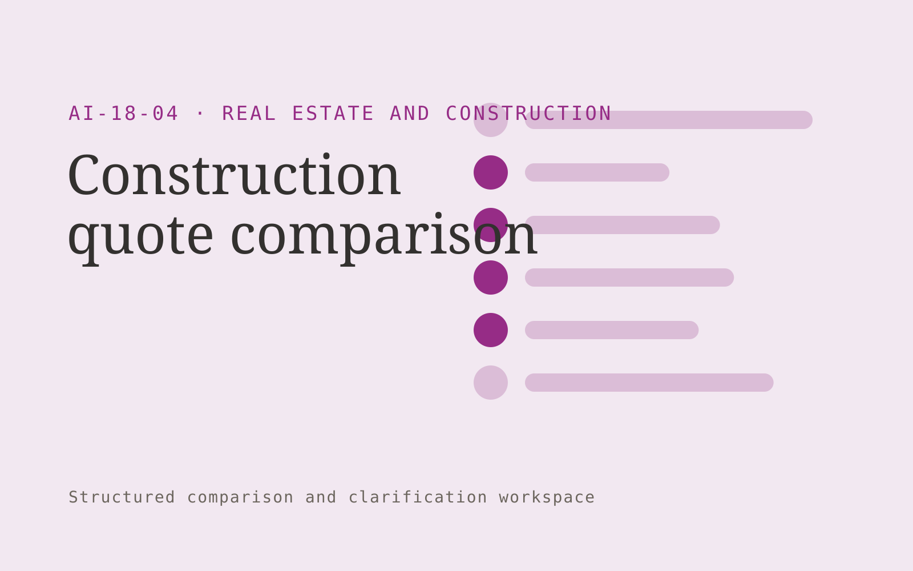

# Construction quote comparison

**Real Estate and Construction** · Also fits: Operations; Sales

> For small building contractors and project managers, turn supplier quotes, scope schedule and project requirements into construction quote comparison pack. Address the recurring problem: quotes omit different scope items and are difficult to compare. The value hypothesis is a more complete, reviewable deliverable with less repeated preparation; the pilot must establish whether that benefit is real.

| | |
|---|---|
| **Buyer** | Small building contractors and project managers |
| **Problem** | Quotes omit different scope items and are difficult to compare. |
| **Format** | Structured comparison and clarification workspace |
| **USP** | Trade-specific scope comparison exposes unanswered pricing assumptions. |

## The product
Key screens: Trade comparison, exclusions, clarification queue. Use a side-by-side matrix with the same fields for every document or option. Clicking a value reveals its original passage. Highlight missing, different and uncertain items separately. Provide a clarification queue and reviewer annotations before exporting a decision pack. In this product, the first view is trade comparison, followed by exclusions and clarification queue.

## Core functionality
1. Normalize scope items.
2. Compare quantities.
3. Highlight exclusions.
4. Separate provisional sums.
5. Flag delivery differences.
6. Draft clarification questions.

## Customer workflow
Define comparison fields, upload source versions or offers, extract candidate values, normalize only agreed units, inspect differences, resolve questions with reviewers, and export an evidence-linked comparison. Start with supplier quotes, scope schedule and project requirements and finish with construction quote comparison pack.

## AI and human review
Align document sections and extract proposed comparable fields. Deterministic checks handle units and arithmetic. Preserve original wording and label assumptions. Professional reviewers assess the meaning and significance of differences.

## Customer inputs
Supplier quotes, scope schedule and project requirements

## Customer deliverables
Construction quote comparison pack

## Accounts and administration
Document versions, field definitions, source references, reviewer corrections, unresolved questions, comparison history and exportable matrices.

## MVP scope
Begin with small building contractors and project managers and one recurring use case. Build the first two modules: normalize scope items; compare quantities. Provide operator assistance for the third module: highlight exclusions. Deliver construction quote comparison pack through a manual review queue. Perform other necessary full-scope functions manually during the pilot. Include all applicable access, accuracy and professional-review controls from the start.

## After MVP validation
After paid pilots establish value, automate the remaining modules: separate provisional sums; flag delivery differences; draft clarification questions. Add one validated source integration, reusable customer configuration and recurring delivery. Expand to additional teams, document formats or languages only after testing the new scope.

## Build dependencies
Document alignment, field provenance, unit normalization, missing-value handling and reviewer correction. Similar-looking documents may contain materially different terms.

## Integrations and data access
Property records, construction documents, project photos and supplier quotes. Document repositories, procurement or contract records and spreadsheet exports. Preserve originals and avoid writing back interpretations without approval. These are candidate integration categories, not verified supported connectors.

## Defensibility
A niche comparison schema, reviewed extraction examples and clear handling of the differences that matter to a specific buyer. For this idea, build around trade-specific scope comparison exposes unanswered pricing assumptions. This advantage requires execution and accumulated customer trust; the base model alone is not a defensible asset.

## Alternatives and positioning
Spreadsheet comparisons, professional reviewers, document diff tools and manual quote or contract review. Differentiate on this specific proposed advantage: trade-specific scope comparison exposes unanswered pricing assumptions. Test it against the buyer's current method on the same task. Competitor coverage and uniqueness have not been established.

## Revenue model and test pricing (USD)
Test USD 300-1,500 for one bounded comparison package, then USD 150-600 monthly for recurring volume with review limits. Complex expert interpretation is separately priced. Figures are hypotheses.

## Main delivery costs
Document parsing, field alignment, source verification, expert interpretation, clarification rounds and changing document formats.

## Marketing message to test
> Construction quote comparison for small building contractors and project managers. Trade-specific scope comparison exposes unanswered pricing assumptions. Demonstrate the claim through a quote comparison revealing scope gaps.

## Acquisition channels
Builders' networks and quantity surveying partners

## Lead magnet
A quote comparison revealing scope gaps

## First 30 days of marketing
- Week 1: interview five prospective buyers in this segment: small building contractors and project managers. Ask to see a recent example of the problem and their current process.
- Week 2: prepare this demonstration using authorized or synthetic material: a quote comparison revealing scope gaps.
- Week 3: present it through builders' networks and quantity surveying partners and seek one narrowly scoped paid pilot.
- Week 4: review confirmed discrepancies, review time, total delivery effort and a concrete renewal decision before increasing scope.

## Paid pilot and validation
Compare a known set already reviewed by a domain expert. Check meaningful differences, false alarms and missing fields. Measure reviewer time including corrections rather than extraction speed alone. For this idea, use supplier quotes, scope schedule and project requirements and evaluate construction quote comparison pack. Agree success thresholds with the buyer before starting; collect a baseline for confirmed discrepancies, review time. A positive signal is payment and repeat use with acceptable quality and delivery cost, not a favorable demo reaction alone.

## Success metrics
Confirmed discrepancies, review time

## Retention and expansion
Save reviewer-approved comparison fields and recurring document formats. Offer repeat comparisons and explicit updates when the source options change.

## Operating controls and limitations
Verify property facts and scope assumptions. Clearly label visual alterations. Professional reviewers retain responsibility for contracts, engineering and legal interpretations. Validate source access and reviewer availability during the pilot. Maintain customer-level access, data deletion controls and a record of final approvals.

## Brand style (concept)

- Colors: `#91277e` primary · `#54c979` accent · `#f1e4ee` surface · `#22201e` ink
- Type: Playfair Display for headings, Source Sans 3 for text
- Voice: Solid, practical, on-schedule
- Demo site: [https://nexibeo.com/ideas/construction-quote-comparison/demo/](https://nexibeo.com/ideas/construction-quote-comparison/demo/)

## Investment indication

Indicative build budget, from MVP to full product. This is a planning range, not a quote; it excludes running costs such as model usage, hosting and reviewer hours.

| Phase | Scope | Timeline | Indicative budget |
|---|---|---|---|
| MVP | One buyer segment, one recurring use case; first modules: normalize scope items; compare quantities. Manual review in the loop. | 4 weeks | $8,000 |
| Paid pilot | Accounts, roles, review states, audit trail and the first integration, hardened for two to three paying pilot customers. | 6 weeks | $9,000 |
| Full product | Remaining modules: separate provisional sums; flag delivery differences; draft clarification questions. Self-serve onboarding, billing, monitoring and the wider integration set. | 9 weeks | $12,500 |
| **Total** | | 19 weeks | **$29,500** |

### Running costs per month (rough indication, untested)

| Stage | Hosting and infrastructure | AI usage | Total per month |
|---|---|---|---|
| MVP and paid pilot (about 3 customers) | $30–$60 | $50–$100 | **$80–$160** |
| Full product (about 50 customers) | $110–$210 | $350–$700 | **$460–$910** |

**Co-create this project with us:** [contact Nexibeo](https://nexibeo.com/ideas/construction-quote-comparison/#apply) and we build it with you.

## Research status
Concept proposal expanded from the 315-idea conversation. Demand, pricing, differentiation, build scope and integration feasibility are hypotheses, not verified market findings. Category link is inspiration rather than evidence of business viability.

## Credits and next steps

- **Estimation and building this idea:** see the full idea page on [nexibeo.com](https://nexibeo.com/ideas/construction-quote-comparison/) for more detail on estimation, and to co-create and build this idea with Nexibeo.
- **Become an AI-optimized specialist for Real Estate and Construction:** [Complete AI Training](https://completeaitraining.com/certification/12b-ai-certification-for-real-estate-agents/).
- Field news: [AI news for Real Estate and Construction](https://completeaitraining.com/all-ai-news-for-real-estate-and-construction/).
