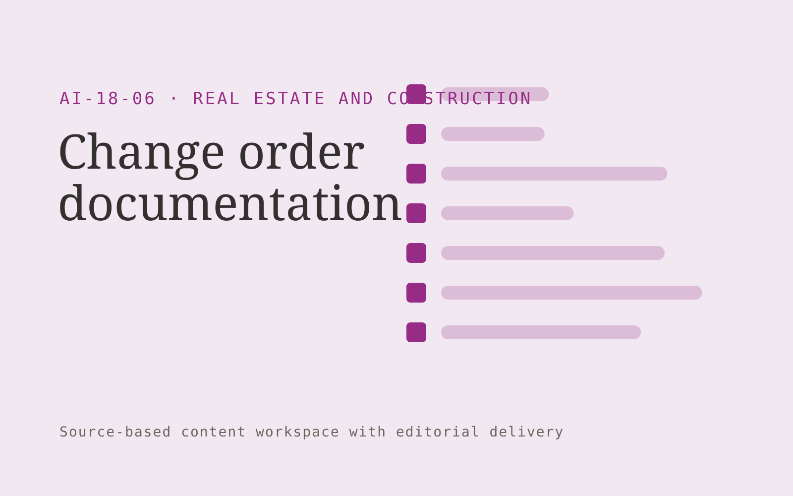

# Change order documentation

**Real Estate and Construction** · Also fits: Operations; Sales; Writers

> For construction project administrators, turn approved site notes, photos and change instructions into reviewed change order record. Address the recurring problem: scope changes lack clear descriptions and evidence. The value hypothesis is a more complete, reviewable deliverable with less repeated preparation; the pilot must establish whether that benefit is real.

| | |
|---|---|
| **Buyer** | Construction project administrators |
| **Problem** | Scope changes lack clear descriptions and evidence. |
| **Format** | Source-based content workspace with editorial delivery |
| **USP** | A traceable change narrative tied to instructions and supporting records. |

## The product
Key screens: Change register, evidence editor, approval status. Use a project list and editorial calendar beside a document editor. Keep original material and supporting passages in a collapsible side panel. Show outline, draft, review and approved stages. Provide tracked edits, comments, version comparisons and an export preview that reflects the final delivery format. In this product, the first view is change register, followed by evidence editor and approval status.

## Core functionality
1. Capture change facts.
2. Link site evidence.
3. Draft scope descriptions.
4. Record supplied cost impacts.
5. Preserve approval status.
6. Export review forms.

## Customer workflow
Collect a structured brief and source material, identify unanswered questions, approve an outline, generate a draft, verify claims, gather reviewer edits, approve a final version and export the agreed formats. Start with approved site notes, photos and change instructions and finish with reviewed change order record.

## AI and human review
Extract and organize information, propose structure, draft prose and adapt approved content to audiences. Attach evidence to factual claims. Keep names, dates, amounts and quoted wording linked to their source. Editors resolve ambiguity and approve publication.

## Customer inputs
Approved site notes, photos and change instructions

## Customer deliverables
Reviewed change order record

## Accounts and administration
Client workspaces, source permissions, editorial assignments, change history, reviewer comments, approval gates, revision allowances and export templates.

## MVP scope
Begin with construction project administrators and one recurring use case. Build the first two modules: capture change facts; link site evidence. Provide operator assistance for the third module: draft scope descriptions. Deliver reviewed change order record through a manual review queue. Perform other necessary full-scope functions manually during the pilot. Include all applicable access, accuracy and professional-review controls from the start.

## After MVP validation
After paid pilots establish value, automate the remaining modules: record supplied cost impacts; preserve approval status; export review forms. Add one validated source integration, reusable customer configuration and recurring delivery. Expand to additional teams, document formats or languages only after testing the new scope.

## Build dependencies
Document parsing, a source-linked editor, tracked revisions, reviewer workflow and reliable document export. Rich presentation or print output needs format-specific QA.

## Integrations and data access
Property records, construction documents, project photos and supplier quotes. Document storage, word processor export, content management systems and approved publishing channels. Pilot with uploads and downloadable drafts before adding write integrations. These are candidate integration categories, not verified supported connectors.

## Defensibility
Customer-approved terminology, reusable structures, source libraries and editorial feedback tied to a specific audience and recurring publishing workflow. For this idea, build around a traceable change narrative tied to instructions and supporting records. This advantage requires execution and accumulated customer trust; the base model alone is not a defensible asset.

## Alternatives and positioning
Writers, editors, agencies, internal document templates and general-purpose chat tools. Differentiate on this specific proposed advantage: a traceable change narrative tied to instructions and supporting records. Test it against the buyer's current method on the same task. Competitor coverage and uniqueness have not been established.

## Revenue model and test pricing (USD)
Test USD 400-1,500 for a tightly scoped initial content package. Convert repeated work to a monthly retainer with explicit deliverable and revision limits. Specialist review and substantial research are separately scoped. Prices are hypotheses.

## Main delivery costs
Research and interview time, transcription, model usage, factual verification, subject-matter review, editing and revisions.

## Marketing message to test
> Change order documentation for construction project administrators. A traceable change narrative tied to instructions and supporting records. Demonstrate the claim through an evidence-backed sample change order.

## Acquisition channels
Construction administration advisers

## Lead magnet
An evidence-backed sample change order

## First 30 days of marketing
- Week 1: interview five prospective buyers in this segment: construction project administrators. Ask to see a recent example of the problem and their current process.
- Week 2: prepare this demonstration using authorized or synthetic material: an evidence-backed sample change order.
- Week 3: present it through construction administration advisers and seek one narrowly scoped paid pilot.
- Week 4: review documentation completeness, clarification rounds, total delivery effort and a concrete renewal decision before increasing scope.

## Paid pilot and validation
Complete one existing brief using the customer’s actual sources. Record reviewer edits, factual corrections and preparation time. Ask the same buyer to commission a second comparable deliverable. For this idea, use approved site notes, photos and change instructions and evaluate reviewed change order record. Agree success thresholds with the buyer before starting; collect a baseline for documentation completeness, clarification rounds. A positive signal is payment and repeat use with acceptable quality and delivery cost, not a favorable demo reaction alone.

## Success metrics
Documentation completeness, clarification rounds

## Retention and expansion
Maintain the approved source and voice library, schedule recurring editorial work, and expand into additional formats only after the core deliverable is repeatedly accepted.

## Operating controls and limitations
Verify property facts and scope assumptions. Clearly label visual alterations. Professional reviewers retain responsibility for contracts, engineering and legal interpretations. Validate source access and reviewer availability during the pilot. Maintain customer-level access, data deletion controls and a record of final approvals.

## Brand style (concept)

- Colors: `#912788` primary · `#70c954` accent · `#f1e4f0` surface · `#22201e` ink
- Type: Playfair Display for headings, Source Sans 3 for text
- Voice: Solid, practical, on-schedule
- Demo site: [https://nexibeo.com/ideas/change-order-documentation/demo/](https://nexibeo.com/ideas/change-order-documentation/demo/)

## Investment indication

Indicative build budget, from MVP to full product. This is a planning range, not a quote; it excludes running costs such as model usage, hosting and reviewer hours.

| Phase | Scope | Timeline | Indicative budget |
|---|---|---|---|
| MVP | One buyer segment, one recurring use case; first modules: capture change facts; link site evidence. Manual review in the loop. | 5 weeks | $8,500 |
| Paid pilot | Accounts, roles, review states, audit trail and the first integration, hardened for two to three paying pilot customers. | 6 weeks | $10,000 |
| Full product | Remaining modules: record supplied cost impacts; preserve approval status; export review forms. Self-serve onboarding, billing, monitoring and the wider integration set. | 10 weeks | $14,000 |
| **Total** | | 21 weeks | **$32,500** |

### Running costs per month (rough indication, untested)

| Stage | Hosting and infrastructure | AI usage | Total per month |
|---|---|---|---|
| MVP and paid pilot (about 3 customers) | $30–$60 | $70–$140 | **$100–$200** |
| Full product (about 50 customers) | $110–$210 | $700–$1,400 | **$810–$1,610** |

**Co-create this project with us:** [contact Nexibeo](https://nexibeo.com/ideas/change-order-documentation/#apply) and we build it with you.

## Research status
Concept proposal expanded from the 315-idea conversation. Demand, pricing, differentiation, build scope and integration feasibility are hypotheses, not verified market findings. Category link is inspiration rather than evidence of business viability.

## Credits and next steps

- **Estimation and building this idea:** see the full idea page on [nexibeo.com](https://nexibeo.com/ideas/change-order-documentation/) for more detail on estimation, and to co-create and build this idea with Nexibeo.
- **Become an AI-optimized specialist for Real Estate and Construction:** [Complete AI Training](https://completeaitraining.com/certification/12b-ai-certification-for-real-estate-agents/).
- Field news: [AI news for Real Estate and Construction](https://completeaitraining.com/all-ai-news-for-real-estate-and-construction/).
