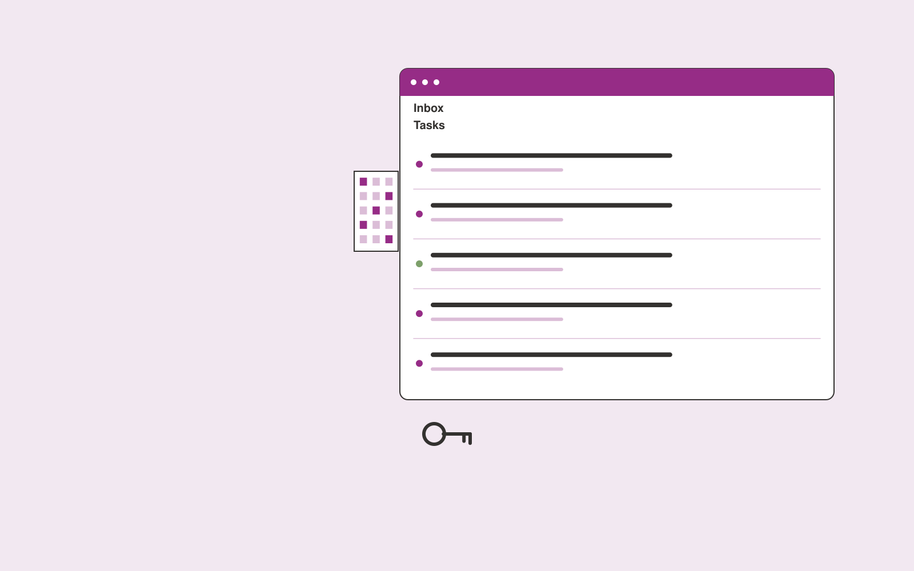

# Property management inbox service

**Real Estate and Construction** · Also fits: Operations; Sales; Customer Support

> For small residential property management firms, turn authorized tenant messages and maintenance routing rules into structured tenant request queue. Address the recurring problem: tenant messages are difficult to prioritize and route. The value hypothesis is a more complete, reviewable deliverable with less repeated preparation; the pilot must establish whether that benefit is real.

| | |
|---|---|
| **Buyer** | Small residential property management firms |
| **Problem** | Tenant messages are difficult to prioritize and route. |
| **Format** | Client intake portal and staff exception queue |
| **USP** | Property-linked triage with explicit maintenance escalation rules. |

## The product
Key screens: Message inbox, property context, task queue. Give submitters a mobile-friendly step-by-step form with document uploads and a visible completeness checklist. Staff see a queue with missing items and extracted fields. Place the original document beside each uncertain value. Show submitted, clarification required and ready-for-review states. In this product, the first view is message inbox, followed by property context and task queue.

## Core functionality
1. Identify property references.
2. Classify request types.
3. Collect missing details.
4. Flag urgent stated issues.
5. Assign staff.
6. Draft reviewed responses.

## Customer workflow
Choose the request type, collect declared facts and required documents, extract relevant fields, show missing or inconsistent information, let the submitter correct it, and route the complete package to an authorized reviewer. Start with authorized tenant messages and maintenance routing rules and finish with structured tenant request queue.

## AI and human review
Classify submitted material, extract candidate fields and draft clarification questions. Deterministic rules test required fields and formats. Keep uncertain extraction visible and preserve the original statement. Do not infer missing material facts.

## Customer inputs
Authorized tenant messages and maintenance routing rules

## Customer deliverables
Structured tenant request queue

## Accounts and administration
Secure uploads, configurable checklists, progress saving, duplicate handling, reviewer assignments, clarification threads, deadlines and submission history.

## MVP scope
Begin with small residential property management firms and one recurring use case. Build the first two modules: identify property references; classify request types. Provide operator assistance for the third module: collect missing details. Deliver structured tenant request queue through a manual review queue. Perform other necessary full-scope functions manually during the pilot. Include all applicable access, accuracy and professional-review controls from the start.

## After MVP validation
After paid pilots establish value, automate the remaining modules: flag urgent stated issues; assign staff; draft reviewed responses. Add one validated source integration, reusable customer configuration and recurring delivery. Expand to additional teams, document formats or languages only after testing the new scope.

## Build dependencies
Secure upload handling, reliable extraction, versioned completeness rules, submitter identity and staff routing. Third-party checklist changes require maintenance.

## Integrations and data access
Property records, construction documents, project photos and supplier quotes. Case management, customer records, document storage and notification systems. Begin with an exportable review pack before automating destination writes. These are candidate integration categories, not verified supported connectors.

## Defensibility
Document-type expertise, tested completeness rules and a low-friction client experience embedded in a repeat administrative process. For this idea, build around property-linked triage with explicit maintenance escalation rules. This advantage requires execution and accumulated customer trust; the base model alone is not a defensible asset.

## Alternatives and positioning
Email collection, generic web forms, spreadsheets and existing case management systems. Differentiate on this specific proposed advantage: property-linked triage with explicit maintenance escalation rules. Test it against the buyer's current method on the same task. Competitor coverage and uniqueness have not been established.

## Revenue model and test pricing (USD)
Test USD 500-2,000 setup plus USD 150-750 monthly for one form family and a capped submission volume. Quote specialist review and unusual document formats separately. Prices are experimental.

## Main delivery costs
Document processing, storage, exception review, support, checklist maintenance and customer-specific integration work.

## Marketing message to test
> Property management inbox service for small residential property management firms. Property-linked triage with explicit maintenance escalation rules. Demonstrate the claim through a tenant-message-to-task demonstration.

## Acquisition channels
Property management consultants

## Lead magnet
A tenant-message-to-task demonstration

## First 30 days of marketing
- Week 1: interview five prospective buyers in this segment: small residential property management firms. Ask to see a recent example of the problem and their current process.
- Week 2: prepare this demonstration using authorized or synthetic material: a tenant-message-to-task demonstration.
- Week 3: present it through property management consultants and seek one narrowly scoped paid pilot.
- Week 4: review routing accuracy, response preparation time, total delivery effort and a concrete renewal decision before increasing scope.

## Paid pilot and validation
Process a bounded set of historical and new submissions. Include missing, duplicate and unreadable documents. Compare complete submissions and clarification effort with the current intake method. For this idea, use authorized tenant messages and maintenance routing rules and evaluate structured tenant request queue. Agree success thresholds with the buyer before starting; collect a baseline for routing accuracy, response preparation time. A positive signal is payment and repeat use with acceptable quality and delivery cost, not a favorable demo reaction alone.

## Success metrics
Routing accuracy, response preparation time

## Retention and expansion
Review incomplete submissions and simplify recurring friction. Expand to another form or document family after the first workflow reliably produces review-ready cases.

## Operating controls and limitations
Verify property facts and scope assumptions. Clearly label visual alterations. Professional reviewers retain responsibility for contracts, engineering and legal interpretations. Validate source access and reviewer availability during the pilot. Maintain customer-level access, data deletion controls and a record of final approvals.

## Brand style (concept)

- Colors: `#912778` primary · `#54c958` accent · `#f1e4ee` surface · `#22201e` ink
- Type: Sora for headings, Work Sans for text
- Voice: Solid, practical, on-schedule
- Demo site: [https://nexibeo.com/solutions/property-management-inbox-service/demo/](https://nexibeo.com/solutions/property-management-inbox-service/demo/)

## Investment indication

Indicative build budget, from MVP to full product. This is a planning range, not a quote; it excludes running costs such as model usage, hosting and reviewer hours. Built with Nexibeo's AI software development factory, most implementations take days to a few weeks of creation time, depending on availability.

| Phase | Scope | Creation time | Indicative budget |
|---|---|---|---|
| MVP | One buyer segment, one recurring use case; first modules: identify property references; classify request types. Manual review in the loop. | 5 days | $8,500 |
| Paid pilot | Accounts, roles, review states, audit trail and the first integration, hardened for two to three paying pilot customers. | 6 days | $10,000 |
| Full product | Remaining modules: flag urgent stated issues; assign staff; draft reviewed responses. Self-serve onboarding, billing, monitoring and the wider integration set. | 10 days | $14,000 |
| **Total** | | about 4 weeks | **$32,500** |

### Running costs per month (rough indication, untested)

| Stage | Hosting and infrastructure | AI usage | Total per month |
|---|---|---|---|
| MVP and paid pilot (about 3 customers) | $30–$60 | $40–$90 | **$70–$150** |
| Full product (about 50 customers) | $110–$210 | $280–$560 | **$390–$770** |

**Get this built:** [contact Nexibeo](https://nexibeo.com/solutions/property-management-inbox-service/#apply). We build it with our AI software factory, usually in days to a few weeks, for you to run internally or offer to your clients.

## Research status
Concept proposal expanded from the 315-idea conversation. Demand, pricing, differentiation, build scope and integration feasibility are hypotheses, not verified market findings. Category link is inspiration rather than evidence of business viability.

## Credits and next steps

- **Estimation and having it built:** see the full solution page on [nexibeo.com](https://nexibeo.com/solutions/property-management-inbox-service/) for more detail on estimation. Nexibeo builds it for you as a custom AI implementation, to run internally or to offer to your own clients.
- **Become an AI-optimized specialist for Real Estate and Construction:** [Complete AI Training](https://completeaitraining.com/certification/12b-ai-certification-for-real-estate-agents/).
- Field news: [AI news for Real Estate and Construction](https://completeaitraining.com/all-ai-news-for-real-estate-and-construction/).
