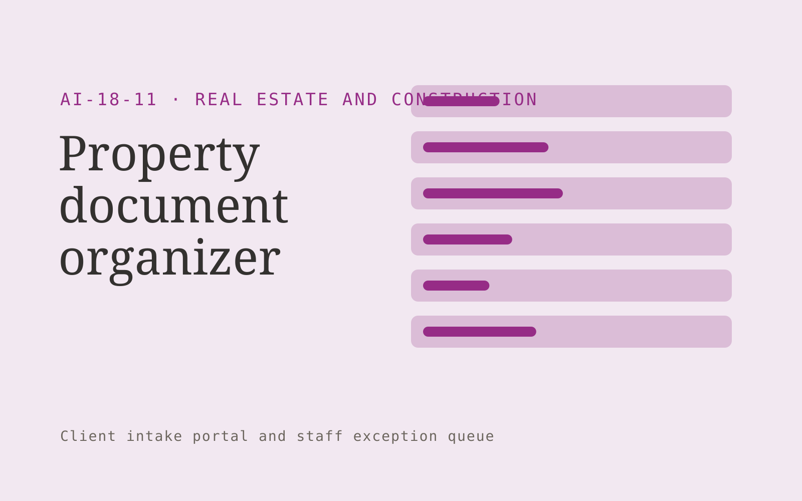

# Property document organizer

**Real Estate and Construction** · Also fits: Operations; Sales; Customer Support

> For real estate transaction coordinators, turn transaction checklists and authorized property documents into indexed property transaction pack. Address the recurring problem: transactions stall because requested records are missing. The value hypothesis is a more complete, reviewable deliverable with less repeated preparation; the pilot must establish whether that benefit is real.

| | |
|---|---|
| **Buyer** | Real estate transaction coordinators |
| **Problem** | Transactions stall because requested records are missing. |
| **Format** | Client intake portal and staff exception queue |
| **USP** | Checklist-driven completeness with a clear record of outstanding items. |

## The product
Key screens: Transaction checklist, document index, outstanding requests. Give submitters a mobile-friendly step-by-step form with document uploads and a visible completeness checklist. Staff see a queue with missing items and extracted fields. Place the original document beside each uncertain value. Show submitted, clarification required and ready-for-review states. In this product, the first view is transaction checklist, followed by document index and outstanding requests.

## Core functionality
1. Classify supplied records.
2. Match checklist items.
3. Flag missing signatures.
4. Track document versions.
5. Draft follow-up requests.
6. Assemble adviser packs.

## Customer workflow
Choose the request type, collect declared facts and required documents, extract relevant fields, show missing or inconsistent information, let the submitter correct it, and route the complete package to an authorized reviewer. Start with transaction checklists and authorized property documents and finish with indexed property transaction pack.

## AI and human review
Classify submitted material, extract candidate fields and draft clarification questions. Deterministic rules test required fields and formats. Keep uncertain extraction visible and preserve the original statement. Do not infer missing material facts.

## Customer inputs
Transaction checklists and authorized property documents

## Customer deliverables
Indexed property transaction pack

## Accounts and administration
Secure uploads, configurable checklists, progress saving, duplicate handling, reviewer assignments, clarification threads, deadlines and submission history.

## MVP scope
Begin with real estate transaction coordinators and one recurring use case. Build the first two modules: classify supplied records; match checklist items. Provide operator assistance for the third module: flag missing signatures. Deliver indexed property transaction pack through a manual review queue. Perform other necessary full-scope functions manually during the pilot. Include all applicable access, accuracy and professional-review controls from the start.

## After MVP validation
After paid pilots establish value, automate the remaining modules: track document versions; draft follow-up requests; assemble adviser packs. Add one validated source integration, reusable customer configuration and recurring delivery. Expand to additional teams, document formats or languages only after testing the new scope.

## Build dependencies
Secure upload handling, reliable extraction, versioned completeness rules, submitter identity and staff routing. Third-party checklist changes require maintenance.

## Integrations and data access
Property records, construction documents, project photos and supplier quotes. Case management, customer records, document storage and notification systems. Begin with an exportable review pack before automating destination writes. These are candidate integration categories, not verified supported connectors.

## Defensibility
Document-type expertise, tested completeness rules and a low-friction client experience embedded in a repeat administrative process. For this idea, build around checklist-driven completeness with a clear record of outstanding items. This advantage requires execution and accumulated customer trust; the base model alone is not a defensible asset.

## Alternatives and positioning
Email collection, generic web forms, spreadsheets and existing case management systems. Differentiate on this specific proposed advantage: checklist-driven completeness with a clear record of outstanding items. Test it against the buyer's current method on the same task. Competitor coverage and uniqueness have not been established.

## Revenue model and test pricing (USD)
Test USD 500-2,000 setup plus USD 150-750 monthly for one form family and a capped submission volume. Quote specialist review and unusual document formats separately. Prices are experimental.

## Main delivery costs
Document processing, storage, exception review, support, checklist maintenance and customer-specific integration work.

## Marketing message to test
> Property document organizer for real estate transaction coordinators. Checklist-driven completeness with a clear record of outstanding items. Demonstrate the claim through a transaction document readiness report.

## Acquisition channels
Conveyancing and transaction coordination partners

## Lead magnet
A transaction document readiness report

## First 30 days of marketing
- Week 1: interview five prospective buyers in this segment: real estate transaction coordinators. Ask to see a recent example of the problem and their current process.
- Week 2: prepare this demonstration using authorized or synthetic material: a transaction document readiness report.
- Week 3: present it through conveyancing and transaction coordination partners and seek one narrowly scoped paid pilot.
- Week 4: review complete records, clarification rounds, total delivery effort and a concrete renewal decision before increasing scope.

## Paid pilot and validation
Process a bounded set of historical and new submissions. Include missing, duplicate and unreadable documents. Compare complete submissions and clarification effort with the current intake method. For this idea, use transaction checklists and authorized property documents and evaluate indexed property transaction pack. Agree success thresholds with the buyer before starting; collect a baseline for complete records, clarification rounds. A positive signal is payment and repeat use with acceptable quality and delivery cost, not a favorable demo reaction alone.

## Success metrics
Complete records, clarification rounds

## Retention and expansion
Review incomplete submissions and simplify recurring friction. Expand to another form or document family after the first workflow reliably produces review-ready cases.

## Operating controls and limitations
Verify property facts and scope assumptions. Clearly label visual alterations. Professional reviewers retain responsibility for contracts, engineering and legal interpretations. Validate source access and reviewer availability during the pilot. Maintain customer-level access, data deletion controls and a record of final approvals.

## Brand style (concept)

- Colors: `#8c2791` primary · `#66c954` accent · `#f0e4f1` surface · `#22201e` ink
- Type: Sora for headings, Work Sans for text
- Voice: Solid, practical, on-schedule
- Demo site: [https://nexibeo.com/ideas/property-document-organizer/demo/](https://nexibeo.com/ideas/property-document-organizer/demo/)

## Investment indication

Indicative build budget, from MVP to full product. This is a planning range, not a quote; it excludes running costs such as model usage, hosting and reviewer hours.

| Phase | Scope | Timeline | Indicative budget |
|---|---|---|---|
| MVP | One buyer segment, one recurring use case; first modules: classify supplied records; match checklist items. Manual review in the loop. | 5 weeks | $8,500 |
| Paid pilot | Accounts, roles, review states, audit trail and the first integration, hardened for two to three paying pilot customers. | 6 weeks | $10,500 |
| Full product | Remaining modules: track document versions; draft follow-up requests; assemble adviser packs. Self-serve onboarding, billing, monitoring and the wider integration set. | 10 weeks | $14,500 |
| **Total** | | 21 weeks | **$33,500** |

**Co-create this project with us:** [contact Nexibeo](https://nexibeo.com/ideas/property-document-organizer/#apply) and we build it with you.

## Research status
Concept proposal expanded from the 315-idea conversation. Demand, pricing, differentiation, build scope and integration feasibility are hypotheses, not verified market findings. Category link is inspiration rather than evidence of business viability.

## Credits and next steps

- **Estimation and building this idea:** see the full idea page on [nexibeo.com](https://nexibeo.com/ideas/property-document-organizer/) for more detail on estimation, and to co-create and build this idea with Nexibeo.
- **Become an AI-optimized specialist for Real Estate and Construction:** [Complete AI Training](https://completeaitraining.com/certification/12b-ai-certification-for-real-estate-agents/).
- Field news: [AI news for Real Estate and Construction](https://completeaitraining.com/all-ai-news-for-real-estate-and-construction/).
