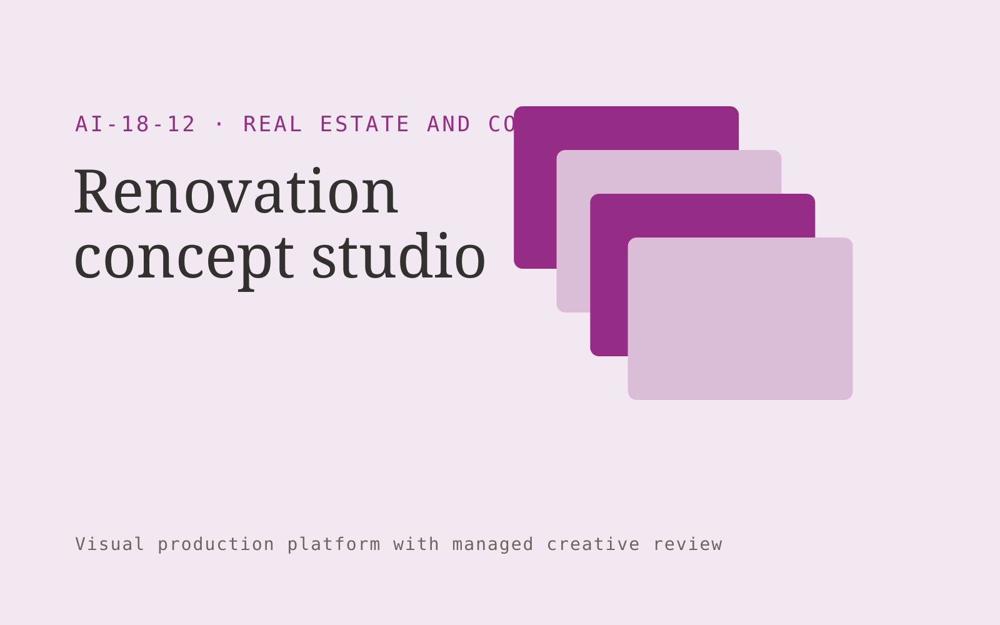

# Renovation concept studio

**Real Estate and Construction** · Also fits: Operations; Sales; Creatives

> For interior designers serving residential renovations, turn existing photos, measured plans and design preferences into concept visualization and design briefing pack. Address the recurring problem: clients struggle to compare concepts before detailed design. The value hypothesis is a more complete, reviewable deliverable with less repeated preparation; the pilot must establish whether that benefit is real.

| | |
|---|---|
| **Buyer** | Interior designers serving residential renovations |
| **Problem** | Clients struggle to compare concepts before detailed design. |
| **Format** | Visual production platform with managed creative review |
| **USP** | Concepts stay linked to the supplied room and explicit design assumptions. |

## The product
Key screens: Room brief, concept canvas, client comparison. Use a thumbnail gallery for projects, a large central editing canvas, and a right-hand panel for references, constraints and comments. Let users compare versions side by side. Display draft, changes requested and approved states. Provide a client preview link with comments anchored to the relevant asset. In this product, the first view is room brief, followed by concept canvas and client comparison.

## Core functionality
1. Capture style preferences.
2. Respect supplied dimensions.
3. Generate visual alternatives.
4. Annotate proposed changes.
5. Collect client feedback.
6. Prepare designer handoffs.

## Customer workflow
Create a brief, upload reference material, choose constraints, review a small set of directions, refine the selected direction, request client approval, and export a versioned delivery pack. Start with existing photos, measured plans and design preferences and finish with concept visualization and design briefing pack.

## AI and human review
Use language models to interpret briefs and visual models where appropriate to generate or adapt assets. Keep factual attributes in structured fields. Validate dimensions and export formats through deterministic checks. A creative reviewer confirms visual quality and fidelity before delivery.

## Customer inputs
Existing photos, measured plans and design preferences

## Customer deliverables
Concept visualization and design briefing pack

## Accounts and administration
Project ownership, asset versions, client comments, approval states, usage allowances, revision limits, download history and a rights record for supplied material.

## MVP scope
Begin with interior designers serving residential renovations and one recurring use case. Build the first two modules: capture style preferences; respect supplied dimensions. Provide operator assistance for the third module: generate visual alternatives. Deliver concept visualization and design briefing pack through a manual review queue. Perform other necessary full-scope functions manually during the pilot. Include all applicable access, accuracy and professional-review controls from the start.

## After MVP validation
After paid pilots establish value, automate the remaining modules: annotate proposed changes; collect client feedback; prepare designer handoffs. Add one validated source integration, reusable customer configuration and recurring delivery. Expand to additional teams, document formats or languages only after testing the new scope.

## Build dependencies
Asset upload and preview, asynchronous generation jobs, editable version history, reviewer access and tested export formats. High-fidelity production requires specialist creative QA.

## Integrations and data access
Property records, construction documents, project photos and supplier quotes. Cloud asset storage, design-file import/export and publishing destinations. Start with file exchange and validate destination specifications before promising direct publishing. These are candidate integration categories, not verified supported connectors.

## Defensibility
A reusable library of approved styles, production constraints and review examples, together with reliable delivery for a narrow creative niche. For this idea, build around concepts stay linked to the supplied room and explicit design assumptions. This advantage requires execution and accumulated customer trust; the base model alone is not a defensible asset.

## Alternatives and positioning
Freelancers, creative agencies, generic generation tools and existing design applications. Differentiate on this specific proposed advantage: concepts stay linked to the supplied room and explicit design assumptions. Test it against the buyer's current method on the same task. Competitor coverage and uniqueness have not been established.

## Revenue model and test pricing (USD)
Test a USD 300-1,500 fixed pilot for one defined asset package. Offer a monthly production allowance after repeat demand. Quote complex video, 3D or specialist design separately. These are test prices, not market benchmarks.

## Main delivery costs
Generation attempts, video or image processing, storage, reviewer hours, client revision rounds and licensed source assets.

## Marketing message to test
> Renovation concept studio for interior designers serving residential renovations. Concepts stay linked to the supplied room and explicit design assumptions. Demonstrate the claim through two renovation directions for one measured room.

## Acquisition channels
Interior design studios

## Lead magnet
Two renovation directions for one measured room

## First 30 days of marketing
- Week 1: interview five prospective buyers in this segment: interior designers serving residential renovations. Ask to see a recent example of the problem and their current process.
- Week 2: prepare this demonstration using authorized or synthetic material: two renovation directions for one measured room.
- Week 3: present it through interior design studios and seek one narrowly scoped paid pilot.
- Week 4: review client decision time, designer revision rounds, total delivery effort and a concrete renewal decision before increasing scope.

## Paid pilot and validation
Deliver one real creative brief with a capped asset count and revision allowance. Compare usable deliverables, reviewer time and client acceptance with the existing production method. For this idea, use existing photos, measured plans and design preferences and evaluate concept visualization and design briefing pack. Agree success thresholds with the buyer before starting; collect a baseline for client decision time, designer revision rounds. A positive signal is payment and repeat use with acceptable quality and delivery cost, not a favorable demo reaction alone.

## Success metrics
Client decision time, designer revision rounds

## Retention and expansion
Save approved styles and constraints, offer repeat production batches, and expand only into adjacent asset formats the same buyer already commissions.

## Operating controls and limitations
Verify property facts and scope assumptions. Clearly label visual alterations. Professional reviewers retain responsibility for contracts, engineering and legal interpretations. Validate source access and reviewer availability during the pilot. Maintain customer-level access, data deletion controls and a record of final approvals.

## Brand style (concept)

- Colors: `#912786` primary · `#54c962` accent · `#f1e4ef` surface · `#22201e` ink
- Type: Sora for headings, Work Sans for text
- Voice: Solid, practical, on-schedule
- Demo site: [https://nexibeo.com/solutions/renovation-concept-studio/demo/](https://nexibeo.com/solutions/renovation-concept-studio/demo/)

## Investment indication

Indicative build budget, from MVP to full product. This is a planning range, not a quote; it excludes running costs such as model usage, hosting and reviewer hours. Built with Nexibeo's AI software development factory, most implementations take days to a few weeks of creation time, depending on availability.

| Phase | Scope | Creation time | Indicative budget |
|---|---|---|---|
| MVP | One buyer segment, one recurring use case; first modules: capture style preferences; respect supplied dimensions. Manual review in the loop. | 7 days | $11,500 |
| Paid pilot | Accounts, roles, review states, audit trail and the first integration, hardened for two to three paying pilot customers. | 8 days | $15,000 |
| Full product | Remaining modules: annotate proposed changes; collect client feedback; prepare designer handoffs. Self-serve onboarding, billing, monitoring and the wider integration set. | 3 weeks | $20,500 |
| **Total** | | about 6 weeks | **$47,000** |

### Running costs per month (rough indication, untested)

| Stage | Hosting and infrastructure | AI usage | Total per month |
|---|---|---|---|
| MVP and paid pilot (about 3 customers) | $40–$80 | $150–$310 | **$190–$390** |
| Full product (about 50 customers) | $160–$320 | $2,100–$4,200 | **$2,260–$4,520** |

**Get this built:** [contact Nexibeo](https://nexibeo.com/solutions/renovation-concept-studio/#apply). We build it with our AI software factory, usually in days to a few weeks, for you to run internally or offer to your clients.

## Research status
Concept proposal expanded from the 315-idea conversation. Demand, pricing, differentiation, build scope and integration feasibility are hypotheses, not verified market findings. Category link is inspiration rather than evidence of business viability.

## Credits and next steps

- **Estimation and having it built:** see the full solution page on [nexibeo.com](https://nexibeo.com/solutions/renovation-concept-studio/) for more detail on estimation. Nexibeo builds it for you as a custom AI implementation, to run internally or to offer to your own clients.
- **Become an AI-optimized specialist for Real Estate and Construction:** [Complete AI Training](https://completeaitraining.com/certification/12b-ai-certification-for-real-estate-agents/).
- Field news: [AI news for Real Estate and Construction](https://completeaitraining.com/all-ai-news-for-real-estate-and-construction/).
