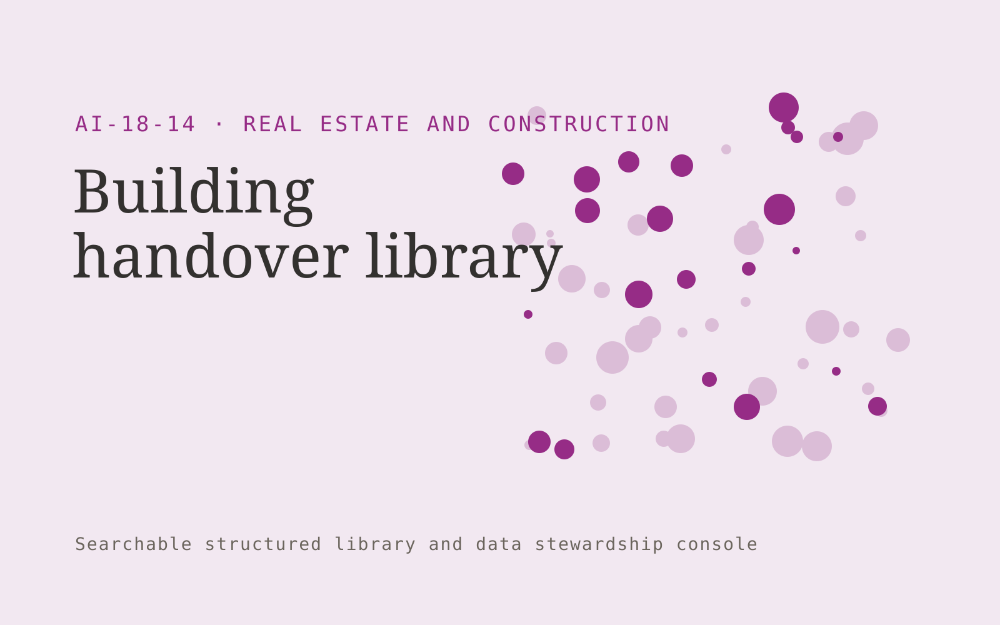

# Building handover library

**Real Estate and Construction** · Also fits: Operations; Sales; IT and Development

> For developers handing over small commercial buildings, turn as-built records, manuals, warranties and asset registers into searchable building handover portal. Address the recurring problem: owners receive disorganized manuals and warranty files. The value hypothesis is a more complete, reviewable deliverable with less repeated preparation; the pilot must establish whether that benefit is real.

| | |
|---|---|
| **Buyer** | Developers handing over small commercial buildings |
| **Problem** | Owners receive disorganized manuals and warranty files. |
| **Format** | Searchable structured library and data stewardship console |
| **USP** | Asset-specific retrieval with evidence of handover completeness. |

## The product
Key screens: Building map, asset search, document expiry. Use a searchable table or visual gallery with filters for the domain’s important attributes. Open each item into a detail drawer containing source records, ownership and history. Put proposed merges and field changes in a separate review queue. Provide a preview before any bulk export. In this product, the first view is building map, followed by asset search and document expiry.

## Core functionality
1. Index building assets.
2. Link relevant manuals.
3. Record warranty dates.
4. Flag missing certificates.
5. Assign document owners.
6. Export searchable handover portals.

## Customer workflow
Import a limited collection, define canonical fields, suggest tags or mappings, review uncertain records, publish approved items, search and reuse them, and request periodic owner updates. Start with as-built records, manuals, warranties and asset registers and finish with searchable building handover portal.

## AI and human review
Suggest classifications, semantic tags, duplicate candidates and field mappings. Preserve original values. Use explicit validation for identifiers and units. Human stewards approve ambiguous merges and factual changes.

## Customer inputs
As-built records, manuals, warranties and asset registers

## Customer deliverables
Searchable building handover portal

## Accounts and administration
Record ownership, access permissions, change proposals, original-value retention, version history, review dates, bulk import/export and duplicate resolution.

## MVP scope
Begin with developers handing over small commercial buildings and one recurring use case. Build the first two modules: index building assets; link relevant manuals. Provide operator assistance for the third module: record warranty dates. Deliver searchable building handover portal through a manual review queue. Perform other necessary full-scope functions manually during the pilot. Include all applicable access, accuracy and professional-review controls from the start.

## After MVP validation
After paid pilots establish value, automate the remaining modules: flag missing certificates; assign document owners; export searchable handover portals. Add one validated source integration, reusable customer configuration and recurring delivery. Expand to additional teams, document formats or languages only after testing the new scope.

## Build dependencies
Stable identifiers, an agreed data schema, reversible imports, mapping review and source ownership. Data quality work can exceed model development effort.

## Integrations and data access
Property records, construction documents, project photos and supplier quotes. Source systems, catalog exports and cloud file storage. Start with reversible CSV or file imports and validate identifiers before any direct writes. These are candidate integration categories, not verified supported connectors.

## Defensibility
A useful niche taxonomy, customer-approved mappings and accumulated correction history that improve retrieval and reduce repeated cleanup. For this idea, build around asset-specific retrieval with evidence of handover completeness. This advantage requires execution and accumulated customer trust; the base model alone is not a defensible asset.

## Alternatives and positioning
Spreadsheets, shared folders, existing asset or information management systems and manual data cleanup. Differentiate on this specific proposed advantage: asset-specific retrieval with evidence of handover completeness. Test it against the buyer's current method on the same task. Competitor coverage and uniqueness have not been established.

## Revenue model and test pricing (USD)
Test USD 500-2,500 for one collection cleanup and launch, followed by USD 100-500 monthly for maintenance within agreed record limits. Larger migrations and complex rights management are separately scoped. Prices are hypotheses.

## Main delivery costs
Import cleanup, extraction, storage, indexing, steward review, duplicate investigation and recurring source updates.

## Marketing message to test
> Building handover library for developers handing over small commercial buildings. Asset-specific retrieval with evidence of handover completeness. Demonstrate the claim through a searchable handover sample for one building system.

## Acquisition channels
Building commissioning consultants

## Lead magnet
A searchable handover sample for one building system

## First 30 days of marketing
- Week 1: interview five prospective buyers in this segment: developers handing over small commercial buildings. Ask to see a recent example of the problem and their current process.
- Week 2: prepare this demonstration using authorized or synthetic material: a searchable handover sample for one building system.
- Week 3: present it through building commissioning consultants and seek one narrowly scoped paid pilot.
- Week 4: review document retrieval, missing handover items, total delivery effort and a concrete renewal decision before increasing scope.

## Paid pilot and validation
Clean and organize one representative collection. Have users perform real search or mapping tasks. Check every proposed merge in the sample and compare search success with the existing system. For this idea, use as-built records, manuals, warranties and asset registers and evaluate searchable building handover portal. Agree success thresholds with the buyer before starting; collect a baseline for document retrieval, missing handover items. A positive signal is payment and repeat use with acceptable quality and delivery cost, not a favorable demo reaction alone.

## Success metrics
Document retrieval, missing handover items

## Retention and expansion
Provide owner reminders and periodic cleanup. Add another collection only after record quality and retrieval are stable in the initial one.

## Operating controls and limitations
Verify property facts and scope assumptions. Clearly label visual alterations. Professional reviewers retain responsibility for contracts, engineering and legal interpretations. Validate source access and reviewer availability during the pilot. Maintain customer-level access, data deletion controls and a record of final approvals.

## Brand style (concept)

- Colors: `#912791` primary · `#54c970` accent · `#f1e4f1` surface · `#22201e` ink
- Type: Libre Baskerville for headings, IBM Plex Sans for text
- Voice: Solid, practical, on-schedule
- Demo site: [https://nexibeo.com/solutions/building-handover-library/demo/](https://nexibeo.com/solutions/building-handover-library/demo/)

## Investment indication

Indicative build budget, from MVP to full product. This is a planning range, not a quote; it excludes running costs such as model usage, hosting and reviewer hours. Built with Nexibeo's AI software development factory, most implementations take days to a few weeks of creation time, depending on availability.

| Phase | Scope | Creation time | Indicative budget |
|---|---|---|---|
| MVP | One buyer segment, one recurring use case; first modules: index building assets; link relevant manuals. Manual review in the loop. | 4 days | $8,000 |
| Paid pilot | Accounts, roles, review states, audit trail and the first integration, hardened for two to three paying pilot customers. | 5 days | $9,000 |
| Full product | Remaining modules: flag missing certificates; assign document owners; export searchable handover portals. Self-serve onboarding, billing, monitoring and the wider integration set. | 9 days | $12,500 |
| **Total** | | about 4 weeks | **$29,500** |

### Running costs per month (rough indication, untested)

| Stage | Hosting and infrastructure | AI usage | Total per month |
|---|---|---|---|
| MVP and paid pilot (about 3 customers) | $30–$60 | $50–$100 | **$80–$160** |
| Full product (about 50 customers) | $110–$210 | $350–$700 | **$460–$910** |

**Get this built:** [contact Nexibeo](https://nexibeo.com/solutions/building-handover-library/#apply). We build it with our AI software factory, usually in days to a few weeks, for you to run internally or offer to your clients.

## Research status
Concept proposal expanded from the 315-idea conversation. Demand, pricing, differentiation, build scope and integration feasibility are hypotheses, not verified market findings. Category link is inspiration rather than evidence of business viability.

## Credits and next steps

- **Estimation and having it built:** see the full solution page on [nexibeo.com](https://nexibeo.com/solutions/building-handover-library/) for more detail on estimation. Nexibeo builds it for you as a custom AI implementation, to run internally or to offer to your own clients.
- **Become an AI-optimized specialist for Real Estate and Construction:** [Complete AI Training](https://completeaitraining.com/certification/12b-ai-certification-for-real-estate-agents/).
- Field news: [AI news for Real Estate and Construction](https://completeaitraining.com/all-ai-news-for-real-estate-and-construction/).
