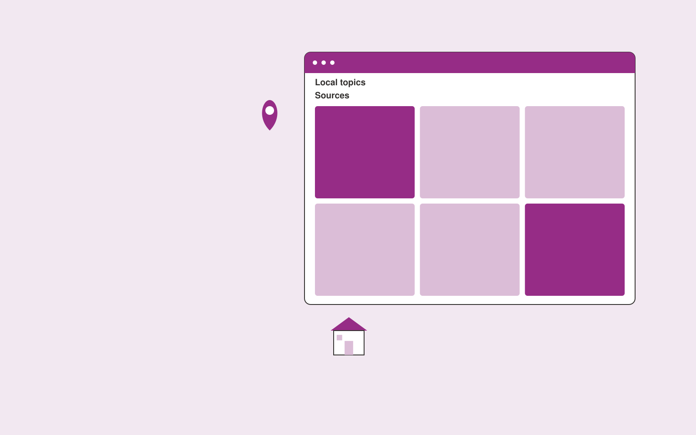

# Real estate content subscription

**Real Estate and Construction** · Also fits: Operations; Sales; Writers

> For local estate agencies building educational audiences, turn official local sources and agent-approved expertise into approved local property content subscription. Address the recurring problem: generic property content lacks verified local relevance. The value hypothesis is a more complete, reviewable deliverable with less repeated preparation; the pilot must establish whether that benefit is real.

| | |
|---|---|
| **Buyer** | Local estate agencies building educational audiences |
| **Problem** | Generic property content lacks verified local relevance. |
| **Format** | Source-based content workspace with editorial delivery |
| **USP** | Local source verification and agent expertise in recurring educational content. |

## The product
Key screens: Local topics, content editor, source review. Use a project list and editorial calendar beside a document editor. Keep original material and supporting passages in a collapsible side panel. Show outline, draft, review and approved stages. Provide tracked edits, comments, version comparisons and an export preview that reflects the final delivery format. In this product, the first view is local topics, followed by content editor and source review.

## Core functionality
1. Plan buyer questions.
2. Research official information.
3. Interview agents.
4. Draft guides.
5. Flag dated facts.
6. Adapt newsletter formats.

## Customer workflow
Collect a structured brief and source material, identify unanswered questions, approve an outline, generate a draft, verify claims, gather reviewer edits, approve a final version and export the agreed formats. Start with official local sources and agent-approved expertise and finish with approved local property content subscription.

## AI and human review
Extract and organize information, propose structure, draft prose and adapt approved content to audiences. Attach evidence to factual claims. Keep names, dates, amounts and quoted wording linked to their source. Editors resolve ambiguity and approve publication.

## Customer inputs
Official local sources and agent-approved expertise

## Customer deliverables
Approved local property content subscription

## Accounts and administration
Client workspaces, source permissions, editorial assignments, change history, reviewer comments, approval gates, revision allowances and export templates.

## MVP scope
Begin with local estate agencies building educational audiences and one recurring use case. Build the first two modules: plan buyer questions; research official information. Provide operator assistance for the third module: interview agents. Deliver approved local property content subscription through a manual review queue. Perform other necessary full-scope functions manually during the pilot. Include all applicable access, accuracy and professional-review controls from the start.

## After MVP validation
After paid pilots establish value, automate the remaining modules: draft guides; flag dated facts; adapt newsletter formats. Add one validated source integration, reusable customer configuration and recurring delivery. Expand to additional teams, document formats or languages only after testing the new scope.

## Build dependencies
Document parsing, a source-linked editor, tracked revisions, reviewer workflow and reliable document export. Rich presentation or print output needs format-specific QA.

## Integrations and data access
Property records, construction documents, project photos and supplier quotes. Document storage, word processor export, content management systems and approved publishing channels. Pilot with uploads and downloadable drafts before adding write integrations. These are candidate integration categories, not verified supported connectors.

## Defensibility
Customer-approved terminology, reusable structures, source libraries and editorial feedback tied to a specific audience and recurring publishing workflow. For this idea, build around local source verification and agent expertise in recurring educational content. This advantage requires execution and accumulated customer trust; the base model alone is not a defensible asset.

## Alternatives and positioning
Writers, editors, agencies, internal document templates and general-purpose chat tools. Differentiate on this specific proposed advantage: local source verification and agent expertise in recurring educational content. Test it against the buyer's current method on the same task. Competitor coverage and uniqueness have not been established.

## Revenue model and test pricing (USD)
Test USD 400-1,500 for a tightly scoped initial content package. Convert repeated work to a monthly retainer with explicit deliverable and revision limits. Specialist review and substantial research are separately scoped. Prices are hypotheses.

## Main delivery costs
Research and interview time, transcription, model usage, factual verification, subject-matter review, editing and revisions.

## Marketing message to test
> Real estate content subscription for local estate agencies building educational audiences. Local source verification and agent expertise in recurring educational content. Demonstrate the claim through a source-linked local buyer guide.

## Acquisition channels
Real estate marketing agencies

## Lead magnet
A source-linked local buyer guide

## First 30 days of marketing
- Week 1: interview five prospective buyers in this segment: local estate agencies building educational audiences. Ask to see a recent example of the problem and their current process.
- Week 2: prepare this demonstration using authorized or synthetic material: a source-linked local buyer guide.
- Week 3: present it through real estate marketing agencies and seek one narrowly scoped paid pilot.
- Week 4: review agent acceptance, qualified reader inquiries, total delivery effort and a concrete renewal decision before increasing scope.

## Paid pilot and validation
Complete one existing brief using the customer’s actual sources. Record reviewer edits, factual corrections and preparation time. Ask the same buyer to commission a second comparable deliverable. For this idea, use official local sources and agent-approved expertise and evaluate approved local property content subscription. Agree success thresholds with the buyer before starting; collect a baseline for agent acceptance, qualified reader inquiries. A positive signal is payment and repeat use with acceptable quality and delivery cost, not a favorable demo reaction alone.

## Success metrics
Agent acceptance, qualified reader inquiries

## Retention and expansion
Maintain the approved source and voice library, schedule recurring editorial work, and expand into additional formats only after the core deliverable is repeatedly accepted.

## Operating controls and limitations
Verify property facts and scope assumptions. Clearly label visual alterations. Professional reviewers retain responsibility for contracts, engineering and legal interpretations. Validate source access and reviewer availability during the pilot. Maintain customer-level access, data deletion controls and a record of final approvals.

## Brand style (concept)

- Colors: `#912781` primary · `#6ac954` accent · `#f1e4ef` surface · `#22201e` ink
- Type: Libre Baskerville for headings, IBM Plex Sans for text
- Voice: Solid, practical, on-schedule
- Demo site: [https://nexibeo.com/ideas/real-estate-content-subscription/demo/](https://nexibeo.com/ideas/real-estate-content-subscription/demo/)

## Investment indication

Indicative build budget, from MVP to full product. This is a planning range, not a quote; it excludes running costs such as model usage, hosting and reviewer hours.

| Phase | Scope | Timeline | Indicative budget |
|---|---|---|---|
| MVP | One buyer segment, one recurring use case; first modules: plan buyer questions; research official information. Manual review in the loop. | 5 weeks | $8,500 |
| Paid pilot | Accounts, roles, review states, audit trail and the first integration, hardened for two to three paying pilot customers. | 6 weeks | $10,500 |
| Full product | Remaining modules: draft guides; flag dated facts; adapt newsletter formats. Self-serve onboarding, billing, monitoring and the wider integration set. | 10 weeks | $14,500 |
| **Total** | | 21 weeks | **$33,500** |

**Co-create this project with us:** [contact Nexibeo](https://nexibeo.com/ideas/real-estate-content-subscription/#apply) and we build it with you.

## Research status
Concept proposal expanded from the 315-idea conversation. Demand, pricing, differentiation, build scope and integration feasibility are hypotheses, not verified market findings. Category link is inspiration rather than evidence of business viability.

## Credits and next steps

- **Estimation and building this idea:** see the full idea page on [nexibeo.com](https://nexibeo.com/ideas/real-estate-content-subscription/) for more detail on estimation, and to co-create and build this idea with Nexibeo.
- **Become an AI-optimized specialist for Real Estate and Construction:** [Complete AI Training](https://completeaitraining.com/certification/12b-ai-certification-for-real-estate-agents/).
- Field news: [AI news for Real Estate and Construction](https://completeaitraining.com/all-ai-news-for-real-estate-and-construction/).
