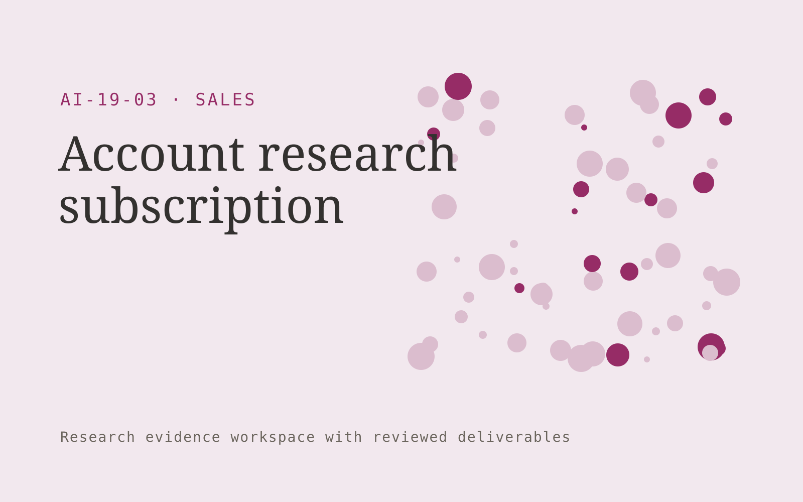

# Account research subscription

**Sales** · Also fits: Marketing; Operations; Science and Research

> For sales teams targeting niche business accounts, turn public company information and account research criteria into account intelligence brief. Address the recurring problem: representatives lack time to understand each account's situation. The value hypothesis is a more complete, reviewable deliverable with less repeated preparation; the pilot must establish whether that benefit is real.

| | |
|---|---|
| **Buyer** | Sales teams targeting niche business accounts |
| **Problem** | Representatives lack time to understand each account's situation. |
| **Format** | Research evidence workspace with reviewed deliverables |
| **USP** | Source-linked account context tailored to a particular sales motion. |

## The product
Key screens: Account watchlist, evidence profile, meeting brief. Organize work by research question. Show a source library, an evidence matrix and a draft findings panel with linked quotations. Keep contradictory findings and unanswered questions visible. Allow reviewers to inspect the original context before accepting an interpretation. In this product, the first view is account watchlist, followed by evidence profile and meeting brief.

## Core functionality
1. Collect verified company facts.
2. Track relevant developments.
3. Map stated priorities.
4. Identify evidence gaps.
5. Draft conversation questions.
6. Refresh account briefs.

## Customer workflow
Agree the decision and research questions, define permitted sources or participants, collect evidence, code findings, compare supporting and contradictory material, review interpretations, and deliver a cited brief with next questions. Start with public company information and account research criteria and finish with account intelligence brief.

## AI and human review
Assist with retrieval, transcription, structured extraction and thematic synthesis. Preserve source passages and methodological context. Human researchers validate inclusion, quotations and conclusions. Use real participants when customer research is required.

## Customer inputs
Public company information and account research criteria

## Customer deliverables
Account intelligence brief

## Accounts and administration
Source provenance, participant consent where applicable, research questions, coding definitions, reviewer disagreements, citations and versioned conclusions.

## MVP scope
Begin with sales teams targeting niche business accounts and one recurring use case. Build the first two modules: collect verified company facts; track relevant developments. Provide operator assistance for the third module: map stated priorities. Deliver account intelligence brief through a manual review queue. Perform other necessary full-scope functions manually during the pilot. Include all applicable access, accuracy and professional-review controls from the start.

## After MVP validation
After paid pilots establish value, automate the remaining modules: identify evidence gaps; draft conversation questions; refresh account briefs. Add one validated source integration, reusable customer configuration and recurring delivery. Expand to additional teams, document formats or languages only after testing the new scope.

## Build dependencies
A clear research protocol, source access, citation tracking and qualified interpretation. Interview work also needs relevant participants and consent management.

## Integrations and data access
Approved sales collateral, CRM records and product or pricing information. Permitted research libraries, interview recording imports, citation exports and document editors. Preserve original source metadata throughout the workflow. These are candidate integration categories, not verified supported connectors.

## Defensibility
Niche research protocols, credible researcher relationships and a rights-cleared evidence archive with consistent interpretation methods. For this idea, build around source-linked account context tailored to a particular sales motion. This advantage requires execution and accumulated customer trust; the base model alone is not a defensible asset.

## Alternatives and positioning
Research consultants, internal analysts, literature databases and general search or summarization tools. Differentiate on this specific proposed advantage: source-linked account context tailored to a particular sales motion. Test it against the buyer's current method on the same task. Competitor coverage and uniqueness have not been established.

## Revenue model and test pricing (USD)
Test USD 750-3,000 for one tightly bounded research question and evidence pack. Participant recruitment, specialist review and licensed data are separately scoped. Repeat tracking can become a retainer. Prices are hypotheses.

## Main delivery costs
Researcher time, source access, participant recruitment, transcription, evidence coding, expert review and report revisions.

## Marketing message to test
> Account research subscription for sales teams targeting niche business accounts. Source-linked account context tailored to a particular sales motion. Demonstrate the claim through a researched meeting brief for one target account.

## Acquisition channels
Sales enablement consultants

## Lead magnet
A researched meeting brief for one target account

## First 30 days of marketing
- Week 1: interview five prospective buyers in this segment: sales teams targeting niche business accounts. Ask to see a recent example of the problem and their current process.
- Week 2: prepare this demonstration using authorized or synthetic material: a researched meeting brief for one target account.
- Week 3: present it through sales enablement consultants and seek one narrowly scoped paid pilot.
- Week 4: review relevant findings, seller preparation time, total delivery effort and a concrete renewal decision before increasing scope.

## Paid pilot and validation
Answer one practical question using a bounded evidence set. Ask a domain expert to review citations and reasoning, identify contrary evidence and assess whether the deliverable supports the intended decision. For this idea, use public company information and account research criteria and evaluate account intelligence brief. Agree success thresholds with the buyer before starting; collect a baseline for relevant findings, seller preparation time. A positive signal is payment and repeat use with acceptable quality and delivery cost, not a favorable demo reaction alone.

## Success metrics
Relevant findings, seller preparation time

## Retention and expansion
Maintain the research question and evidence archive, offer follow-up studies and refresh important sources. Build repeat work around the buyer’s decision cycle.

## Operating controls and limitations
Keep product capabilities and commercial terms verified. Use authorized customer records and require review before outreach, promises or pricing exceptions. Validate source access and reviewer availability during the pilot. Maintain customer-level access, data deletion controls and a record of final approvals.

## Brand style (concept)

- Colors: `#912761` primary · `#54c97b` accent · `#f1e4eb` surface · `#22201e` ink
- Type: Fraunces for headings, Inter for text
- Voice: Direct, upbeat, outcome-focused
- Demo site: [https://nexibeo.com/solutions/account-research-subscription/demo/](https://nexibeo.com/solutions/account-research-subscription/demo/)

## Investment indication

Indicative build budget, from MVP to full product. This is a planning range, not a quote; it excludes running costs such as model usage, hosting and reviewer hours. Built with Nexibeo's AI software development factory, most implementations take days to a few weeks of creation time, depending on availability.

| Phase | Scope | Creation time | Indicative budget |
|---|---|---|---|
| MVP | One buyer segment, one recurring use case; first modules: collect verified company facts; track relevant developments. Manual review in the loop. | 3 days | $6,000 |
| Paid pilot | Accounts, roles, review states, audit trail and the first integration, hardened for two to three paying pilot customers. | 4 days | $5,500 |
| Full product | Remaining modules: identify evidence gaps; draft conversation questions; refresh account briefs. Self-serve onboarding, billing, monitoring and the wider integration set. | 6 days | $8,000 |
| **Total** | | about 3 weeks | **$19,500** |

### Running costs per month (rough indication, untested)

| Stage | Hosting and infrastructure | AI usage | Total per month |
|---|---|---|---|
| MVP and paid pilot (about 3 customers) | $30–$60 | $80–$160 | **$110–$220** |
| Full product (about 50 customers) | $110–$210 | $880–$1,750 | **$990–$1,960** |

**Get this built:** [contact Nexibeo](https://nexibeo.com/solutions/account-research-subscription/#apply). We build it with our AI software factory, usually in days to a few weeks, for you to run internally or offer to your clients.

## Research status
Concept proposal expanded from the 315-idea conversation. Demand, pricing, differentiation, build scope and integration feasibility are hypotheses, not verified market findings. Category link is inspiration rather than evidence of business viability.

## Credits and next steps

- **Estimation and having it built:** see the full solution page on [nexibeo.com](https://nexibeo.com/solutions/account-research-subscription/) for more detail on estimation. Nexibeo builds it for you as a custom AI implementation, to run internally or to offer to your own clients.
- **Become an AI-optimized specialist for Sales:** [Complete AI Training](https://completeaitraining.com/certification/12b-ai-certification-for-sales-specialists/).
- Field news: [AI news for Sales](https://completeaitraining.com/all-ai-news-for-sales/).
