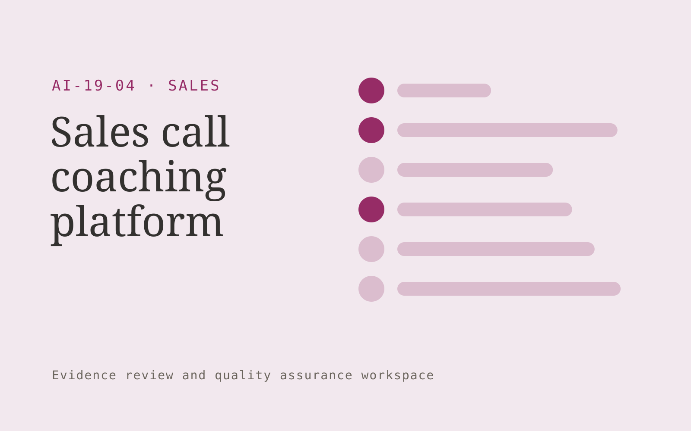

# Sales call coaching platform

**Sales** · Also fits: Marketing; Operations

> For sales enablement managers at B2B firms, turn authorized recordings and agreed sales rubrics into sales coaching report and practice plan. Address the recurring problem: coaching relies on a small inconsistent sample of calls. The value hypothesis is a more complete, reviewable deliverable with less repeated preparation; the pilot must establish whether that benefit is real.

| | |
|---|---|
| **Buyer** | Sales enablement managers at B2B firms |
| **Problem** | Coaching relies on a small inconsistent sample of calls. |
| **Format** | Evidence review and quality assurance workspace |
| **USP** | Observable behavior feedback with manager calibration and conversation evidence. |

## The product
Key screens: Call library, evidence feedback, coaching plan. Open on a review queue ordered by reviewer-selected priorities. Show each finding beside the original evidence and applicable rule. Provide accept, dismiss and needs-information controls with reasons. A separate report view summarizes confirmed findings and unresolved items, not raw AI flags. In this product, the first view is call library, followed by evidence feedback and coaching plan.

## Core functionality
1. Transcribe conversations.
2. Identify discovery evidence.
3. Assess agreed behaviors.
4. Show relevant excerpts.
5. Calibrate manager judgments.
6. Track coaching follow-up.

## Customer workflow
Agree review criteria, ingest a sample, generate candidate findings, inspect supporting evidence, let reviewers confirm or dismiss each item, assign corrections, and recheck the affected material. Start with authorized recordings and agreed sales rubrics and finish with sales coaching report and practice plan.

## AI and human review
Propose possible inconsistencies, omissions and rubric matches. Combine extraction with deterministic checks where rules are explicit. Reviewers make the final judgment. Keep false positives and missed cases visible during evaluation.

## Customer inputs
Authorized recordings and agreed sales rubrics

## Customer deliverables
Sales coaching report and practice plan

## Accounts and administration
Versioned review criteria, evidence links, reviewer decisions, disagreement handling, correction assignments, recheck status and exportable review history.

## MVP scope
Begin with sales enablement managers at B2B firms and one recurring use case. Build the first two modules: transcribe conversations; identify discovery evidence. Provide operator assistance for the third module: assess agreed behaviors. Deliver sales coaching report and practice plan through a manual review queue. Perform other necessary full-scope functions manually during the pilot. Include all applicable access, accuracy and professional-review controls from the start.

## After MVP validation
After paid pilots establish value, automate the remaining modules: show relevant excerpts; calibrate manager judgments; track coaching follow-up. Add one validated source integration, reusable customer configuration and recurring delivery. Expand to additional teams, document formats or languages only after testing the new scope.

## Build dependencies
Evidence coordinates, versioned rules, reviewer decisions and a representative reference set. Measure misses as well as confirmed findings before scaling.

## Integrations and data access
Approved sales collateral, CRM records and product or pricing information. Source repositories, task trackers and report exports. Keep findings as review proposals until authorized owners accept the resulting actions. These are candidate integration categories, not verified supported connectors.

## Defensibility
A domain-specific review rubric and rights-cleared examples of confirmed defects, false alarms and reviewer reasoning. For this idea, build around observable behavior feedback with manager calibration and conversation evidence. This advantage requires execution and accumulated customer trust; the base model alone is not a defensible asset.

## Alternatives and positioning
Manual reviewers, checklists, generic scanning tools and specialist audit services. Differentiate on this specific proposed advantage: observable behavior feedback with manager calibration and conversation evidence. Test it against the buyer's current method on the same task. Competitor coverage and uniqueness have not been established.

## Revenue model and test pricing (USD)
Test USD 500-2,000 for a defined audit sample and report. Offer recurring review priced by reviewed items and specialist hours. Software-only access can follow a reliable reviewed service. All prices require validation.

## Main delivery costs
Document or media processing, model evaluation, expert review, false-positive handling, rechecks and customer-specific rubric calibration.

## Marketing message to test
> Sales call coaching platform for sales enablement managers at B2B firms. Observable behavior feedback with manager calibration and conversation evidence. Demonstrate the claim through a rubric-based review of an anonymized call.

## Acquisition channels
Sales coaching organizations

## Lead magnet
A rubric-based review of an anonymized call

## First 30 days of marketing
- Week 1: interview five prospective buyers in this segment: sales enablement managers at B2B firms. Ask to see a recent example of the problem and their current process.
- Week 2: prepare this demonstration using authorized or synthetic material: a rubric-based review of an anonymized call.
- Week 3: present it through sales coaching organizations and seek one narrowly scoped paid pilot.
- Week 4: review manager agreement, demonstrated improvement, total delivery effort and a concrete renewal decision before increasing scope.

## Paid pilot and validation
Have a qualified reviewer independently assess the same sample. Compare confirmed findings, false alarms and omissions. Repeat on unseen material before agreeing recurring volume. For this idea, use authorized recordings and agreed sales rubrics and evaluate sales coaching report and practice plan. Agree success thresholds with the buyer before starting; collect a baseline for manager agreement, demonstrated improvement. A positive signal is payment and repeat use with acceptable quality and delivery cost, not a favorable demo reaction alone.

## Success metrics
Manager agreement, demonstrated improvement

## Retention and expansion
Offer recurring reviews and rechecks of previously confirmed issues. Expand document or case types after validating the new rubric with qualified reviewers.

## Operating controls and limitations
Keep product capabilities and commercial terms verified. Use authorized customer records and require review before outreach, promises or pricing exceptions. Validate source access and reviewer availability during the pilot. Maintain customer-level access, data deletion controls and a record of final approvals.

## Brand style (concept)

- Colors: `#912751` primary · `#54c999` accent · `#f1e4e9` surface · `#22201e` ink
- Type: Fraunces for headings, Inter for text
- Voice: Direct, upbeat, outcome-focused
- Demo site: [https://nexibeo.com/ideas/sales-call-coaching-platform/demo/](https://nexibeo.com/ideas/sales-call-coaching-platform/demo/)

## Investment indication

Indicative build budget, from MVP to full product. This is a planning range, not a quote; it excludes running costs such as model usage, hosting and reviewer hours.

| Phase | Scope | Timeline | Indicative budget |
|---|---|---|---|
| MVP | One buyer segment, one recurring use case; first modules: transcribe conversations; identify discovery evidence. Manual review in the loop. | 3 weeks | $5,500 |
| Paid pilot | Accounts, roles, review states, audit trail and the first integration, hardened for two to three paying pilot customers. | 4 weeks | $5,000 |
| Full product | Remaining modules: show relevant excerpts; calibrate manager judgments; track coaching follow-up. Self-serve onboarding, billing, monitoring and the wider integration set. | 7 weeks | $6,500 |
| **Total** | | 14 weeks | **$17,000** |

**Co-create this project with us:** [contact Nexibeo](https://nexibeo.com/ideas/sales-call-coaching-platform/#apply) and we build it with you.

## Research status
Concept proposal expanded from the 315-idea conversation. Demand, pricing, differentiation, build scope and integration feasibility are hypotheses, not verified market findings. Category link is inspiration rather than evidence of business viability.

## Credits and next steps

- **Estimation and building this idea:** see the full idea page on [nexibeo.com](https://nexibeo.com/ideas/sales-call-coaching-platform/) for more detail on estimation, and to co-create and build this idea with Nexibeo.
- **Become an AI-optimized specialist for Sales:** [Complete AI Training](https://completeaitraining.com/certification/12b-ai-certification-for-sales-specialists/).
- Field news: [AI news for Sales](https://completeaitraining.com/all-ai-news-for-sales/).
