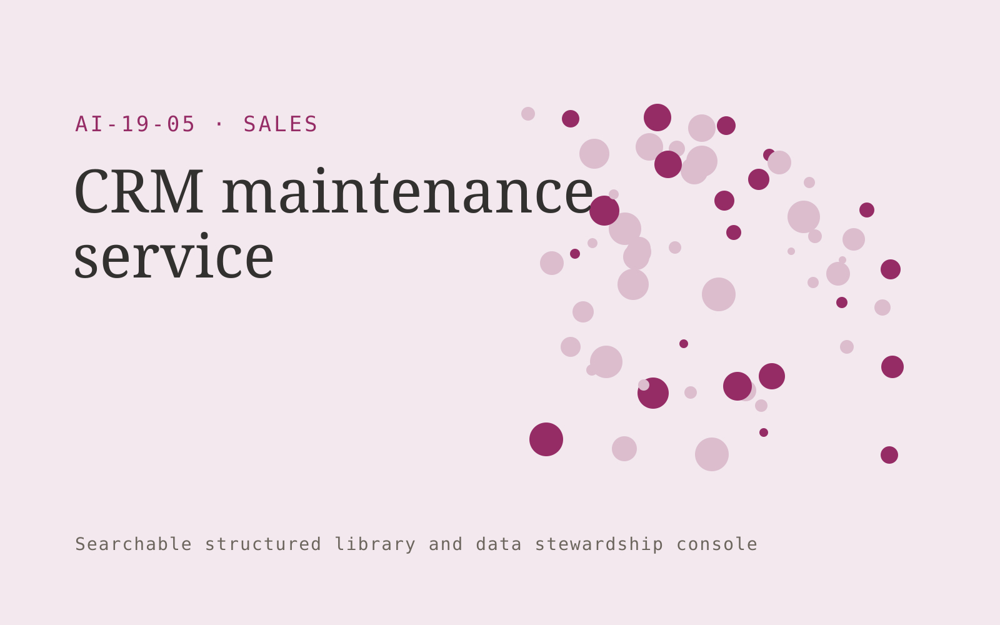

# CRM maintenance service

**Sales** · Also fits: Marketing; Operations; IT and Development

> For revenue operations teams at small B2B firms, turn authorized activity notes and CRM field definitions into approved CRM changes and provenance log. Address the recurring problem: records remain stale after calls and meetings. The value hypothesis is a more complete, reviewable deliverable with less repeated preparation; the pilot must establish whether that benefit is real.

| | |
|---|---|
| **Buyer** | Revenue operations teams at small B2B firms |
| **Problem** | Records remain stale after calls and meetings. |
| **Format** | Searchable structured library and data stewardship console |
| **USP** | Evidence-backed updates that separate confirmed facts from assumptions. |

## The product
Key screens: Update queue, source evidence, duplicate review. Use a searchable table or visual gallery with filters for the domain’s important attributes. Open each item into a detail drawer containing source records, ownership and history. Put proposed merges and field changes in a separate review queue. Provide a preview before any bulk export. In this product, the first view is update queue, followed by source evidence and duplicate review.

## Core functionality
1. Extract confirmed facts.
2. Propose field updates.
3. Link supporting activity.
4. Flag conflicts.
5. Detect duplicate candidates.
6. Require approval before writes.

## Customer workflow
Import a limited collection, define canonical fields, suggest tags or mappings, review uncertain records, publish approved items, search and reuse them, and request periodic owner updates. Start with authorized activity notes and CRM field definitions and finish with approved CRM changes and provenance log.

## AI and human review
Suggest classifications, semantic tags, duplicate candidates and field mappings. Preserve original values. Use explicit validation for identifiers and units. Human stewards approve ambiguous merges and factual changes.

## Customer inputs
Authorized activity notes and CRM field definitions

## Customer deliverables
Approved CRM changes and provenance log

## Accounts and administration
Record ownership, access permissions, change proposals, original-value retention, version history, review dates, bulk import/export and duplicate resolution.

## MVP scope
Begin with revenue operations teams at small B2B firms and one recurring use case. Build the first two modules: extract confirmed facts; propose field updates. Provide operator assistance for the third module: link supporting activity. Deliver approved CRM changes and provenance log through a manual review queue. Perform other necessary full-scope functions manually during the pilot. Include all applicable access, accuracy and professional-review controls from the start.

## After MVP validation
After paid pilots establish value, automate the remaining modules: flag conflicts; detect duplicate candidates; require approval before writes. Add one validated source integration, reusable customer configuration and recurring delivery. Expand to additional teams, document formats or languages only after testing the new scope.

## Build dependencies
Stable identifiers, an agreed data schema, reversible imports, mapping review and source ownership. Data quality work can exceed model development effort.

## Integrations and data access
Approved sales collateral, CRM records and product or pricing information. Source systems, catalog exports and cloud file storage. Start with reversible CSV or file imports and validate identifiers before any direct writes. These are candidate integration categories, not verified supported connectors.

## Defensibility
A useful niche taxonomy, customer-approved mappings and accumulated correction history that improve retrieval and reduce repeated cleanup. For this idea, build around evidence-backed updates that separate confirmed facts from assumptions. This advantage requires execution and accumulated customer trust; the base model alone is not a defensible asset.

## Alternatives and positioning
Spreadsheets, shared folders, existing asset or information management systems and manual data cleanup. Differentiate on this specific proposed advantage: evidence-backed updates that separate confirmed facts from assumptions. Test it against the buyer's current method on the same task. Competitor coverage and uniqueness have not been established.

## Revenue model and test pricing (USD)
Test USD 500-2,500 for one collection cleanup and launch, followed by USD 100-500 monthly for maintenance within agreed record limits. Larger migrations and complex rights management are separately scoped. Prices are hypotheses.

## Main delivery costs
Import cleanup, extraction, storage, indexing, steward review, duplicate investigation and recurring source updates.

## Marketing message to test
> CRM maintenance service for revenue operations teams at small B2B firms. Evidence-backed updates that separate confirmed facts from assumptions. Demonstrate the claim through an activity-to-reviewed-record update demo.

## Acquisition channels
CRM implementation partners

## Lead magnet
An activity-to-reviewed-record update demo

## First 30 days of marketing
- Week 1: interview five prospective buyers in this segment: revenue operations teams at small B2B firms. Ask to see a recent example of the problem and their current process.
- Week 2: prepare this demonstration using authorized or synthetic material: an activity-to-reviewed-record update demo.
- Week 3: present it through CRM implementation partners and seek one narrowly scoped paid pilot.
- Week 4: review accepted field updates, duplicate errors, total delivery effort and a concrete renewal decision before increasing scope.

## Paid pilot and validation
Clean and organize one representative collection. Have users perform real search or mapping tasks. Check every proposed merge in the sample and compare search success with the existing system. For this idea, use authorized activity notes and CRM field definitions and evaluate approved CRM changes and provenance log. Agree success thresholds with the buyer before starting; collect a baseline for accepted field updates, duplicate errors. A positive signal is payment and repeat use with acceptable quality and delivery cost, not a favorable demo reaction alone.

## Success metrics
Accepted field updates, duplicate errors

## Retention and expansion
Provide owner reminders and periodic cleanup. Add another collection only after record quality and retrieval are stable in the initial one.

## Operating controls and limitations
Keep product capabilities and commercial terms verified. Use authorized customer records and require review before outreach, promises or pricing exceptions. Validate source access and reviewer availability during the pilot. Maintain customer-level access, data deletion controls and a record of final approvals.

## Brand style (concept)

- Colors: `#91276c` primary · `#54c989` accent · `#f1e4ec` surface · `#22201e` ink
- Type: Fraunces for headings, Inter for text
- Voice: Direct, upbeat, outcome-focused
- Demo site: [https://nexibeo.com/ideas/crm-maintenance-service/demo/](https://nexibeo.com/ideas/crm-maintenance-service/demo/)

## Investment indication

Indicative build budget, from MVP to full product. This is a planning range, not a quote; it excludes running costs such as model usage, hosting and reviewer hours.

| Phase | Scope | Timeline | Indicative budget |
|---|---|---|---|
| MVP | One buyer segment, one recurring use case; first modules: extract confirmed facts; propose field updates. Manual review in the loop. | 3 weeks | $5,500 |
| Paid pilot | Accounts, roles, review states, audit trail and the first integration, hardened for two to three paying pilot customers. | 4 weeks | $5,000 |
| Full product | Remaining modules: flag conflicts; detect duplicate candidates; require approval before writes. Self-serve onboarding, billing, monitoring and the wider integration set. | 7 weeks | $7,000 |
| **Total** | | 14 weeks | **$17,500** |

### Running costs per month (rough indication, untested)

| Stage | Hosting and infrastructure | AI usage | Total per month |
|---|---|---|---|
| MVP and paid pilot (about 3 customers) | $30–$60 | $50–$100 | **$80–$160** |
| Full product (about 50 customers) | $110–$210 | $350–$700 | **$460–$910** |

**Co-create this project with us:** [contact Nexibeo](https://nexibeo.com/ideas/crm-maintenance-service/#apply) and we build it with you.

## Research status
Concept proposal expanded from the 315-idea conversation. Demand, pricing, differentiation, build scope and integration feasibility are hypotheses, not verified market findings. Category link is inspiration rather than evidence of business viability.

## Credits and next steps

- **Estimation and building this idea:** see the full idea page on [nexibeo.com](https://nexibeo.com/ideas/crm-maintenance-service/) for more detail on estimation, and to co-create and build this idea with Nexibeo.
- **Become an AI-optimized specialist for Sales:** [Complete AI Training](https://completeaitraining.com/certification/12b-ai-certification-for-sales-specialists/).
- Field news: [AI news for Sales](https://completeaitraining.com/all-ai-news-for-sales/).
