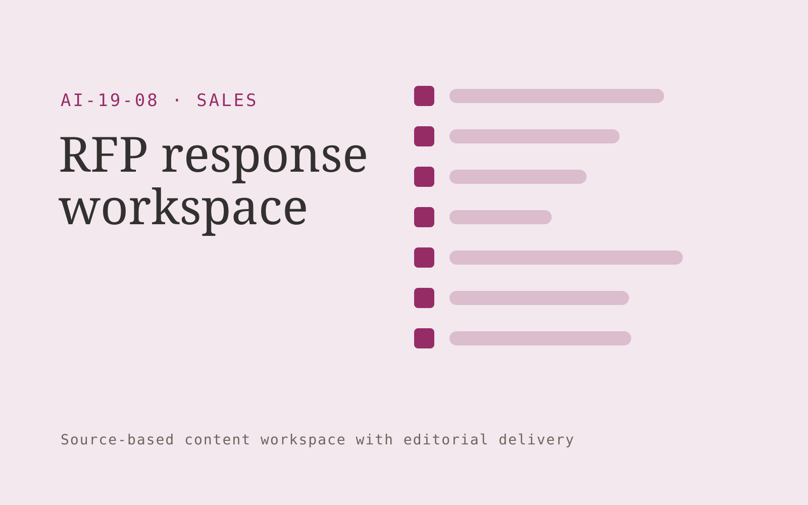

# RFP response workspace

**Sales** · Also fits: Marketing; Operations; Writers

> For sales operations teams at growing software vendors, turn RFP questions and approved product, security and commercial material into reviewed RFP response pack. Address the recurring problem: questionnaires repeat while approved answers become stale. The value hypothesis is a more complete, reviewable deliverable with less repeated preparation; the pilot must establish whether that benefit is real.

| | |
|---|---|
| **Buyer** | Sales operations teams at growing software vendors |
| **Problem** | Questionnaires repeat while approved answers become stale. |
| **Format** | Source-based content workspace with editorial delivery |
| **USP** | Each answer has an owner, source and review status. |

## The product
Key screens: Question matrix, answer sources, reviewer assignments. Use a project list and editorial calendar beside a document editor. Keep original material and supporting passages in a collapsible side panel. Show outline, draft, review and approved stages. Provide tracked edits, comments, version comparisons and an export preview that reflects the final delivery format. In this product, the first view is question matrix, followed by answer sources and reviewer assignments.

## Core functionality
1. Classify questions.
2. Retrieve approved answers.
3. Flag missing evidence.
4. Identify stale claims.
5. Assign specialist review.
6. Export response packages.

## Customer workflow
Collect a structured brief and source material, identify unanswered questions, approve an outline, generate a draft, verify claims, gather reviewer edits, approve a final version and export the agreed formats. Start with RFP questions and approved product, security and commercial material and finish with reviewed RFP response pack.

## AI and human review
Extract and organize information, propose structure, draft prose and adapt approved content to audiences. Attach evidence to factual claims. Keep names, dates, amounts and quoted wording linked to their source. Editors resolve ambiguity and approve publication.

## Customer inputs
RFP questions and approved product, security and commercial material

## Customer deliverables
Reviewed RFP response pack

## Accounts and administration
Client workspaces, source permissions, editorial assignments, change history, reviewer comments, approval gates, revision allowances and export templates.

## MVP scope
Begin with sales operations teams at growing software vendors and one recurring use case. Build the first two modules: classify questions; retrieve approved answers. Provide operator assistance for the third module: flag missing evidence. Deliver reviewed RFP response pack through a manual review queue. Perform other necessary full-scope functions manually during the pilot. Include all applicable access, accuracy and professional-review controls from the start.

## After MVP validation
After paid pilots establish value, automate the remaining modules: identify stale claims; assign specialist review; export response packages. Add one validated source integration, reusable customer configuration and recurring delivery. Expand to additional teams, document formats or languages only after testing the new scope.

## Build dependencies
Document parsing, a source-linked editor, tracked revisions, reviewer workflow and reliable document export. Rich presentation or print output needs format-specific QA.

## Integrations and data access
Approved sales collateral, CRM records and product or pricing information. Document storage, word processor export, content management systems and approved publishing channels. Pilot with uploads and downloadable drafts before adding write integrations. These are candidate integration categories, not verified supported connectors.

## Defensibility
Customer-approved terminology, reusable structures, source libraries and editorial feedback tied to a specific audience and recurring publishing workflow. For this idea, build around each answer has an owner, source and review status. This advantage requires execution and accumulated customer trust; the base model alone is not a defensible asset.

## Alternatives and positioning
Writers, editors, agencies, internal document templates and general-purpose chat tools. Differentiate on this specific proposed advantage: each answer has an owner, source and review status. Test it against the buyer's current method on the same task. Competitor coverage and uniqueness have not been established.

## Revenue model and test pricing (USD)
Test USD 400-1,500 for a tightly scoped initial content package. Convert repeated work to a monthly retainer with explicit deliverable and revision limits. Specialist review and substantial research are separately scoped. Prices are hypotheses.

## Main delivery costs
Research and interview time, transcription, model usage, factual verification, subject-matter review, editing and revisions.

## Marketing message to test
> RFP response workspace for sales operations teams at growing software vendors. Each answer has an owner, source and review status. Demonstrate the claim through an evidence-linked questionnaire response sample.

## Acquisition channels
Proposal management consultants

## Lead magnet
An evidence-linked questionnaire response sample

## First 30 days of marketing
- Week 1: interview five prospective buyers in this segment: sales operations teams at growing software vendors. Ask to see a recent example of the problem and their current process.
- Week 2: prepare this demonstration using authorized or synthetic material: an evidence-linked questionnaire response sample.
- Week 3: present it through proposal management consultants and seek one narrowly scoped paid pilot.
- Week 4: review approved answer reuse, review time, total delivery effort and a concrete renewal decision before increasing scope.

## Paid pilot and validation
Complete one existing brief using the customer’s actual sources. Record reviewer edits, factual corrections and preparation time. Ask the same buyer to commission a second comparable deliverable. For this idea, use RFP questions and approved product, security and commercial material and evaluate reviewed RFP response pack. Agree success thresholds with the buyer before starting; collect a baseline for approved answer reuse, review time. A positive signal is payment and repeat use with acceptable quality and delivery cost, not a favorable demo reaction alone.

## Success metrics
Approved answer reuse, review time

## Retention and expansion
Maintain the approved source and voice library, schedule recurring editorial work, and expand into additional formats only after the core deliverable is repeatedly accepted.

## Operating controls and limitations
Keep product capabilities and commercial terms verified. Use authorized customer records and require review before outreach, promises or pricing exceptions. Validate source access and reviewer availability during the pilot. Maintain customer-level access, data deletion controls and a record of final approvals.

## Brand style (concept)

- Colors: `#912766` primary · `#54c968` accent · `#f1e4ec` surface · `#22201e` ink
- Type: Fraunces for headings, Inter for text
- Voice: Direct, upbeat, outcome-focused
- Demo site: [https://nexibeo.com/ideas/rfp-response-workspace/demo/](https://nexibeo.com/ideas/rfp-response-workspace/demo/)

## Investment indication

Indicative build budget, from MVP to full product. This is a planning range, not a quote; it excludes running costs such as model usage, hosting and reviewer hours. Built with Nexibeo's AI software development factory, most implementations take days to a few weeks of creation time, depending on availability.

| Phase | Scope | Creation time | Indicative budget |
|---|---|---|---|
| MVP | One buyer segment, one recurring use case; first modules: classify questions; retrieve approved answers. Manual review in the loop. | 3 days | $6,000 |
| Paid pilot | Accounts, roles, review states, audit trail and the first integration, hardened for two to three paying pilot customers. | 4 days | $6,000 |
| Full product | Remaining modules: identify stale claims; assign specialist review; export response packages. Self-serve onboarding, billing, monitoring and the wider integration set. | 6 days | $8,000 |
| **Total** | | about 3 weeks | **$20,000** |

### Running costs per month (rough indication, untested)

| Stage | Hosting and infrastructure | AI usage | Total per month |
|---|---|---|---|
| MVP and paid pilot (about 3 customers) | $30–$60 | $70–$140 | **$100–$200** |
| Full product (about 50 customers) | $110–$210 | $700–$1,400 | **$810–$1,610** |

**Co-create this project with us:** [contact Nexibeo](https://nexibeo.com/ideas/rfp-response-workspace/#apply) and we build it with you.

## Research status
Concept proposal expanded from the 315-idea conversation. Demand, pricing, differentiation, build scope and integration feasibility are hypotheses, not verified market findings. Category link is inspiration rather than evidence of business viability.

## Credits and next steps

- **Estimation and building this idea:** see the full idea page on [nexibeo.com](https://nexibeo.com/ideas/rfp-response-workspace/) for more detail on estimation, and to co-create and build this idea with Nexibeo.
- **Become an AI-optimized specialist for Sales:** [Complete AI Training](https://completeaitraining.com/certification/12b-ai-certification-for-sales-specialists/).
- Field news: [AI news for Sales](https://completeaitraining.com/all-ai-news-for-sales/).
