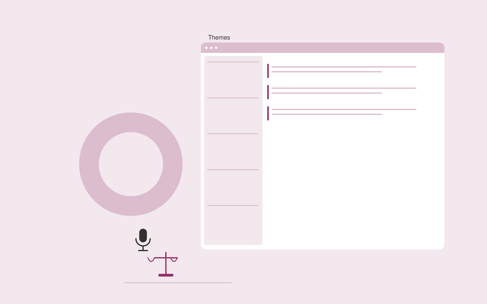

# Win-loss research studio

**AI-19-14 · Sales** · Also fits: Marketing; Operations; Science and Research

> For product marketing leads at B2B vendors, turn consented buyer interviews and confirmed deal context into win-loss evidence report. Address the recurring problem: internal explanations of deals differ from buyers' actual reasons. The value hypothesis is a more complete, reviewable deliverable with less repeated preparation; the pilot must establish whether that benefit is real.

| | |
|---|---|
| **Buyer** | Product marketing leads at B2B vendors |
| **Problem** | Internal explanations of deals differ from buyers' actual reasons. |
| **Format** | Research evidence workspace with reviewed deliverables |
| **USP** | Independent buyer evidence separated from sales team assumptions. |

## The product
Key screens: Interview studies, decision themes, evidence report. Organize work by research question. Show a source library, an evidence matrix and a draft findings panel with linked quotations. Keep contradictory findings and unanswered questions visible. Allow reviewers to inspect the original context before accepting an interpretation. In this product, the first view is interview studies, followed by decision themes and evidence report.

## Core functionality
1. Recruit willing buyers.
2. Prepare neutral questions.
3. Capture decision criteria.
4. Preserve contradictory views.
5. Compare segments.
6. Propose testable changes.

## Customer workflow
Agree the decision and research questions, define permitted sources or participants, collect evidence, code findings, compare supporting and contradictory material, review interpretations, and deliver a cited brief with next questions. Start with consented buyer interviews and confirmed deal context and finish with win-loss evidence report.

## AI and human review
Assist with retrieval, transcription, structured extraction and thematic synthesis. Preserve source passages and methodological context. Human researchers validate inclusion, quotations and conclusions. Use real participants when customer research is required.

## Customer inputs
Consented buyer interviews and confirmed deal context

## Customer deliverables
Win-loss evidence report

## Accounts and administration
Source provenance, participant consent where applicable, research questions, coding definitions, reviewer disagreements, citations and versioned conclusions.

## MVP scope
Begin with product marketing leads at B2B vendors and one recurring use case. Build the first two modules: recruit willing buyers; prepare neutral questions. Provide operator assistance for the third module: capture decision criteria. Deliver win-loss evidence report through a manual review queue. Perform other necessary full-scope functions manually during the pilot. Include all applicable access, accuracy and professional-review controls from the start.

## After MVP validation
After paid pilots establish value, automate the remaining modules: preserve contradictory views; compare segments; propose testable changes. Add one validated source integration, reusable customer configuration and recurring delivery. Expand to additional teams, document formats or languages only after testing the new scope.

## Build dependencies
A clear research protocol, source access, citation tracking and qualified interpretation. Interview work also needs relevant participants and consent management.

## Integrations and data access
Approved sales collateral, CRM records and product or pricing information. Permitted research libraries, interview recording imports, citation exports and document editors. Preserve original source metadata throughout the workflow. These are candidate integration categories, not verified supported connectors.

## Defensibility
Niche research protocols, credible researcher relationships and a rights-cleared evidence archive with consistent interpretation methods. For this idea, build around independent buyer evidence separated from sales team assumptions. This advantage requires execution and accumulated customer trust; the base model alone is not a defensible asset.

## Alternatives and positioning
Research consultants, internal analysts, literature databases and general search or summarization tools. Differentiate on this specific proposed advantage: independent buyer evidence separated from sales team assumptions. Test it against the buyer's current method on the same task. Competitor coverage and uniqueness have not been established.

## Revenue model and test pricing (USD)
Test USD 750-3,000 for one tightly bounded research question and evidence pack. Participant recruitment, specialist review and licensed data are separately scoped. Repeat tracking can become a retainer. Prices are hypotheses.

## Main delivery costs
Researcher time, source access, participant recruitment, transcription, evidence coding, expert review and report revisions.

## Marketing message to test
> Win-loss research studio for product marketing leads at B2B vendors. Independent buyer evidence separated from sales team assumptions. Demonstrate the claim through an anonymized buyer decision study.

## Acquisition channels
Product marketing consultants

## Lead magnet
An anonymized buyer decision study

## First 30 days of marketing
- Week 1: interview five prospective buyers in this segment: product marketing leads at B2B vendors. Ask to see a recent example of the problem and their current process.
- Week 2: prepare this demonstration using authorized or synthetic material: an anonymized buyer decision study.
- Week 3: present it through product marketing consultants and seek one narrowly scoped paid pilot.
- Week 4: review buyer participation, validated improvements, total delivery effort and a concrete renewal decision before increasing scope.

## Paid pilot and validation
Answer one practical question using a bounded evidence set. Ask a domain expert to review citations and reasoning, identify contrary evidence and assess whether the deliverable supports the intended decision. For this idea, use consented buyer interviews and confirmed deal context and evaluate win-loss evidence report. Agree success thresholds with the buyer before starting; collect a baseline for buyer participation, validated improvements. A positive signal is payment and repeat use with acceptable quality and delivery cost, not a favorable demo reaction alone.

## Success metrics
Buyer participation, validated improvements

## Retention and expansion
Maintain the research question and evidence archive, offer follow-up studies and refresh important sources. Build repeat work around the buyer’s decision cycle.

## Operating controls and limitations
Keep product capabilities and commercial terms verified. Use authorized customer records and require review before outreach, promises or pricing exceptions. Validate source access and reviewer availability during the pilot. Maintain customer-level access, data deletion controls and a record of final approvals.

## Brand style (concept)

- Colors: `#912765` primary · `#54c98f` accent · `#f1e4ec` surface · `#22201e` ink
- Type: DM Serif Display for headings, DM Sans for text
- Voice: Direct, upbeat, outcome-focused
- Demo site: [https://nexibeo.com/ideas/win-loss-research-studio/demo/](https://nexibeo.com/ideas/win-loss-research-studio/demo/)

## Investment indication

Indicative build budget, from MVP to full product. This is a planning range, not a quote; it excludes running costs such as model usage, hosting and reviewer hours.

| Phase | Scope | Timeline | Indicative budget |
|---|---|---|---|
| MVP | One buyer segment, one recurring use case; first modules: recruit willing buyers; prepare neutral questions. Manual review in the loop. | 3 weeks | $6,000 |
| Paid pilot | Accounts, roles, review states, audit trail and the first integration, hardened for two to three paying pilot customers. | 5 weeks | $6,000 |
| Full product | Remaining modules: preserve contradictory views; compare segments; propose testable changes. Self-serve onboarding, billing, monitoring and the wider integration set. | 7 weeks | $8,500 |
| **Total** | | 15 weeks | **$20,500** |

**Co-create this project with us:** [contact Nexibeo](https://nexibeo.com/ideas/win-loss-research-studio/#apply) and we build it with you.

## Research status
Concept proposal expanded from the 315-idea conversation. Demand, pricing, differentiation, build scope and integration feasibility are hypotheses, not verified market findings. Category link is inspiration rather than evidence of business viability.

## Credits and next steps

- **Estimation and building this idea:** see the full idea page on [nexibeo.com](https://nexibeo.com/ideas/win-loss-research-studio/) for more detail on estimation, and to co-create and build this idea with Nexibeo.
- **Become an AI-optimized specialist for Sales:** [Complete AI Training](https://completeaitraining.com/certification/12b-ai-certification-for-sales-specialists/).
- Field news: [AI news for Sales](https://completeaitraining.com/all-ai-news-for-sales/).
