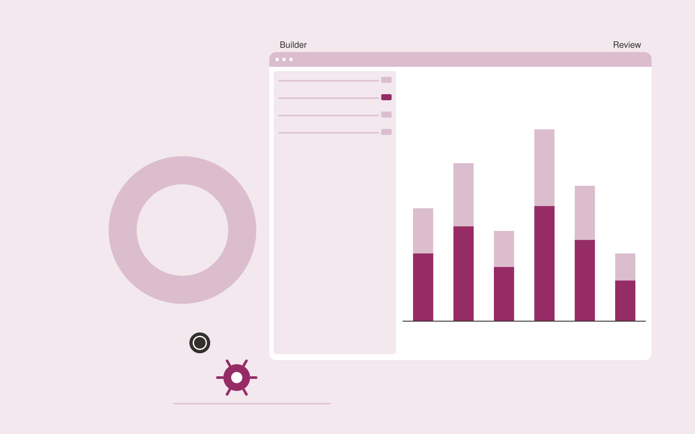

# Quote configuration assistant

**AI-19-15 · Sales** · Also fits: Marketing; Operations; Finance

> For sales teams at specialist equipment distributors, turn approved catalog, compatibility rules and current price lists into reviewed product configuration and quotation. Address the recurring problem: complex configurations produce incompatible or incomplete quotes. The value hypothesis is a more complete, reviewable deliverable with less repeated preparation; the pilot must establish whether that benefit is real.

| | |
|---|---|
| **Buyer** | Sales teams at specialist equipment distributors |
| **Problem** | Complex configurations produce incompatible or incomplete quotes. |
| **Format** | Assumption-driven planning and decision workspace |
| **USP** | Explainable compatibility checks and controlled commercial calculations. |

## The product
Key screens: Requirement intake, configuration builder, quote review. Place editable drivers and constraints beside a clearly labeled scenario output. Include a baseline view, comparison chart or schedule, and an assumptions history. Let users trace a proposed quantity or date back to its inputs. Keep forecasts distinct from actual results. In this product, the first view is requirement intake, followed by configuration builder and quote review.

## Core functionality
1. Collect technical needs.
2. Validate product compatibility.
3. Apply approved options.
4. Calculate supplied prices.
5. Flag missing components.
6. Prepare approval copies.

## Customer workflow
Validate baseline inputs, confirm definitions and constraints, select editable assumptions, calculate feasible alternatives, inspect sensitivities, let the responsible person approve a plan, and compare later actuals with the recorded assumptions. Start with approved catalog, compatibility rules and current price lists and finish with reviewed product configuration and quotation.

## AI and human review
Extract input context and explain scenario differences. Use deterministic calculations or explicit optimization for quantities, compatibility, dates and prices. Show uncertain assumptions. Never let generated prose silently change the calculation rules.

## Customer inputs
Approved catalog, compatibility rules and current price lists

## Customer deliverables
Reviewed product configuration and quotation

## Accounts and administration
Scenario versions, baseline reconciliation, constraint checks, assumption ownership, reviewer approvals, plan exports and actual-versus-plan tracking.

## MVP scope
Begin with sales teams at specialist equipment distributors and one recurring use case. Build the first two modules: collect technical needs; validate product compatibility. Provide operator assistance for the third module: apply approved options. Deliver reviewed product configuration and quotation through a manual review queue. Perform other necessary full-scope functions manually during the pilot. Include all applicable access, accuracy and professional-review controls from the start.

## After MVP validation
After paid pilots establish value, automate the remaining modules: calculate supplied prices; flag missing components; prepare approval copies. Add one validated source integration, reusable customer configuration and recurring delivery. Expand to additional teams, document formats or languages only after testing the new scope.

## Build dependencies
A defensible calculation model, explicit units, constraint validation and representative boundary tests. Advanced forecasting or optimization needs adequate historical data.

## Integrations and data access
Approved sales collateral, CRM records and product or pricing information. Read-only operational exports, calendars and finance or inventory records as relevant. Start with plan exports and retain human approval for execution. These are candidate integration categories, not verified supported connectors.

## Defensibility
A validated domain model, customer-approved constraints and forecast or decision history that improves practical planning. For this idea, build around explainable compatibility checks and controlled commercial calculations. This advantage requires execution and accumulated customer trust; the base model alone is not a defensible asset.

## Alternatives and positioning
Spreadsheets, planners, specialist forecasting tools and existing scheduling or configuration software. Differentiate on this specific proposed advantage: explainable compatibility checks and controlled commercial calculations. Test it against the buyer's current method on the same task. Competitor coverage and uniqueness have not been established.

## Revenue model and test pricing (USD)
Test USD 750-3,000 for a scoped planning setup and review, then USD 200-900 monthly for refreshes within agreed complexity. Data integration and optimization are separately scoped. All ranges are hypotheses.

## Main delivery costs
Data preparation, domain modeling, validation, scenario computation, reviewer support and ongoing assumption maintenance.

## Marketing message to test
> Quote configuration assistant for sales teams at specialist equipment distributors. Explainable compatibility checks and controlled commercial calculations. Demonstrate the claim through a configuration-to-quote demonstration.

## Acquisition channels
Equipment distributor networks

## Lead magnet
A configuration-to-quote demonstration

## First 30 days of marketing
- Week 1: interview five prospective buyers in this segment: sales teams at specialist equipment distributors. Ask to see a recent example of the problem and their current process.
- Week 2: prepare this demonstration using authorized or synthetic material: a configuration-to-quote demonstration.
- Week 3: present it through equipment distributor networks and seek one narrowly scoped paid pilot.
- Week 4: review configuration accuracy, quote preparation time, total delivery effort and a concrete renewal decision before increasing scope.

## Paid pilot and validation
Reproduce a known historical plan, test missing inputs and boundary constraints, then run a new scenario. Compare feasibility, reconciliation and observed error rather than judging the quality of the explanation alone. For this idea, use approved catalog, compatibility rules and current price lists and evaluate reviewed product configuration and quotation. Agree success thresholds with the buyer before starting; collect a baseline for configuration accuracy, quote preparation time. A positive signal is payment and repeat use with acceptable quality and delivery cost, not a favorable demo reaction alone.

## Success metrics
Configuration accuracy, quote preparation time

## Retention and expansion
Refresh inputs, compare recorded assumptions with actual outcomes and refine validated constraints. Expand scenario complexity only when the buyer uses it for a decision.

## Operating controls and limitations
Keep product capabilities and commercial terms verified. Use authorized customer records and require review before outreach, promises or pricing exceptions. Validate source access and reviewer availability during the pilot. Maintain customer-level access, data deletion controls and a record of final approvals.

## Brand style (concept)

- Colors: `#912755` primary · `#54c9ae` accent · `#f1e4ea` surface · `#22201e` ink
- Type: DM Serif Display for headings, DM Sans for text
- Voice: Direct, upbeat, outcome-focused
- Demo site: [https://nexibeo.com/ideas/quote-configuration-assistant/demo/](https://nexibeo.com/ideas/quote-configuration-assistant/demo/)

## Investment indication

Indicative build budget, from MVP to full product. This is a planning range, not a quote; it excludes running costs such as model usage, hosting and reviewer hours.

| Phase | Scope | Timeline | Indicative budget |
|---|---|---|---|
| MVP | One buyer segment, one recurring use case; first modules: collect technical needs; validate product compatibility. Manual review in the loop. | 3 weeks | $5,500 |
| Paid pilot | Accounts, roles, review states, audit trail and the first integration, hardened for two to three paying pilot customers. | 4 weeks | $5,500 |
| Full product | Remaining modules: calculate supplied prices; flag missing components; prepare approval copies. Self-serve onboarding, billing, monitoring and the wider integration set. | 7 weeks | $7,000 |
| **Total** | | 14 weeks | **$18,000** |

**Co-create this project with us:** [contact Nexibeo](https://nexibeo.com/ideas/quote-configuration-assistant/#apply) and we build it with you.

## Research status
Concept proposal expanded from the 315-idea conversation. Demand, pricing, differentiation, build scope and integration feasibility are hypotheses, not verified market findings. Category link is inspiration rather than evidence of business viability.

## Credits and next steps

- **Estimation and building this idea:** see the full idea page on [nexibeo.com](https://nexibeo.com/ideas/quote-configuration-assistant/) for more detail on estimation, and to co-create and build this idea with Nexibeo.
- **Become an AI-optimized specialist for Sales:** [Complete AI Training](https://completeaitraining.com/certification/12b-ai-certification-for-sales-specialists/).
- Field news: [AI news for Sales](https://completeaitraining.com/all-ai-news-for-sales/).
