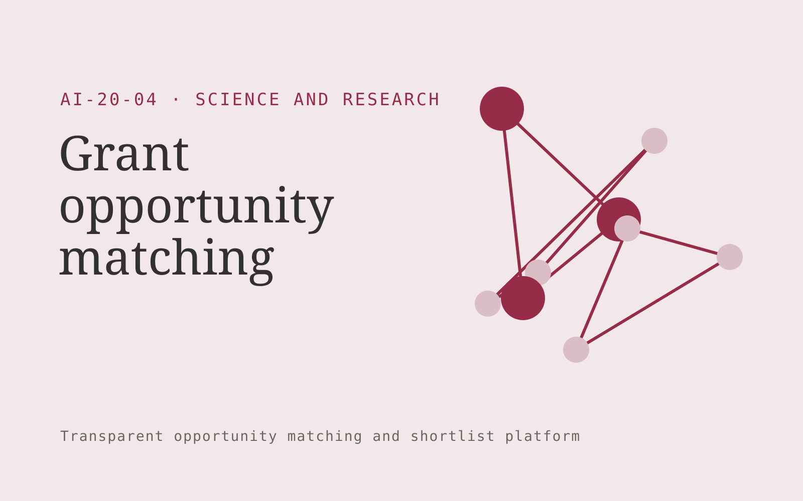

# Grant opportunity matching

**Science and Research** · Also fits: Education; Executives and Strategy; Sales

> For university research support offices, turn published funding calls and researcher-declared project profiles into research funding shortlist. Address the recurring problem: researchers miss suitable calls or pursue ineligible ones. The value hypothesis is a more complete, reviewable deliverable with less repeated preparation; the pilot must establish whether that benefit is real.

| | |
|---|---|
| **Buyer** | University research support offices |
| **Problem** | Researchers miss suitable calls or pursue ineligible ones. |
| **Format** | Transparent opportunity matching and shortlist platform |
| **USP** | Eligibility and collaboration requirements are explicit alongside topic fit. |

## The product
Key screens: Funding watchlist, eligibility evidence, deadline calendar. Open with a filterable opportunity feed and clear fit explanations. Each profile shows source evidence, eligibility conditions and missing information. Keep saved, rejected and needs-review states. Include a deadline or next-action view without hiding the basis of recommendations. In this product, the first view is funding watchlist, followed by eligibility evidence and deadline calendar.

## Core functionality
1. Match research themes.
2. Extract eligibility.
3. Compare institution constraints.
4. Identify partner requirements.
5. Track call revisions.
6. Save pursuit decisions.

## Customer workflow
Define buyer-selected criteria, gather authorized opportunity information, apply explicit eligibility rules, propose matches with evidence, let the user review uncertain conditions, save a shortlist and track the resulting conversations or applications. Start with published funding calls and researcher-declared project profiles and finish with research funding shortlist.

## AI and human review
Extract criteria, normalize opportunity descriptions and explain possible fit. Use explicit rules for hard requirements. Do not invent missing eligibility facts or represent a suggested match as a verified qualification.

## Customer inputs
Published funding calls and researcher-declared project profiles

## Customer deliverables
Research funding shortlist

## Accounts and administration
Editable criteria, dated sources, eligibility evidence, missing-data flags, saved shortlists, rejection reasons, deadline alerts and owner follow-up.

## MVP scope
Begin with university research support offices and one recurring use case. Build the first two modules: match research themes; extract eligibility. Provide operator assistance for the third module: compare institution constraints. Deliver research funding shortlist through a manual review queue. Perform other necessary full-scope functions manually during the pilot. Include all applicable access, accuracy and professional-review controls from the start.

## After MVP validation
After paid pilots establish value, automate the remaining modules: identify partner requirements; track call revisions; save pursuit decisions. Add one validated source integration, reusable customer configuration and recurring delivery. Expand to additional teams, document formats or languages only after testing the new scope.

## Build dependencies
Current source information, explicit eligibility rules, entity identity checks and inspectable fit reasoning. Sparse evidence limits match quality.

## Integrations and data access
Authorized datasets, papers, protocols, code and research records. Permitted opportunity feeds, customer profiles, calendars and CRM exports. Keep initial outreach or applications as user-reviewed drafts. These are candidate integration categories, not verified supported connectors.

## Defensibility
A maintained niche opportunity dataset and documented relevance feedback, supported by relationships with the intended buyer community. For this idea, build around eligibility and collaboration requirements are explicit alongside topic fit. This advantage requires execution and accumulated customer trust; the base model alone is not a defensible asset.

## Alternatives and positioning
Manual research, directories, generic databases, referrals and existing opportunity marketplaces. Differentiate on this specific proposed advantage: eligibility and collaboration requirements are explicit alongside topic fit. Test it against the buyer's current method on the same task. Competitor coverage and uniqueness have not been established.

## Revenue model and test pricing (USD)
Test USD 150-600 monthly for one narrow opportunity feed, or USD 750-2,500 for a bespoke researched shortlist. Price manual verification and custom research explicitly. These are pricing hypotheses.

## Main delivery costs
Source collection, profile updates, entity resolution, eligibility verification, analyst research and customer feedback review.

## Marketing message to test
> Grant opportunity matching for university research support offices. Eligibility and collaboration requirements are explicit alongside topic fit. Demonstrate the claim through a documented funding shortlist for one research group.

## Acquisition channels
Research administration networks

## Lead magnet
A documented funding shortlist for one research group

## First 30 days of marketing
- Week 1: interview five prospective buyers in this segment: university research support offices. Ask to see a recent example of the problem and their current process.
- Week 2: prepare this demonstration using authorized or synthetic material: a documented funding shortlist for one research group.
- Week 3: present it through research administration networks and seek one narrowly scoped paid pilot.
- Week 4: review eligible match rate, useful opportunities, total delivery effort and a concrete renewal decision before increasing scope.

## Paid pilot and validation
Produce a small shortlist and ask the buyer to verify fit independently. Record why each option is accepted or rejected and whether it leads to a useful next step. Review missed eligible options too. For this idea, use published funding calls and researcher-declared project profiles and evaluate research funding shortlist. Agree success thresholds with the buyer before starting; collect a baseline for eligible match rate, useful opportunities. A positive signal is payment and repeat use with acceptable quality and delivery cost, not a favorable demo reaction alone.

## Success metrics
Eligible match rate, useful opportunities

## Retention and expansion
Refresh opportunity profiles, improve criteria from accepted and rejected matches, and offer deeper verification for shortlisted options.

## Operating controls and limitations
Preserve original data, methods, citations and research limitations. Use researcher review and document every substantive transformation. Validate source access and reviewer availability during the pilot. Maintain customer-level access, data deletion controls and a record of final approvals.

## Brand style (concept)

- Colors: `#912747` primary · `#54c9c1` accent · `#f1e4e8` surface · `#22201e` ink
- Type: Playfair Display for headings, Source Sans 3 for text
- Voice: Rigorous, transparent, cited
- Demo site: [https://nexibeo.com/ideas/grant-opportunity-matching/demo/](https://nexibeo.com/ideas/grant-opportunity-matching/demo/)

## Investment indication

Indicative build budget, from MVP to full product. This is a planning range, not a quote; it excludes running costs such as model usage, hosting and reviewer hours.

| Phase | Scope | Timeline | Indicative budget |
|---|---|---|---|
| MVP | One buyer segment, one recurring use case; first modules: match research themes; extract eligibility. Manual review in the loop. | 4 weeks | $7,500 |
| Paid pilot | Accounts, roles, review states, audit trail and the first integration, hardened for two to three paying pilot customers. | 6 weeks | $9,000 |
| Full product | Remaining modules: identify partner requirements; track call revisions; save pursuit decisions. Self-serve onboarding, billing, monitoring and the wider integration set. | 9 weeks | $12,000 |
| **Total** | | 19 weeks | **$28,500** |

**Co-create this project with us:** [contact Nexibeo](https://nexibeo.com/ideas/grant-opportunity-matching/#apply) and we build it with you.

## Research status
Concept proposal expanded from the 315-idea conversation. Demand, pricing, differentiation, build scope and integration feasibility are hypotheses, not verified market findings. Category link is inspiration rather than evidence of business viability.

## Credits and next steps

- **Estimation and building this idea:** see the full idea page on [nexibeo.com](https://nexibeo.com/ideas/grant-opportunity-matching/) for more detail on estimation, and to co-create and build this idea with Nexibeo.
- **Become an AI-optimized specialist for Science and Research:** [Complete AI Training](https://completeaitraining.com/tag/science-and-research/?contentType=ai-certification).
- Field news: [AI news for Science and Research](https://completeaitraining.com/all-ai-news-for-science-and-research/).
