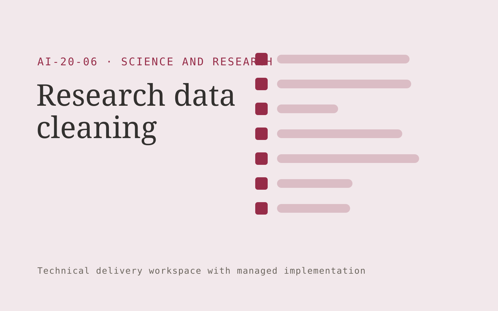

# Research data cleaning

**Science and Research** · Also fits: Education; Executives and Strategy; IT and Development

> For research groups with messy observational datasets, turn authorized datasets, data dictionaries and cleaning rules into cleaned dataset and transformation script. Address the recurring problem: undocumented cleaning steps undermine subsequent analysis. The value hypothesis is a more complete, reviewable deliverable with less repeated preparation; the pilot must establish whether that benefit is real.

| | |
|---|---|
| **Buyer** | Research groups with messy observational datasets |
| **Problem** | Undocumented cleaning steps undermine subsequent analysis. |
| **Format** | Technical delivery workspace with managed implementation |
| **USP** | Reversible, documented transformations with researcher-approved rules. |

## The product
Key screens: Data profile, transformation preview, provenance log. Show a work backlog, proposed changes and verification results. Link each item to its source configuration, code or data mapping. Provide execution logs and an owner-facing health view. Keep environments and approval states clearly separated so a draft cannot be mistaken for a live change. In this product, the first view is data profile, followed by transformation preview and provenance log.

## Core functionality
1. Profile missing values.
2. Detect inconsistent coding.
3. Propose transformations.
4. Preserve raw data.
5. Generate reproducible scripts.
6. Validate reviewed outputs.

## Customer workflow
Scope one technical task, inspect authorized material, propose an implementation, build in a controlled environment, run relevant checks, obtain the required change approval, deliver with recovery instructions, and monitor the agreed operating scope. Start with authorized datasets, data dictionaries and cleaning rules and finish with cleaned dataset and transformation script.

## AI and human review
Explain code or configuration, draft transformations and propose technical changes. Execute deterministic validation and meaningful tests. Engineers review correctness, access handling and failure behavior before deployment.

## Customer inputs
Authorized datasets, data dictionaries and cleaning rules

## Customer deliverables
Cleaned dataset and transformation script

## Accounts and administration
Project access, environment separation, versioned changes, test evidence, owner approvals, execution logs, rollback instructions and incident handling.

## MVP scope
Begin with research groups with messy observational datasets and one recurring use case. Build the first two modules: profile missing values; detect inconsistent coding. Provide operator assistance for the third module: propose transformations. Deliver cleaned dataset and transformation script through a manual review queue. Perform other necessary full-scope functions manually during the pilot. Include all applicable access, accuracy and professional-review controls from the start.

## After MVP validation
After paid pilots establish value, automate the remaining modules: preserve raw data; generate reproducible scripts; validate reviewed outputs. Add one validated source integration, reusable customer configuration and recurring delivery. Expand to additional teams, document formats or languages only after testing the new scope.

## Build dependencies
Authorized technical access, suitable test environments, documented APIs or schemas, secrets management, meaningful checks and recovery procedures.

## Integrations and data access
Authorized datasets, papers, protocols, code and research records. Approved repositories, application APIs, execution platforms and monitoring systems. Validate current API access and behavior during discovery before promising compatibility. These are candidate integration categories, not verified supported connectors.

## Defensibility
Reliable niche implementations, integration knowledge, representative tests and ongoing operational responsibility. For this idea, build around reversible, documented transformations with researcher-approved rules. This advantage requires execution and accumulated customer trust; the base model alone is not a defensible asset.

## Alternatives and positioning
Developers, system integrators, existing automation products and internal engineering work. Differentiate on this specific proposed advantage: reversible, documented transformations with researcher-approved rules. Test it against the buyer's current method on the same task. Competitor coverage and uniqueness have not been established.

## Revenue model and test pricing (USD)
Test USD 1,000-4,000 for one bounded implementation or technical review, then USD 200-1,000 monthly for defined maintenance. Hosting, vendor fees and major feature changes are separate. Prices are hypotheses.

## Main delivery costs
Engineering, testing, cloud execution, third-party API fees, monitoring, incident response and vendor-change maintenance.

## Marketing message to test
> Research data cleaning for research groups with messy observational datasets. Reversible, documented transformations with researcher-approved rules. Demonstrate the claim through a reproducible cleaning report on a sample dataset.

## Acquisition channels
Research data management services

## Lead magnet
A reproducible cleaning report on a sample dataset

## First 30 days of marketing
- Week 1: interview five prospective buyers in this segment: research groups with messy observational datasets. Ask to see a recent example of the problem and their current process.
- Week 2: prepare this demonstration using authorized or synthetic material: a reproducible cleaning report on a sample dataset.
- Week 3: present it through research data management services and seek one narrowly scoped paid pilot.
- Week 4: review verified transformations, reproducibility, total delivery effort and a concrete renewal decision before increasing scope.

## Paid pilot and validation
Implement one bounded task in a safe test environment. Demonstrate normal operation, failure handling and recovery with representative inputs. Have the responsible technical owner review the results. For this idea, use authorized datasets, data dictionaries and cleaning rules and evaluate cleaned dataset and transformation script. Agree success thresholds with the buyer before starting; collect a baseline for verified transformations, reproducibility. A positive signal is payment and repeat use with acceptable quality and delivery cost, not a favorable demo reaction alone.

## Success metrics
Verified transformations, reproducibility

## Retention and expansion
Maintain agreed integrations or technical assets, review failures and upstream changes, and sell additional scoped work only after the first implementation is stable.

## Operating controls and limitations
Preserve original data, methods, citations and research limitations. Use researcher review and document every substantive transformation. Validate source access and reviewer availability during the pilot. Maintain customer-level access, data deletion controls and a record of final approvals.

## Brand style (concept)

- Colors: `#912751` primary · `#54c981` accent · `#f1e4e9` surface · `#22201e` ink
- Type: Playfair Display for headings, Source Sans 3 for text
- Voice: Rigorous, transparent, cited
- Demo site: [https://nexibeo.com/ideas/research-data-cleaning/demo/](https://nexibeo.com/ideas/research-data-cleaning/demo/)

## Investment indication

Indicative build budget, from MVP to full product. This is a planning range, not a quote; it excludes running costs such as model usage, hosting and reviewer hours.

| Phase | Scope | Timeline | Indicative budget |
|---|---|---|---|
| MVP | One buyer segment, one recurring use case; first modules: profile missing values; detect inconsistent coding. Manual review in the loop. | 5 weeks | $10,000 |
| Paid pilot | Accounts, roles, review states, audit trail and the first integration, hardened for two to three paying pilot customers. | 7 weeks | $12,500 |
| Full product | Remaining modules: preserve raw data; generate reproducible scripts; validate reviewed outputs. Self-serve onboarding, billing, monitoring and the wider integration set. | 12 weeks | $17,000 |
| **Total** | | 24 weeks | **$39,500** |

### Running costs per month (rough indication, untested)

| Stage | Hosting and infrastructure | AI usage | Total per month |
|---|---|---|---|
| MVP and paid pilot (about 3 customers) | $30–$60 | $60–$120 | **$90–$180** |
| Full product (about 50 customers) | $110–$210 | $530–$1,050 | **$640–$1,260** |

**Co-create this project with us:** [contact Nexibeo](https://nexibeo.com/ideas/research-data-cleaning/#apply) and we build it with you.

## Research status
Concept proposal expanded from the 315-idea conversation. Demand, pricing, differentiation, build scope and integration feasibility are hypotheses, not verified market findings. Category link is inspiration rather than evidence of business viability.

## Credits and next steps

- **Estimation and building this idea:** see the full idea page on [nexibeo.com](https://nexibeo.com/ideas/research-data-cleaning/) for more detail on estimation, and to co-create and build this idea with Nexibeo.
- **Become an AI-optimized specialist for Science and Research:** [Complete AI Training](https://completeaitraining.com/tag/science-and-research/?contentType=ai-certification).
- Field news: [AI news for Science and Research](https://completeaitraining.com/all-ai-news-for-science-and-research/).
