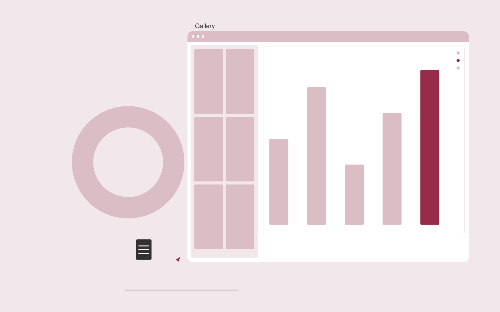

# Scientific figure studio

**Science and Research** · Also fits: Education; Executives and Strategy; Creatives

> For researchers preparing manuscripts and presentations, turn verified analysis outputs and publication requirements into publication-ready figures and captions. Address the recurring problem: valid results are communicated through unclear figures. The value hypothesis is a more complete, reviewable deliverable with less repeated preparation; the pilot must establish whether that benefit is real.

| | |
|---|---|
| **Buyer** | Researchers preparing manuscripts and presentations |
| **Problem** | Valid results are communicated through unclear figures. |
| **Format** | Visual production platform with managed creative review |
| **USP** | Visual clarity with traceability to the supplied numerical results. |

## The product
Key screens: Figure gallery, chart editor, caption review. Use a thumbnail gallery for projects, a large central editing canvas, and a right-hand panel for references, constraints and comments. Let users compare versions side by side. Display draft, changes requested and approved states. Provide a client preview link with comments anchored to the relevant asset. In this product, the first view is figure gallery, followed by chart editor and caption review.

## Core functionality
1. Choose appropriate encodings.
2. Preserve numerical values.
3. Check labels and units.
4. Apply consistent styles.
5. Draft factual captions.
6. Export publication formats.

## Customer workflow
Create a brief, upload reference material, choose constraints, review a small set of directions, refine the selected direction, request client approval, and export a versioned delivery pack. Start with verified analysis outputs and publication requirements and finish with publication-ready figures and captions.

## AI and human review
Use language models to interpret briefs and visual models where appropriate to generate or adapt assets. Keep factual attributes in structured fields. Validate dimensions and export formats through deterministic checks. A creative reviewer confirms visual quality and fidelity before delivery.

## Customer inputs
Verified analysis outputs and publication requirements

## Customer deliverables
Publication-ready figures and captions

## Accounts and administration
Project ownership, asset versions, client comments, approval states, usage allowances, revision limits, download history and a rights record for supplied material.

## MVP scope
Begin with researchers preparing manuscripts and presentations and one recurring use case. Build the first two modules: choose appropriate encodings; preserve numerical values. Provide operator assistance for the third module: check labels and units. Deliver publication-ready figures and captions through a manual review queue. Perform other necessary full-scope functions manually during the pilot. Include all applicable access, accuracy and professional-review controls from the start.

## After MVP validation
After paid pilots establish value, automate the remaining modules: apply consistent styles; draft factual captions; export publication formats. Add one validated source integration, reusable customer configuration and recurring delivery. Expand to additional teams, document formats or languages only after testing the new scope.

## Build dependencies
Asset upload and preview, asynchronous generation jobs, editable version history, reviewer access and tested export formats. High-fidelity production requires specialist creative QA.

## Integrations and data access
Authorized datasets, papers, protocols, code and research records. Cloud asset storage, design-file import/export and publishing destinations. Start with file exchange and validate destination specifications before promising direct publishing. These are candidate integration categories, not verified supported connectors.

## Defensibility
A reusable library of approved styles, production constraints and review examples, together with reliable delivery for a narrow creative niche. For this idea, build around visual clarity with traceability to the supplied numerical results. This advantage requires execution and accumulated customer trust; the base model alone is not a defensible asset.

## Alternatives and positioning
Freelancers, creative agencies, generic generation tools and existing design applications. Differentiate on this specific proposed advantage: visual clarity with traceability to the supplied numerical results. Test it against the buyer's current method on the same task. Competitor coverage and uniqueness have not been established.

## Revenue model and test pricing (USD)
Test a USD 300-1,500 fixed pilot for one defined asset package. Offer a monthly production allowance after repeat demand. Quote complex video, 3D or specialist design separately. These are test prices, not market benchmarks.

## Main delivery costs
Generation attempts, video or image processing, storage, reviewer hours, client revision rounds and licensed source assets.

## Marketing message to test
> Scientific figure studio for researchers preparing manuscripts and presentations. Visual clarity with traceability to the supplied numerical results. Demonstrate the claim through a before-and-after research figure redesign.

## Acquisition channels
Academic editing services

## Lead magnet
A before-and-after research figure redesign

## First 30 days of marketing
- Week 1: interview five prospective buyers in this segment: researchers preparing manuscripts and presentations. Ask to see a recent example of the problem and their current process.
- Week 2: prepare this demonstration using authorized or synthetic material: a before-and-after research figure redesign.
- Week 3: present it through academic editing services and seek one narrowly scoped paid pilot.
- Week 4: review numerical fidelity, researcher acceptance, total delivery effort and a concrete renewal decision before increasing scope.

## Paid pilot and validation
Deliver one real creative brief with a capped asset count and revision allowance. Compare usable deliverables, reviewer time and client acceptance with the existing production method. For this idea, use verified analysis outputs and publication requirements and evaluate publication-ready figures and captions. Agree success thresholds with the buyer before starting; collect a baseline for numerical fidelity, researcher acceptance. A positive signal is payment and repeat use with acceptable quality and delivery cost, not a favorable demo reaction alone.

## Success metrics
Numerical fidelity, researcher acceptance

## Retention and expansion
Save approved styles and constraints, offer repeat production batches, and expand only into adjacent asset formats the same buyer already commissions.

## Operating controls and limitations
Preserve original data, methods, citations and research limitations. Use researcher review and document every substantive transformation. Validate source access and reviewer availability during the pilot. Maintain customer-level access, data deletion controls and a record of final approvals.

## Brand style (concept)

- Colors: `#912731` primary · `#54c9bd` accent · `#f1e4e6` surface · `#22201e` ink
- Type: Playfair Display for headings, Source Sans 3 for text
- Voice: Rigorous, transparent, cited
- Demo site: [https://nexibeo.com/ideas/scientific-figure-studio/demo/](https://nexibeo.com/ideas/scientific-figure-studio/demo/)

## Investment indication

Indicative build budget, from MVP to full product. This is a planning range, not a quote; it excludes running costs such as model usage, hosting and reviewer hours.

| Phase | Scope | Timeline | Indicative budget |
|---|---|---|---|
| MVP | One buyer segment, one recurring use case; first modules: choose appropriate encodings; preserve numerical values. Manual review in the loop. | 6 weeks | $11,500 |
| Paid pilot | Accounts, roles, review states, audit trail and the first integration, hardened for two to three paying pilot customers. | 8 weeks | $14,500 |
| Full product | Remaining modules: apply consistent styles; draft factual captions; export publication formats. Self-serve onboarding, billing, monitoring and the wider integration set. | 13 weeks | $20,500 |
| **Total** | | 27 weeks | **$46,500** |

**Co-create this project with us:** [contact Nexibeo](https://nexibeo.com/ideas/scientific-figure-studio/#apply) and we build it with you.

## Research status
Concept proposal expanded from the 315-idea conversation. Demand, pricing, differentiation, build scope and integration feasibility are hypotheses, not verified market findings. Category link is inspiration rather than evidence of business viability.

## Credits and next steps

- **Estimation and building this idea:** see the full idea page on [nexibeo.com](https://nexibeo.com/ideas/scientific-figure-studio/) for more detail on estimation, and to co-create and build this idea with Nexibeo.
- **Become an AI-optimized specialist for Science and Research:** [Complete AI Training](https://completeaitraining.com/tag/science-and-research/?contentType=ai-certification).
- Field news: [AI news for Science and Research](https://completeaitraining.com/all-ai-news-for-science-and-research/).
