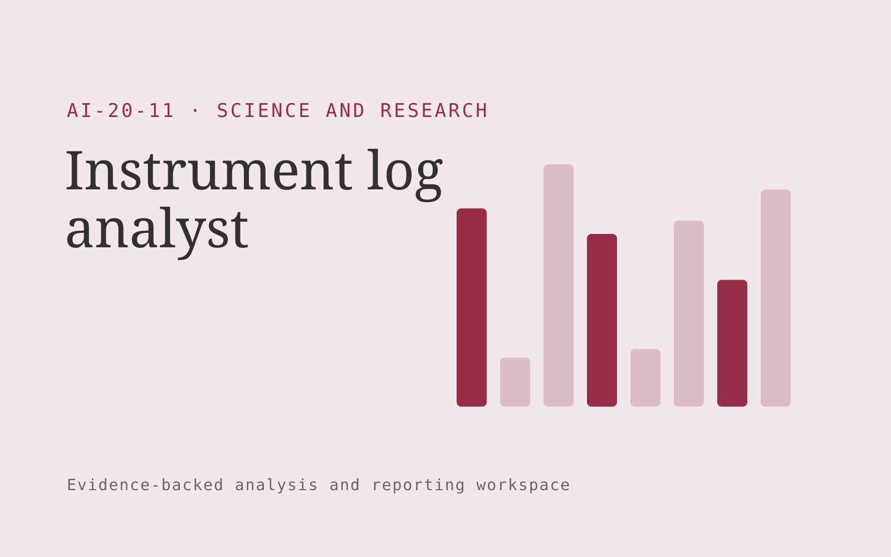

# Instrument log analyst

**Science and Research** · Also fits: Education; Executives and Strategy

> For laboratory equipment managers, turn authorized equipment logs and maintenance history into instrument investigation brief. Address the recurring problem: maintenance signals are buried in unstructured instrument records. The value hypothesis is a more complete, reviewable deliverable with less repeated preparation; the pilot must establish whether that benefit is real.

| | |
|---|---|
| **Buyer** | Laboratory equipment managers |
| **Problem** | Maintenance signals are buried in unstructured instrument records. |
| **Format** | Evidence-backed analysis and reporting workspace |
| **USP** | Equipment-specific context with evidence for investigation rather than automatic diagnosis. |

## The product
Key screens: Instrument timeline, anomaly evidence, service tasks. Open with a compact overview and filters for the relevant period or segment. Let users drill from each theme or metric into underlying records. Keep source definitions and missing-data notes near the result. Use an action panel to assign investigations and record what was learned. In this product, the first view is instrument timeline, followed by anomaly evidence and service tasks.

## Core functionality
1. Parse log events.
2. Align timestamps.
3. Identify unusual patterns.
4. Compare maintenance periods.
5. Flag investigation candidates.
6. Record technician conclusions.

## Customer workflow
Agree definitions, import authorized data, validate coverage and identifiers, compute transparent measures, group relevant evidence, review findings, assign investigations or improvements, and repeat on a comparable period. Start with authorized equipment logs and maintenance history and finish with instrument investigation brief.

## AI and human review
Classify text, summarize evidence and propose explanations to investigate. Compute financial or operational measures with deterministic code. Separate observed patterns from causal claims and preserve examples that contradict the summary.

## Customer inputs
Authorized equipment logs and maintenance history

## Customer deliverables
Instrument investigation brief

## Accounts and administration
Dataset permissions, field mappings, metric definitions, source drill-down, saved filters, reviewer annotations, recurring reports and action ownership.

## MVP scope
Begin with laboratory equipment managers and one recurring use case. Build the first two modules: parse log events; align timestamps. Provide operator assistance for the third module: identify unusual patterns. Deliver instrument investigation brief through a manual review queue. Perform other necessary full-scope functions manually during the pilot. Include all applicable access, accuracy and professional-review controls from the start.

## After MVP validation
After paid pilots establish value, automate the remaining modules: compare maintenance periods; flag investigation candidates; record technician conclusions. Add one validated source integration, reusable customer configuration and recurring delivery. Expand to additional teams, document formats or languages only after testing the new scope.

## Build dependencies
Stable identifiers, consistent metric definitions, deterministic calculations, source lineage and representative review samples. Poor coverage must remain visible.

## Integrations and data access
Authorized datasets, papers, protocols, code and research records. Read-only business data exports, reporting databases and task trackers. Reconcile source totals before scheduling recurring data refreshes. These are candidate integration categories, not verified supported connectors.

## Defensibility
Domain-specific definitions, trusted source mappings and a history connecting findings to actions and observed results. For this idea, build around equipment-specific context with evidence for investigation rather than automatic diagnosis. This advantage requires execution and accumulated customer trust; the base model alone is not a defensible asset.

## Alternatives and positioning
Analysts, business intelligence dashboards, spreadsheets and general text summarization tools. Differentiate on this specific proposed advantage: equipment-specific context with evidence for investigation rather than automatic diagnosis. Test it against the buyer's current method on the same task. Competitor coverage and uniqueness have not been established.

## Revenue model and test pricing (USD)
Test USD 500-2,000 for an initial analysis of one bounded dataset. Offer USD 250-1,000 monthly for repeat reporting at agreed volume. Data cleanup and specialist analysis are separately priced. These are test ranges.

## Main delivery costs
Data preparation, reconciliation, classification, expert interpretation, customer-specific definitions and recurring reporting support.

## Marketing message to test
> Instrument log analyst for laboratory equipment managers. Equipment-specific context with evidence for investigation rather than automatic diagnosis. Demonstrate the claim through a retrospective instrument-log pattern report.

## Acquisition channels
Laboratory service providers

## Lead magnet
A retrospective instrument-log pattern report

## First 30 days of marketing
- Week 1: interview five prospective buyers in this segment: laboratory equipment managers. Ask to see a recent example of the problem and their current process.
- Week 2: prepare this demonstration using authorized or synthetic material: a retrospective instrument-log pattern report.
- Week 3: present it through laboratory service providers and seek one narrowly scoped paid pilot.
- Week 4: review confirmed useful alerts, false alarms, total delivery effort and a concrete renewal decision before increasing scope.

## Paid pilot and validation
Analyze one historical period and review findings with the responsible domain owner. Reconcile headline measures, inspect counterexamples and ask the buyer to choose a concrete follow-up action. For this idea, use authorized equipment logs and maintenance history and evaluate instrument investigation brief. Agree success thresholds with the buyer before starting; collect a baseline for confirmed useful alerts, false alarms. A positive signal is payment and repeat use with acceptable quality and delivery cost, not a favorable demo reaction alone.

## Success metrics
Confirmed useful alerts, false alarms

## Retention and expansion
Repeat the same definitions each reporting period and track whether findings lead to useful action. Expand data sources without breaking historical comparability.

## Operating controls and limitations
Preserve original data, methods, citations and research limitations. Use researcher review and document every substantive transformation. Validate source access and reviewer availability during the pilot. Maintain customer-level access, data deletion controls and a record of final approvals.

## Brand style (concept)

- Colors: `#912735` primary · `#54c9ba` accent · `#f1e4e6` surface · `#22201e` ink
- Type: Sora for headings, Work Sans for text
- Voice: Rigorous, transparent, cited
- Demo site: [https://nexibeo.com/ideas/instrument-log-analyst/demo/](https://nexibeo.com/ideas/instrument-log-analyst/demo/)

## Investment indication

Indicative build budget, from MVP to full product. This is a planning range, not a quote; it excludes running costs such as model usage, hosting and reviewer hours.

| Phase | Scope | Timeline | Indicative budget |
|---|---|---|---|
| MVP | One buyer segment, one recurring use case; first modules: parse log events; align timestamps. Manual review in the loop. | 4 weeks | $7,000 |
| Paid pilot | Accounts, roles, review states, audit trail and the first integration, hardened for two to three paying pilot customers. | 5 weeks | $7,500 |
| Full product | Remaining modules: compare maintenance periods; flag investigation candidates; record technician conclusions. Self-serve onboarding, billing, monitoring and the wider integration set. | 8 weeks | $10,000 |
| **Total** | | 17 weeks | **$24,500** |

**Co-create this project with us:** [contact Nexibeo](https://nexibeo.com/ideas/instrument-log-analyst/#apply) and we build it with you.

## Research status
Concept proposal expanded from the 315-idea conversation. Demand, pricing, differentiation, build scope and integration feasibility are hypotheses, not verified market findings. Category link is inspiration rather than evidence of business viability.

## Credits and next steps

- **Estimation and building this idea:** see the full idea page on [nexibeo.com](https://nexibeo.com/ideas/instrument-log-analyst/) for more detail on estimation, and to co-create and build this idea with Nexibeo.
- **Become an AI-optimized specialist for Science and Research:** [Complete AI Training](https://completeaitraining.com/tag/science-and-research/?contentType=ai-certification).
- Field news: [AI news for Science and Research](https://completeaitraining.com/all-ai-news-for-science-and-research/).
