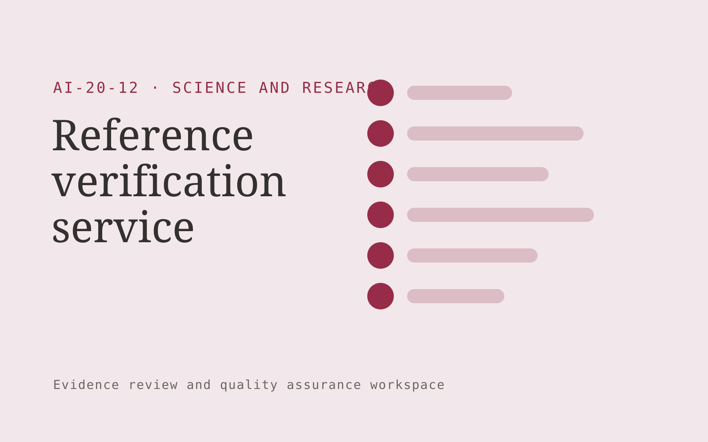

# Reference verification service

**AI-20-12 · Science and Research** · Also fits: Education; Executives and Strategy; Operations

> For research publishers and manuscript authors, turn manuscripts, bibliographies and accessible original sources into reference verification report. Address the recurring problem: references may be incorrect or fail to support claims. The value hypothesis is a more complete, reviewable deliverable with less repeated preparation; the pilot must establish whether that benefit is real.

| | |
|---|---|
| **Buyer** | Research publishers and manuscript authors |
| **Problem** | References may be incorrect or fail to support claims. |
| **Format** | Evidence review and quality assurance workspace |
| **USP** | Checks both reference identity and the associated factual claim. |

## The product
Key screens: Citation inventory, source passages, reviewer verdict. Open on a review queue ordered by reviewer-selected priorities. Show each finding beside the original evidence and applicable rule. Provide accept, dismiss and needs-information controls with reasons. A separate report view summarizes confirmed findings and unresolved items, not raw AI flags. In this product, the first view is citation inventory, followed by source passages and reviewer verdict.

## Core functionality
1. Resolve bibliographic records.
2. Check quoted text.
3. Inspect claim support.
4. Flag unavailable sources.
5. Identify retraction notices when supplied.
6. Record reviewer decisions.

## Customer workflow
Agree review criteria, ingest a sample, generate candidate findings, inspect supporting evidence, let reviewers confirm or dismiss each item, assign corrections, and recheck the affected material. Start with manuscripts, bibliographies and accessible original sources and finish with reference verification report.

## AI and human review
Propose possible inconsistencies, omissions and rubric matches. Combine extraction with deterministic checks where rules are explicit. Reviewers make the final judgment. Keep false positives and missed cases visible during evaluation.

## Customer inputs
Manuscripts, bibliographies and accessible original sources

## Customer deliverables
Reference verification report

## Accounts and administration
Versioned review criteria, evidence links, reviewer decisions, disagreement handling, correction assignments, recheck status and exportable review history.

## MVP scope
Begin with research publishers and manuscript authors and one recurring use case. Build the first two modules: resolve bibliographic records; check quoted text. Provide operator assistance for the third module: inspect claim support. Deliver reference verification report through a manual review queue. Perform other necessary full-scope functions manually during the pilot. Include all applicable access, accuracy and professional-review controls from the start.

## After MVP validation
After paid pilots establish value, automate the remaining modules: flag unavailable sources; identify retraction notices when supplied; record reviewer decisions. Add one validated source integration, reusable customer configuration and recurring delivery. Expand to additional teams, document formats or languages only after testing the new scope.

## Build dependencies
Evidence coordinates, versioned rules, reviewer decisions and a representative reference set. Measure misses as well as confirmed findings before scaling.

## Integrations and data access
Authorized datasets, papers, protocols, code and research records. Source repositories, task trackers and report exports. Keep findings as review proposals until authorized owners accept the resulting actions. These are candidate integration categories, not verified supported connectors.

## Defensibility
A domain-specific review rubric and rights-cleared examples of confirmed defects, false alarms and reviewer reasoning. For this idea, build around checks both reference identity and the associated factual claim. This advantage requires execution and accumulated customer trust; the base model alone is not a defensible asset.

## Alternatives and positioning
Manual reviewers, checklists, generic scanning tools and specialist audit services. Differentiate on this specific proposed advantage: checks both reference identity and the associated factual claim. Test it against the buyer's current method on the same task. Competitor coverage and uniqueness have not been established.

## Revenue model and test pricing (USD)
Test USD 500-2,000 for a defined audit sample and report. Offer recurring review priced by reviewed items and specialist hours. Software-only access can follow a reliable reviewed service. All prices require validation.

## Main delivery costs
Document or media processing, model evaluation, expert review, false-positive handling, rechecks and customer-specific rubric calibration.

## Marketing message to test
> Reference verification service for research publishers and manuscript authors. Checks both reference identity and the associated factual claim. Demonstrate the claim through an annotated reference audit of one manuscript section.

## Acquisition channels
Academic editing companies

## Lead magnet
An annotated reference audit of one manuscript section

## First 30 days of marketing
- Week 1: interview five prospective buyers in this segment: research publishers and manuscript authors. Ask to see a recent example of the problem and their current process.
- Week 2: prepare this demonstration using authorized or synthetic material: an annotated reference audit of one manuscript section.
- Week 3: present it through academic editing companies and seek one narrowly scoped paid pilot.
- Week 4: review confirmed citation defects, false alarms, total delivery effort and a concrete renewal decision before increasing scope.

## Paid pilot and validation
Have a qualified reviewer independently assess the same sample. Compare confirmed findings, false alarms and omissions. Repeat on unseen material before agreeing recurring volume. For this idea, use manuscripts, bibliographies and accessible original sources and evaluate reference verification report. Agree success thresholds with the buyer before starting; collect a baseline for confirmed citation defects, false alarms. A positive signal is payment and repeat use with acceptable quality and delivery cost, not a favorable demo reaction alone.

## Success metrics
Confirmed citation defects, false alarms

## Retention and expansion
Offer recurring reviews and rechecks of previously confirmed issues. Expand document or case types after validating the new rubric with qualified reviewers.

## Operating controls and limitations
Preserve original data, methods, citations and research limitations. Use researcher review and document every substantive transformation. Validate source access and reviewer availability during the pilot. Maintain customer-level access, data deletion controls and a record of final approvals.

## Brand style (concept)

- Colors: `#91274f` primary · `#54c9aa` accent · `#f1e4e9` surface · `#22201e` ink
- Type: Sora for headings, Work Sans for text
- Voice: Rigorous, transparent, cited
- Demo site: [https://nexibeo.com/ideas/reference-verification-service/demo/](https://nexibeo.com/ideas/reference-verification-service/demo/)

## Investment indication

Indicative build budget, from MVP to full product. This is a planning range, not a quote; it excludes running costs such as model usage, hosting and reviewer hours.

| Phase | Scope | Timeline | Indicative budget |
|---|---|---|---|
| MVP | One buyer segment, one recurring use case; first modules: resolve bibliographic records; check quoted text. Manual review in the loop. | 4 weeks | $7,000 |
| Paid pilot | Accounts, roles, review states, audit trail and the first integration, hardened for two to three paying pilot customers. | 5 weeks | $7,500 |
| Full product | Remaining modules: flag unavailable sources; identify retraction notices when supplied; record reviewer decisions. Self-serve onboarding, billing, monitoring and the wider integration set. | 8 weeks | $10,000 |
| **Total** | | 17 weeks | **$24,500** |

**Co-create this project with us:** [contact Nexibeo](https://nexibeo.com/ideas/reference-verification-service/#apply) and we build it with you.

## Research status
Concept proposal expanded from the 315-idea conversation. Demand, pricing, differentiation, build scope and integration feasibility are hypotheses, not verified market findings. Category link is inspiration rather than evidence of business viability.

## Credits and next steps

- **Estimation and building this idea:** see the full idea page on [nexibeo.com](https://nexibeo.com/ideas/reference-verification-service/) for more detail on estimation, and to co-create and build this idea with Nexibeo.
- **Become an AI-optimized specialist for Science and Research:** [Complete AI Training](https://completeaitraining.com/tag/science-and-research/?contentType=ai-certification).
- Field news: [AI news for Science and Research](https://completeaitraining.com/all-ai-news-for-science-and-research/).
