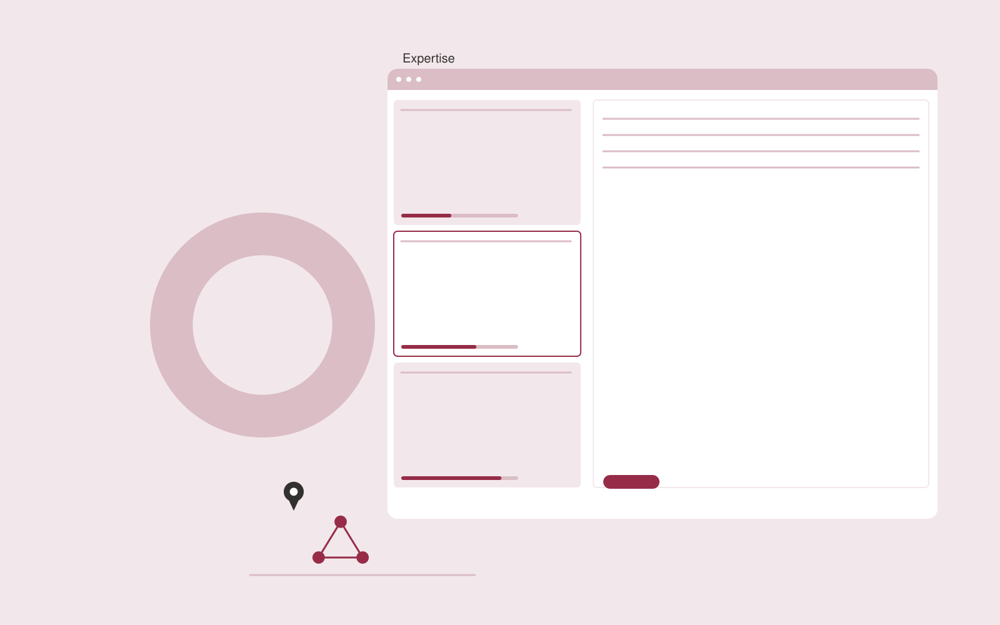

# Research collaboration discovery

**Science and Research** · Also fits: Education; Executives and Strategy; Sales

> For r&D groups seeking complementary expertise, turn published work, declared project needs and collaboration criteria into collaboration research briefs. Address the recurring problem: potential collaborators are identified from incomplete informal networks. The value hypothesis is a more complete, reviewable deliverable with less repeated preparation; the pilot must establish whether that benefit is real.

| | |
|---|---|
| **Buyer** | R&D groups seeking complementary expertise |
| **Problem** | Potential collaborators are identified from incomplete informal networks. |
| **Format** | Transparent opportunity matching and shortlist platform |
| **USP** | Method-level complementarity supported by specific published work. |

## The product
Key screens: Expertise map, team profiles, fit evidence. Open with a filterable opportunity feed and clear fit explanations. Each profile shows source evidence, eligibility conditions and missing information. Keep saved, rejected and needs-review states. Include a deadline or next-action view without hiding the basis of recommendations. In this product, the first view is expertise map, followed by team profiles and fit evidence.

## Core functionality
1. Define capability gaps.
2. Identify relevant teams.
3. Cite supporting publications.
4. Compare complementary methods.
5. Flag outdated affiliations.
6. Prepare collaboration concepts.

## Customer workflow
Define buyer-selected criteria, gather authorized opportunity information, apply explicit eligibility rules, propose matches with evidence, let the user review uncertain conditions, save a shortlist and track the resulting conversations or applications. Start with published work, declared project needs and collaboration criteria and finish with collaboration research briefs.

## AI and human review
Extract criteria, normalize opportunity descriptions and explain possible fit. Use explicit rules for hard requirements. Do not invent missing eligibility facts or represent a suggested match as a verified qualification.

## Customer inputs
Published work, declared project needs and collaboration criteria

## Customer deliverables
Collaboration research briefs

## Accounts and administration
Editable criteria, dated sources, eligibility evidence, missing-data flags, saved shortlists, rejection reasons, deadline alerts and owner follow-up.

## MVP scope
Begin with r&D groups seeking complementary expertise and one recurring use case. Build the first two modules: define capability gaps; identify relevant teams. Provide operator assistance for the third module: cite supporting publications. Deliver collaboration research briefs through a manual review queue. Perform other necessary full-scope functions manually during the pilot. Include all applicable access, accuracy and professional-review controls from the start.

## After MVP validation
After paid pilots establish value, automate the remaining modules: compare complementary methods; flag outdated affiliations; prepare collaboration concepts. Add one validated source integration, reusable customer configuration and recurring delivery. Expand to additional teams, document formats or languages only after testing the new scope.

## Build dependencies
Current source information, explicit eligibility rules, entity identity checks and inspectable fit reasoning. Sparse evidence limits match quality.

## Integrations and data access
Authorized datasets, papers, protocols, code and research records. Permitted opportunity feeds, customer profiles, calendars and CRM exports. Keep initial outreach or applications as user-reviewed drafts. These are candidate integration categories, not verified supported connectors.

## Defensibility
A maintained niche opportunity dataset and documented relevance feedback, supported by relationships with the intended buyer community. For this idea, build around method-level complementarity supported by specific published work. This advantage requires execution and accumulated customer trust; the base model alone is not a defensible asset.

## Alternatives and positioning
Manual research, directories, generic databases, referrals and existing opportunity marketplaces. Differentiate on this specific proposed advantage: method-level complementarity supported by specific published work. Test it against the buyer's current method on the same task. Competitor coverage and uniqueness have not been established.

## Revenue model and test pricing (USD)
Test USD 150-600 monthly for one narrow opportunity feed, or USD 750-2,500 for a bespoke researched shortlist. Price manual verification and custom research explicitly. These are pricing hypotheses.

## Main delivery costs
Source collection, profile updates, entity resolution, eligibility verification, analyst research and customer feedback review.

## Marketing message to test
> Research collaboration discovery for r&D groups seeking complementary expertise. Method-level complementarity supported by specific published work. Demonstrate the claim through a shortlist of complementary teams with evidence.

## Acquisition channels
Research partnership offices

## Lead magnet
A shortlist of complementary teams with evidence

## First 30 days of marketing
- Week 1: interview five prospective buyers in this segment: r&D groups seeking complementary expertise. Ask to see a recent example of the problem and their current process.
- Week 2: prepare this demonstration using authorized or synthetic material: a shortlist of complementary teams with evidence.
- Week 3: present it through research partnership offices and seek one narrowly scoped paid pilot.
- Week 4: review verified relevance, useful introductions, total delivery effort and a concrete renewal decision before increasing scope.

## Paid pilot and validation
Produce a small shortlist and ask the buyer to verify fit independently. Record why each option is accepted or rejected and whether it leads to a useful next step. Review missed eligible options too. For this idea, use published work, declared project needs and collaboration criteria and evaluate collaboration research briefs. Agree success thresholds with the buyer before starting; collect a baseline for verified relevance, useful introductions. A positive signal is payment and repeat use with acceptable quality and delivery cost, not a favorable demo reaction alone.

## Success metrics
Verified relevance, useful introductions

## Retention and expansion
Refresh opportunity profiles, improve criteria from accepted and rejected matches, and offer deeper verification for shortlisted options.

## Operating controls and limitations
Preserve original data, methods, citations and research limitations. Use researcher review and document every substantive transformation. Validate source access and reviewer availability during the pilot. Maintain customer-level access, data deletion controls and a record of final approvals.

## Brand style (concept)

- Colors: `#91273f` primary · `#54c9c7` accent · `#f1e4e7` surface · `#22201e` ink
- Type: Sora for headings, Work Sans for text
- Voice: Rigorous, transparent, cited
- Demo site: [https://nexibeo.com/solutions/research-collaboration-discovery/demo/](https://nexibeo.com/solutions/research-collaboration-discovery/demo/)

## Investment indication

Indicative build budget, from MVP to full product. This is a planning range, not a quote; it excludes running costs such as model usage, hosting and reviewer hours. Built with Nexibeo's AI software development factory, most implementations take days to a few weeks of creation time, depending on availability.

| Phase | Scope | Creation time | Indicative budget |
|---|---|---|---|
| MVP | One buyer segment, one recurring use case; first modules: define capability gaps; identify relevant teams. Manual review in the loop. | 4 days | $8,000 |
| Paid pilot | Accounts, roles, review states, audit trail and the first integration, hardened for two to three paying pilot customers. | 5 days | $9,000 |
| Full product | Remaining modules: compare complementary methods; flag outdated affiliations; prepare collaboration concepts. Self-serve onboarding, billing, monitoring and the wider integration set. | 9 days | $12,000 |
| **Total** | | about 4 weeks | **$29,000** |

### Running costs per month (rough indication, untested)

| Stage | Hosting and infrastructure | AI usage | Total per month |
|---|---|---|---|
| MVP and paid pilot (about 3 customers) | $30–$60 | $40–$90 | **$70–$150** |
| Full product (about 50 customers) | $110–$210 | $280–$560 | **$390–$770** |

**Get this built:** [contact Nexibeo](https://nexibeo.com/solutions/research-collaboration-discovery/#apply). We build it with our AI software factory, usually in days to a few weeks, for you to run internally or offer to your clients.

## Research status
Concept proposal expanded from the 315-idea conversation. Demand, pricing, differentiation, build scope and integration feasibility are hypotheses, not verified market findings. Category link is inspiration rather than evidence of business viability.

## Credits and next steps

- **Estimation and having it built:** see the full solution page on [nexibeo.com](https://nexibeo.com/solutions/research-collaboration-discovery/) for more detail on estimation. Nexibeo builds it for you as a custom AI implementation, to run internally or to offer to your own clients.
- **Become an AI-optimized specialist for Science and Research:** [Complete AI Training](https://completeaitraining.com/tag/science-and-research/?contentType=ai-certification).
- Field news: [AI news for Science and Research](https://completeaitraining.com/all-ai-news-for-science-and-research/).
