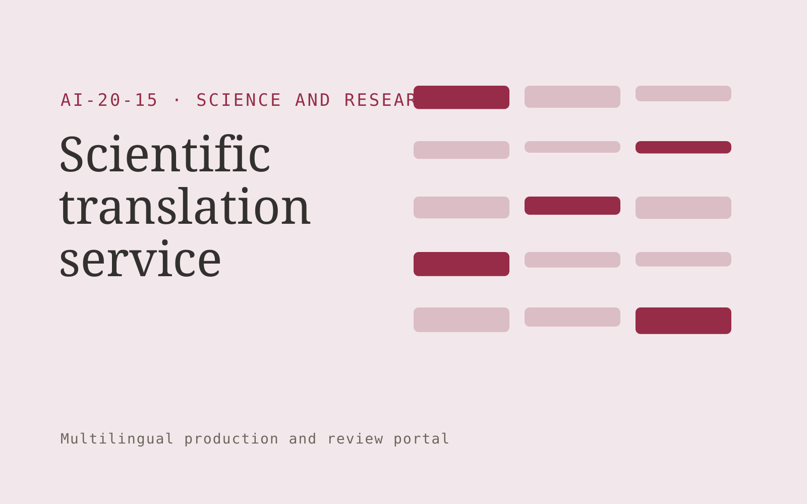

# Scientific translation service

**Science and Research** · Also fits: Education; Executives and Strategy; PR and Communications

> For research groups publishing across languages, turn authorized manuscripts and field-specific glossaries into reviewed scientific translation. Address the recurring problem: technical terminology and methodological meaning drift in translation. The value hypothesis is a more complete, reviewable deliverable with less repeated preparation; the pilot must establish whether that benefit is real.

| | |
|---|---|
| **Buyer** | Research groups publishing across languages |
| **Problem** | Technical terminology and methodological meaning drift in translation. |
| **Format** | Multilingual production and review portal |
| **USP** | Field-specific terminology and method fidelity verified by qualified reviewers. |

## The product
Key screens: Bilingual manuscript, terminology checks, specialist review. Use aligned source and target language panes with shared terminology highlights. Include a language status grid, reviewer assignment queue, and layout or timeline preview. Show unresolved ambiguities next to the affected passage. Keep approvals separate for each language and version. In this product, the first view is bilingual manuscript, followed by terminology checks and specialist review.

## Core functionality
1. Translate technical sections.
2. Preserve symbols and units.
3. Align citations.
4. Flag ambiguous wording.
5. Apply specialist review.
6. Track author approval.

## Customer workflow
Upload authorized source content, confirm target languages and terminology, create translation drafts, assign qualified reviewers, reconcile source changes, check layout or timing, and deliver approved language versions. Start with authorized manuscripts and field-specific glossaries and finish with reviewed scientific translation.

## AI and human review
Draft translations, transcribe media when applicable, suggest terminology and detect inconsistencies. Deterministic checks compare dates, numbers and identifiers. Qualified language reviewers decide idiomatic phrasing and specialist meaning. Voice work requires explicit permissions for the intended use.

## Customer inputs
Authorized manuscripts and field-specific glossaries

## Customer deliverables
Reviewed scientific translation

## Accounts and administration
Language permissions, glossary versions, reviewer assignments, segment comments, source-change alerts, per-language approvals and delivery history.

## MVP scope
Begin with research groups publishing across languages and one recurring use case. Build the first two modules: translate technical sections; preserve symbols and units. Provide operator assistance for the third module: align citations. Deliver reviewed scientific translation through a manual review queue. Perform other necessary full-scope functions manually during the pilot. Include all applicable access, accuracy and professional-review controls from the start.

## After MVP validation
After paid pilots establish value, automate the remaining modules: flag ambiguous wording; apply specialist review; track author approval. Add one validated source integration, reusable customer configuration and recurring delivery. Expand to additional teams, document formats or languages only after testing the new scope.

## Build dependencies
Segment alignment, glossary enforcement, multilingual text handling, comparison views and qualified reviewers. Media projects also need timing and audio/video QA.

## Integrations and data access
Authorized datasets, papers, protocols, code and research records. Document formats, subtitle formats, media storage and publishing systems. Confirm language, font and layout support for each requested output. These are candidate integration categories, not verified supported connectors.

## Defensibility
Customer-controlled approved terminology, reviewed translation examples and dependable specialist reviewer relationships. For this idea, build around field-specific terminology and method fidelity verified by qualified reviewers. This advantage requires execution and accumulated customer trust; the base model alone is not a defensible asset.

## Alternatives and positioning
Translation agencies, freelance linguists, generic machine translation and internal bilingual staff. Differentiate on this specific proposed advantage: field-specific terminology and method fidelity verified by qualified reviewers. Test it against the buyer's current method on the same task. Competitor coverage and uniqueness have not been established.

## Revenue model and test pricing (USD)
Quote an initial USD 300-1,200 batch for a defined word count or media duration and one target language. Charge separately for extra languages, specialist review and dubbing. Test recurring volume agreements after the pilot; prices are hypotheses.

## Main delivery costs
Source preparation, translation volume, transcription or dubbing, qualified reviewers, glossary maintenance and changed-source rework.

## Marketing message to test
> Scientific translation service for research groups publishing across languages. Field-specific terminology and method fidelity verified by qualified reviewers. Demonstrate the claim through a specialist-reviewed manuscript excerpt.

## Acquisition channels
Academic language editing partners

## Lead magnet
A specialist-reviewed manuscript excerpt

## First 30 days of marketing
- Week 1: interview five prospective buyers in this segment: research groups publishing across languages. Ask to see a recent example of the problem and their current process.
- Week 2: prepare this demonstration using authorized or synthetic material: a specialist-reviewed manuscript excerpt.
- Week 3: present it through academic language editing partners and seek one narrowly scoped paid pilot.
- Week 4: review reviewer corrections, author acceptance, total delivery effort and a concrete renewal decision before increasing scope.

## Paid pilot and validation
Translate a representative sample and have an independent qualified reviewer assess it. Include a source revision to measure update handling. Track corrections, meaning preservation and total delivery effort. For this idea, use authorized manuscripts and field-specific glossaries and evaluate reviewed scientific translation. Agree success thresholds with the buyer before starting; collect a baseline for reviewer corrections, author acceptance. A positive signal is payment and repeat use with acceptable quality and delivery cost, not a favorable demo reaction alone.

## Success metrics
Reviewer corrections, author acceptance

## Retention and expansion
Maintain approved terminology and reviewer continuity. Charge for ongoing source updates and add languages only when the buyer has a real publishing need.

## Operating controls and limitations
Preserve original data, methods, citations and research limitations. Use researcher review and document every substantive transformation. Validate source access and reviewer availability during the pilot. Maintain customer-level access, data deletion controls and a record of final approvals.

## Brand style (concept)

- Colors: `#91274a` primary · `#54c987` accent · `#f1e4e9` surface · `#22201e` ink
- Type: Sora for headings, Work Sans for text
- Voice: Rigorous, transparent, cited
- Demo site: [https://nexibeo.com/ideas/scientific-translation-service/demo/](https://nexibeo.com/ideas/scientific-translation-service/demo/)

## Investment indication

Indicative build budget, from MVP to full product. This is a planning range, not a quote; it excludes running costs such as model usage, hosting and reviewer hours.

| Phase | Scope | Timeline | Indicative budget |
|---|---|---|---|
| MVP | One buyer segment, one recurring use case; first modules: translate technical sections; preserve symbols and units. Manual review in the loop. | 5 weeks | $10,500 |
| Paid pilot | Accounts, roles, review states, audit trail and the first integration, hardened for two to three paying pilot customers. | 7 weeks | $13,000 |
| Full product | Remaining modules: flag ambiguous wording; apply specialist review; track author approval. Self-serve onboarding, billing, monitoring and the wider integration set. | 12 weeks | $18,000 |
| **Total** | | 24 weeks | **$41,500** |

### Running costs per month (rough indication, untested)

| Stage | Hosting and infrastructure | AI usage | Total per month |
|---|---|---|---|
| MVP and paid pilot (about 3 customers) | $40–$80 | $100–$200 | **$140–$280** |
| Full product (about 50 customers) | $160–$320 | $1,230–$2,450 | **$1,390–$2,770** |

**Co-create this project with us:** [contact Nexibeo](https://nexibeo.com/ideas/scientific-translation-service/#apply) and we build it with you.

## Research status
Concept proposal expanded from the 315-idea conversation. Demand, pricing, differentiation, build scope and integration feasibility are hypotheses, not verified market findings. Category link is inspiration rather than evidence of business viability.

## Credits and next steps

- **Estimation and building this idea:** see the full idea page on [nexibeo.com](https://nexibeo.com/ideas/scientific-translation-service/) for more detail on estimation, and to co-create and build this idea with Nexibeo.
- **Become an AI-optimized specialist for Science and Research:** [Complete AI Training](https://completeaitraining.com/tag/science-and-research/?contentType=ai-certification).
- Field news: [AI news for Science and Research](https://completeaitraining.com/all-ai-news-for-science-and-research/).
