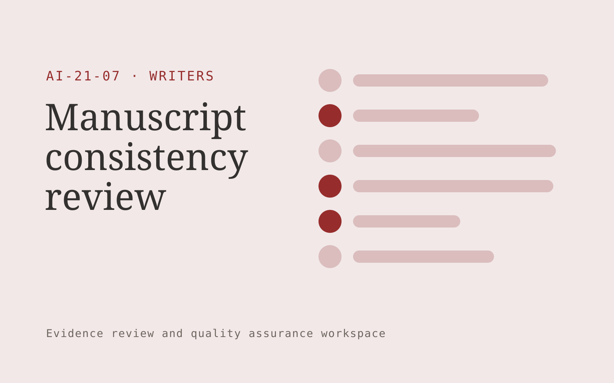

# Manuscript consistency review

**Writers** · Also fits: Marketing; Education; Operations

> For independent fiction authors and small publishers, turn author-owned manuscript and declared story rules into manuscript continuity report. Address the recurring problem: long manuscripts accumulate timeline and character inconsistencies. The value hypothesis is a more complete, reviewable deliverable with less repeated preparation; the pilot must establish whether that benefit is real.

| | |
|---|---|
| **Buyer** | Independent fiction authors and small publishers |
| **Problem** | Long manuscripts accumulate timeline and character inconsistencies. |
| **Format** | Evidence review and quality assurance workspace |
| **USP** | A manuscript-specific continuity reference with inspectable evidence. |

## The product
Key screens: Story reference, inconsistency evidence, author decisions. Open on a review queue ordered by reviewer-selected priorities. Show each finding beside the original evidence and applicable rule. Provide accept, dismiss and needs-information controls with reasons. A separate report view summarizes confirmed findings and unresolved items, not raw AI flags. In this product, the first view is story reference, followed by inconsistency evidence and author decisions.

## Core functionality
1. Build character records.
2. Map timeline claims.
3. Track terminology.
4. Flag conflicting details.
5. Cite passages.
6. Record intentional exceptions.

## Customer workflow
Agree review criteria, ingest a sample, generate candidate findings, inspect supporting evidence, let reviewers confirm or dismiss each item, assign corrections, and recheck the affected material. Start with author-owned manuscript and declared story rules and finish with manuscript continuity report.

## AI and human review
Propose possible inconsistencies, omissions and rubric matches. Combine extraction with deterministic checks where rules are explicit. Reviewers make the final judgment. Keep false positives and missed cases visible during evaluation.

## Customer inputs
Author-owned manuscript and declared story rules

## Customer deliverables
Manuscript continuity report

## Accounts and administration
Versioned review criteria, evidence links, reviewer decisions, disagreement handling, correction assignments, recheck status and exportable review history.

## MVP scope
Begin with independent fiction authors and small publishers and one recurring use case. Build the first two modules: build character records; map timeline claims. Provide operator assistance for the third module: track terminology. Deliver manuscript continuity report through a manual review queue. Perform other necessary full-scope functions manually during the pilot. Include all applicable access, accuracy and professional-review controls from the start.

## After MVP validation
After paid pilots establish value, automate the remaining modules: flag conflicting details; cite passages; record intentional exceptions. Add one validated source integration, reusable customer configuration and recurring delivery. Expand to additional teams, document formats or languages only after testing the new scope.

## Build dependencies
Evidence coordinates, versioned rules, reviewer decisions and a representative reference set. Measure misses as well as confirmed findings before scaling.

## Integrations and data access
Author-owned manuscripts, authorized interviews and permitted research sources. Source repositories, task trackers and report exports. Keep findings as review proposals until authorized owners accept the resulting actions. These are candidate integration categories, not verified supported connectors.

## Defensibility
A domain-specific review rubric and rights-cleared examples of confirmed defects, false alarms and reviewer reasoning. For this idea, build around a manuscript-specific continuity reference with inspectable evidence. This advantage requires execution and accumulated customer trust; the base model alone is not a defensible asset.

## Alternatives and positioning
Manual reviewers, checklists, generic scanning tools and specialist audit services. Differentiate on this specific proposed advantage: a manuscript-specific continuity reference with inspectable evidence. Test it against the buyer's current method on the same task. Competitor coverage and uniqueness have not been established.

## Revenue model and test pricing (USD)
Test USD 150-600 for one manuscript review with explicit word-count and issue-review limits. Sell author revisions or series-wide continuity reviews as additional scopes. Human review time determines viable pricing; these are hypotheses.

## Main delivery costs
Document or media processing, model evaluation, expert review, false-positive handling, rechecks and customer-specific rubric calibration.

## Marketing message to test
> Manuscript consistency review for independent fiction authors and small publishers. A manuscript-specific continuity reference with inspectable evidence. Demonstrate the claim through a continuity review of sample chapters.

## Acquisition channels
Editors and author communities

## Lead magnet
A continuity review of sample chapters

## First 30 days of marketing
- Week 1: interview five prospective buyers in this segment: independent fiction authors and small publishers. Ask to see a recent example of the problem and their current process.
- Week 2: prepare this demonstration using authorized or synthetic material: a continuity review of sample chapters.
- Week 3: present it through editors and author communities and seek one narrowly scoped paid pilot.
- Week 4: review confirmed inconsistencies, false alarms, total delivery effort and a concrete renewal decision before increasing scope.

## Paid pilot and validation
Have a qualified reviewer independently assess the same sample. Compare confirmed findings, false alarms and omissions. Repeat on unseen material before agreeing recurring volume. For this idea, use author-owned manuscript and declared story rules and evaluate manuscript continuity report. Agree success thresholds with the buyer before starting; collect a baseline for confirmed inconsistencies, false alarms. A positive signal is payment and repeat use with acceptable quality and delivery cost, not a favorable demo reaction alone.

## Success metrics
Confirmed inconsistencies, false alarms

## Retention and expansion
Offer recurring reviews and rechecks of previously confirmed issues. Expand document or case types after validating the new rubric with qualified reviewers.

## Operating controls and limitations
Preserve author voice, source attribution, quotation accuracy and usage permissions. Authors approve substantive changes and publication scope. Validate source access and reviewer availability during the pilot. Maintain customer-level access, data deletion controls and a record of final approvals.

## Brand style (concept)

- Colors: `#913727` primary · `#54c9bd` accent · `#f1e6e4` surface · `#22201e` ink
- Type: Archivo for headings, Lora for text
- Voice: Literate, generous, editorial
- Demo site: [https://nexibeo.com/ideas/manuscript-consistency-review/demo/](https://nexibeo.com/ideas/manuscript-consistency-review/demo/)

## Investment indication

Indicative build budget, from MVP to full product. This is a planning range, not a quote; it excludes running costs such as model usage, hosting and reviewer hours. Built with Nexibeo's AI software development factory, most implementations take days to a few weeks of creation time, depending on availability.

| Phase | Scope | Creation time | Indicative budget |
|---|---|---|---|
| MVP | One buyer segment, one recurring use case; first modules: build character records; map timeline claims. Manual review in the loop. | 4 days | $7,500 |
| Paid pilot | Accounts, roles, review states, audit trail and the first integration, hardened for two to three paying pilot customers. | 5 days | $8,000 |
| Full product | Remaining modules: flag conflicting details; cite passages; record intentional exceptions. Self-serve onboarding, billing, monitoring and the wider integration set. | 8 days | $11,500 |
| **Total** | | about 3 weeks | **$27,000** |

### Running costs per month (rough indication, untested)

| Stage | Hosting and infrastructure | AI usage | Total per month |
|---|---|---|---|
| MVP and paid pilot (about 3 customers) | $30–$60 | $80–$160 | **$110–$220** |
| Full product (about 50 customers) | $110–$210 | $880–$1,750 | **$990–$1,960** |

**Co-create this project with us:** [contact Nexibeo](https://nexibeo.com/ideas/manuscript-consistency-review/#apply) and we build it with you.

## Research status
Concept proposal expanded from the 315-idea conversation. Demand, pricing, differentiation, build scope and integration feasibility are hypotheses, not verified market findings. Category link is inspiration rather than evidence of business viability.

## Credits and next steps

- **Estimation and building this idea:** see the full idea page on [nexibeo.com](https://nexibeo.com/ideas/manuscript-consistency-review/) for more detail on estimation, and to co-create and build this idea with Nexibeo.
- **Become an AI-optimized specialist for Writers:** [Complete AI Training](https://completeaitraining.com/tag/writers/?contentType=ai-certification).
- Field news: [AI news for Writers](https://completeaitraining.com/all-ai-news-for-writers/).
