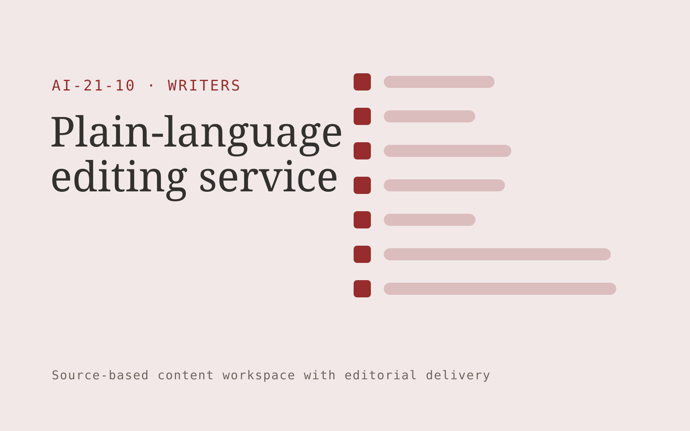

# Plain-language editing service

**AI-21-10 · Writers** · Also fits: Marketing; Education

> For organizations publishing complex customer instructions, turn approved documents and intended audience information into reviewed plain-language documents. Address the recurring problem: readers misunderstand important actions and conditions. The value hypothesis is a more complete, reviewable deliverable with less repeated preparation; the pilot must establish whether that benefit is real.

| | |
|---|---|
| **Buyer** | Organizations publishing complex customer instructions |
| **Problem** | Readers misunderstand important actions and conditions. |
| **Format** | Source-based content workspace with editorial delivery |
| **USP** | Comprehension-focused editing with traceable meaning preservation. |

## The product
Key screens: Source comparison, rewrite editor, comprehension checks. Use a project list and editorial calendar beside a document editor. Keep original material and supporting passages in a collapsible side panel. Show outline, draft, review and approved stages. Provide tracked edits, comments, version comparisons and an export preview that reflects the final delivery format. In this product, the first view is source comparison, followed by rewrite editor and comprehension checks.

## Core functionality
1. Identify difficult wording.
2. Restructure instructions.
3. Explain necessary terms.
4. Preserve conditions.
5. Test comprehension.
6. Collect owner approval.

## Customer workflow
Collect a structured brief and source material, identify unanswered questions, approve an outline, generate a draft, verify claims, gather reviewer edits, approve a final version and export the agreed formats. Start with approved documents and intended audience information and finish with reviewed plain-language documents.

## AI and human review
Extract and organize information, propose structure, draft prose and adapt approved content to audiences. Attach evidence to factual claims. Keep names, dates, amounts and quoted wording linked to their source. Editors resolve ambiguity and approve publication.

## Customer inputs
Approved documents and intended audience information

## Customer deliverables
Reviewed plain-language documents

## Accounts and administration
Client workspaces, source permissions, editorial assignments, change history, reviewer comments, approval gates, revision allowances and export templates.

## MVP scope
Begin with organizations publishing complex customer instructions and one recurring use case. Build the first two modules: identify difficult wording; restructure instructions. Provide operator assistance for the third module: explain necessary terms. Deliver reviewed plain-language documents through a manual review queue. Perform other necessary full-scope functions manually during the pilot. Include all applicable access, accuracy and professional-review controls from the start.

## After MVP validation
After paid pilots establish value, automate the remaining modules: preserve conditions; test comprehension; collect owner approval. Add one validated source integration, reusable customer configuration and recurring delivery. Expand to additional teams, document formats or languages only after testing the new scope.

## Build dependencies
Document parsing, a source-linked editor, tracked revisions, reviewer workflow and reliable document export. Rich presentation or print output needs format-specific QA.

## Integrations and data access
Author-owned manuscripts, authorized interviews and permitted research sources. Document storage, word processor export, content management systems and approved publishing channels. Pilot with uploads and downloadable drafts before adding write integrations. These are candidate integration categories, not verified supported connectors.

## Defensibility
Customer-approved terminology, reusable structures, source libraries and editorial feedback tied to a specific audience and recurring publishing workflow. For this idea, build around comprehension-focused editing with traceable meaning preservation. This advantage requires execution and accumulated customer trust; the base model alone is not a defensible asset.

## Alternatives and positioning
Writers, editors, agencies, internal document templates and general-purpose chat tools. Differentiate on this specific proposed advantage: comprehension-focused editing with traceable meaning preservation. Test it against the buyer's current method on the same task. Competitor coverage and uniqueness have not been established.

## Revenue model and test pricing (USD)
Test USD 400-1,500 for a tightly scoped initial content package. Convert repeated work to a monthly retainer with explicit deliverable and revision limits. Specialist review and substantial research are separately scoped. Prices are hypotheses.

## Main delivery costs
Research and interview time, transcription, model usage, factual verification, subject-matter review, editing and revisions.

## Marketing message to test
> Plain-language editing service for organizations publishing complex customer instructions. Comprehension-focused editing with traceable meaning preservation. Demonstrate the claim through a before-and-after instruction rewrite.

## Acquisition channels
Customer communication agencies

## Lead magnet
A before-and-after instruction rewrite

## First 30 days of marketing
- Week 1: interview five prospective buyers in this segment: organizations publishing complex customer instructions. Ask to see a recent example of the problem and their current process.
- Week 2: prepare this demonstration using authorized or synthetic material: a before-and-after instruction rewrite.
- Week 3: present it through customer communication agencies and seek one narrowly scoped paid pilot.
- Week 4: review reader comprehension, owner corrections, total delivery effort and a concrete renewal decision before increasing scope.

## Paid pilot and validation
Complete one existing brief using the customer’s actual sources. Record reviewer edits, factual corrections and preparation time. Ask the same buyer to commission a second comparable deliverable. For this idea, use approved documents and intended audience information and evaluate reviewed plain-language documents. Agree success thresholds with the buyer before starting; collect a baseline for reader comprehension, owner corrections. A positive signal is payment and repeat use with acceptable quality and delivery cost, not a favorable demo reaction alone.

## Success metrics
Reader comprehension, owner corrections

## Retention and expansion
Maintain the approved source and voice library, schedule recurring editorial work, and expand into additional formats only after the core deliverable is repeatedly accepted.

## Operating controls and limitations
Preserve author voice, source attribution, quotation accuracy and usage permissions. Authors approve substantive changes and publication scope. Validate source access and reviewer availability during the pilot. Maintain customer-level access, data deletion controls and a record of final approvals.

## Brand style (concept)

- Colors: `#913327` primary · `#54c9ba` accent · `#f1e6e4` surface · `#22201e` ink
- Type: Fraunces for headings, Inter for text
- Voice: Literate, generous, editorial
- Demo site: [https://nexibeo.com/ideas/plain-language-editing-service/demo/](https://nexibeo.com/ideas/plain-language-editing-service/demo/)

## Investment indication

Indicative build budget, from MVP to full product. This is a planning range, not a quote; it excludes running costs such as model usage, hosting and reviewer hours.

| Phase | Scope | Timeline | Indicative budget |
|---|---|---|---|
| MVP | One buyer segment, one recurring use case; first modules: identify difficult wording; restructure instructions. Manual review in the loop. | 4 weeks | $8,500 |
| Paid pilot | Accounts, roles, review states, audit trail and the first integration, hardened for two to three paying pilot customers. | 6 weeks | $9,500 |
| Full product | Remaining modules: preserve conditions; test comprehension; collect owner approval. Self-serve onboarding, billing, monitoring and the wider integration set. | 10 weeks | $13,500 |
| **Total** | | 20 weeks | **$31,500** |

**Co-create this project with us:** [contact Nexibeo](https://nexibeo.com/ideas/plain-language-editing-service/#apply) and we build it with you.

## Research status
Concept proposal expanded from the 315-idea conversation. Demand, pricing, differentiation, build scope and integration feasibility are hypotheses, not verified market findings. Category link is inspiration rather than evidence of business viability.

## Credits and next steps

- **Estimation and building this idea:** see the full idea page on [nexibeo.com](https://nexibeo.com/ideas/plain-language-editing-service/) for more detail on estimation, and to co-create and build this idea with Nexibeo.
- **Become an AI-optimized specialist for Writers:** [Complete AI Training](https://completeaitraining.com/tag/writers/?contentType=ai-certification).
- Field news: [AI news for Writers](https://completeaitraining.com/all-ai-news-for-writers/).
