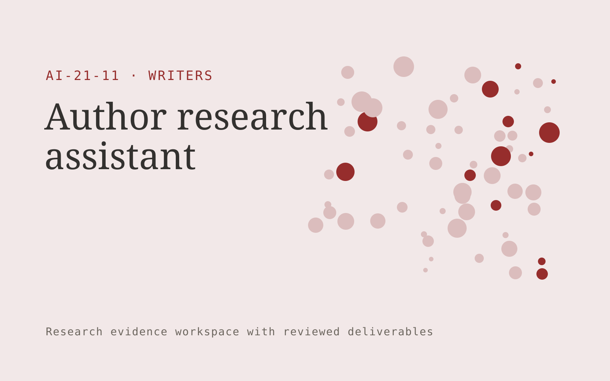

# Author research assistant

**Writers** · Also fits: Marketing; Education; Science and Research

> For nonfiction authors researching specialist books, turn author research questions and permitted sources into source-linked author research dossier. Address the recurring problem: research notes mix verified facts with unanswered questions. The value hypothesis is a more complete, reviewable deliverable with less repeated preparation; the pilot must establish whether that benefit is real.

| | |
|---|---|
| **Buyer** | Nonfiction authors researching specialist books |
| **Problem** | Research notes mix verified facts with unanswered questions. |
| **Format** | Research evidence workspace with reviewed deliverables |
| **USP** | An organized research trail separating evidence, interpretation and uncertainty. |

## The product
Key screens: Question map, source library, evidence notes. Organize work by research question. Show a source library, an evidence matrix and a draft findings panel with linked quotations. Keep contradictory findings and unanswered questions visible. Allow reviewers to inspect the original context before accepting an interpretation. In this product, the first view is question map, followed by source library and evidence notes.

## Core functionality
1. Define research questions.
2. Locate relevant sources.
3. Record quotations accurately.
4. Compare conflicting accounts.
5. Label evidence gaps.
6. Export citations.

## Customer workflow
Agree the decision and research questions, define permitted sources or participants, collect evidence, code findings, compare supporting and contradictory material, review interpretations, and deliver a cited brief with next questions. Start with author research questions and permitted sources and finish with source-linked author research dossier.

## AI and human review
Assist with retrieval, transcription, structured extraction and thematic synthesis. Preserve source passages and methodological context. Human researchers validate inclusion, quotations and conclusions. Use real participants when customer research is required.

## Customer inputs
Author research questions and permitted sources

## Customer deliverables
Source-linked author research dossier

## Accounts and administration
Source provenance, participant consent where applicable, research questions, coding definitions, reviewer disagreements, citations and versioned conclusions.

## MVP scope
Begin with nonfiction authors researching specialist books and one recurring use case. Build the first two modules: define research questions; locate relevant sources. Provide operator assistance for the third module: record quotations accurately. Deliver source-linked author research dossier through a manual review queue. Perform other necessary full-scope functions manually during the pilot. Include all applicable access, accuracy and professional-review controls from the start.

## After MVP validation
After paid pilots establish value, automate the remaining modules: compare conflicting accounts; label evidence gaps; export citations. Add one validated source integration, reusable customer configuration and recurring delivery. Expand to additional teams, document formats or languages only after testing the new scope.

## Build dependencies
A clear research protocol, source access, citation tracking and qualified interpretation. Interview work also needs relevant participants and consent management.

## Integrations and data access
Author-owned manuscripts, authorized interviews and permitted research sources. Permitted research libraries, interview recording imports, citation exports and document editors. Preserve original source metadata throughout the workflow. These are candidate integration categories, not verified supported connectors.

## Defensibility
Niche research protocols, credible researcher relationships and a rights-cleared evidence archive with consistent interpretation methods. For this idea, build around an organized research trail separating evidence, interpretation and uncertainty. This advantage requires execution and accumulated customer trust; the base model alone is not a defensible asset.

## Alternatives and positioning
Research consultants, internal analysts, literature databases and general search or summarization tools. Differentiate on this specific proposed advantage: an organized research trail separating evidence, interpretation and uncertainty. Test it against the buyer's current method on the same task. Competitor coverage and uniqueness have not been established.

## Revenue model and test pricing (USD)
Test USD 750-3,000 for one tightly bounded research question and evidence pack. Participant recruitment, specialist review and licensed data are separately scoped. Repeat tracking can become a retainer. Prices are hypotheses.

## Main delivery costs
Researcher time, source access, participant recruitment, transcription, evidence coding, expert review and report revisions.

## Marketing message to test
> Author research assistant for nonfiction authors researching specialist books. An organized research trail separating evidence, interpretation and uncertainty. Demonstrate the claim through a cited research pack for one chapter question.

## Acquisition channels
Book development editors

## Lead magnet
A cited research pack for one chapter question

## First 30 days of marketing
- Week 1: interview five prospective buyers in this segment: nonfiction authors researching specialist books. Ask to see a recent example of the problem and their current process.
- Week 2: prepare this demonstration using authorized or synthetic material: a cited research pack for one chapter question.
- Week 3: present it through book development editors and seek one narrowly scoped paid pilot.
- Week 4: review source accuracy, author research time, total delivery effort and a concrete renewal decision before increasing scope.

## Paid pilot and validation
Answer one practical question using a bounded evidence set. Ask a domain expert to review citations and reasoning, identify contrary evidence and assess whether the deliverable supports the intended decision. For this idea, use author research questions and permitted sources and evaluate source-linked author research dossier. Agree success thresholds with the buyer before starting; collect a baseline for source accuracy, author research time. A positive signal is payment and repeat use with acceptable quality and delivery cost, not a favorable demo reaction alone.

## Success metrics
Source accuracy, author research time

## Retention and expansion
Maintain the research question and evidence archive, offer follow-up studies and refresh important sources. Build repeat work around the buyer’s decision cycle.

## Operating controls and limitations
Preserve author voice, source attribution, quotation accuracy and usage permissions. Authors approve substantive changes and publication scope. Validate source access and reviewer availability during the pilot. Maintain customer-level access, data deletion controls and a record of final approvals.

## Brand style (concept)

- Colors: `#912735` primary · `#54c9a8` accent · `#f1e4e6` surface · `#22201e` ink
- Type: Fraunces for headings, Inter for text
- Voice: Literate, generous, editorial
- Demo site: [https://nexibeo.com/ideas/author-research-assistant/demo/](https://nexibeo.com/ideas/author-research-assistant/demo/)

## Investment indication

Indicative build budget, from MVP to full product. This is a planning range, not a quote; it excludes running costs such as model usage, hosting and reviewer hours.

| Phase | Scope | Timeline | Indicative budget |
|---|---|---|---|
| MVP | One buyer segment, one recurring use case; first modules: define research questions; locate relevant sources. Manual review in the loop. | 4 weeks | $8,500 |
| Paid pilot | Accounts, roles, review states, audit trail and the first integration, hardened for two to three paying pilot customers. | 6 weeks | $10,000 |
| Full product | Remaining modules: compare conflicting accounts; label evidence gaps; export citations. Self-serve onboarding, billing, monitoring and the wider integration set. | 10 weeks | $13,500 |
| **Total** | | 20 weeks | **$32,000** |

**Co-create this project with us:** [contact Nexibeo](https://nexibeo.com/ideas/author-research-assistant/#apply) and we build it with you.

## Research status
Concept proposal expanded from the 315-idea conversation. Demand, pricing, differentiation, build scope and integration feasibility are hypotheses, not verified market findings. Category link is inspiration rather than evidence of business viability.

## Credits and next steps

- **Estimation and building this idea:** see the full idea page on [nexibeo.com](https://nexibeo.com/ideas/author-research-assistant/) for more detail on estimation, and to co-create and build this idea with Nexibeo.
- **Become an AI-optimized specialist for Writers:** [Complete AI Training](https://completeaitraining.com/tag/writers/?contentType=ai-certification).
- Field news: [AI news for Writers](https://completeaitraining.com/all-ai-news-for-writers/).
