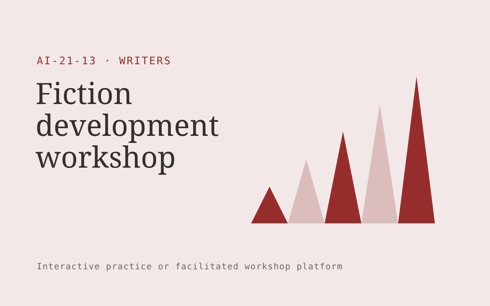

# Fiction development workshop

**Writers** · Also fits: Marketing; Education

> For independent authors seeking structured developmental feedback, turn author-owned drafts, creative goals and chosen constraints into developmental feedback and author-selected revision plan. Address the recurring problem: writers need repeatable feedback without losing creative control. The value hypothesis is a more complete, reviewable deliverable with less repeated preparation; the pilot must establish whether that benefit is real.

| | |
|---|---|
| **Buyer** | Independent authors seeking structured developmental feedback |
| **Problem** | Writers need repeatable feedback without losing creative control. |
| **Format** | Interactive practice or facilitated workshop platform |
| **USP** | Guided exploration organized around the author's explicit creative intent. |

## The product
Key screens: Story workshop, alternative scenes, author decisions. Use a scenario catalog with clear goals and difficulty settings. The main session area supports text, optional voice and visible context. Follow it with a replay or decision map, annotated feedback and a next-practice plan. Facilitators can author scenarios and review participant-selected sessions. In this product, the first view is story workshop, followed by alternative scenes and author decisions.

## Core functionality
1. Explore plot consequences.
2. Test character motivations.
3. Identify structural gaps.
4. Generate optional alternatives.
5. Preserve author choices.
6. Track revisions.

## Customer workflow
Set the participant’s goal, choose or customize a scenario, conduct an interactive session, record choices or dialogue, review evidence-based feedback with a facilitator when needed, and repeat selected parts with changed constraints. Start with author-owned drafts, creative goals and chosen constraints and finish with developmental feedback and author-selected revision plan.

## AI and human review
Generate responsive dialogue, alternative situations and structured reflection prompts. Ground feedback in agreed goals or rubrics. Treat creative choices and facilitator judgment as authoritative. Evaluate specific actions rather than infer personality or hidden traits.

## Customer inputs
Author-owned drafts, creative goals and chosen constraints

## Customer deliverables
Developmental feedback and author-selected revision plan

## Accounts and administration
Participant-controlled session sharing, scenario versions, facilitator tools, replay history, rubric calibration, practice goals and exportable feedback.

## MVP scope
Begin with independent authors seeking structured developmental feedback and one recurring use case. Build the first two modules: explore plot consequences; test character motivations. Provide operator assistance for the third module: identify structural gaps. Deliver developmental feedback and author-selected revision plan through a manual review queue. Perform other necessary full-scope functions manually during the pilot. Include all applicable access, accuracy and professional-review controls from the start.

## After MVP validation
After paid pilots establish value, automate the remaining modules: generate optional alternatives; preserve author choices; track revisions. Add one validated source integration, reusable customer configuration and recurring delivery. Expand to additional teams, document formats or languages only after testing the new scope.

## Build dependencies
Scenario state management, coherent dialogue, explicit rubrics, session replay and reviewer feedback. Voice interaction adds latency and audio QA requirements.

## Integrations and data access
Author-owned manuscripts, authorized interviews and permitted research sources. Learning portals, calendar scheduling and authorized session exports. Make recording, sharing and retention controls explicit in the product. These are candidate integration categories, not verified supported connectors.

## Defensibility
Realistic domain scenarios, qualified facilitator relationships and reviewed examples of useful feedback and successful practice. For this idea, build around guided exploration organized around the author's explicit creative intent. This advantage requires execution and accumulated customer trust; the base model alone is not a defensible asset.

## Alternatives and positioning
Human coaching, workshops, static courses, roleplay with colleagues and general chat tools. Differentiate on this specific proposed advantage: guided exploration organized around the author's explicit creative intent. Test it against the buyer's current method on the same task. Competitor coverage and uniqueness have not been established.

## Revenue model and test pricing (USD)
Test USD 49-149 for a focused manuscript workshop or USD 25-60 monthly for bounded self-serve sessions. Charge separately for developmental editor review. Avoid unlimited manuscript processing before measuring delivery costs. Prices are hypotheses.

## Main delivery costs
Scenario design, voice processing if used, model interaction length, facilitator review, rubric calibration and learner support.

## Marketing message to test
> Fiction development workshop for independent authors seeking structured developmental feedback. Guided exploration organized around the author's explicit creative intent. Demonstrate the claim through a focused character or plot development session.

## Acquisition channels
Writing communities and book coaches

## Lead magnet
A focused character or plot development session

## First 30 days of marketing
- Week 1: interview five prospective buyers in this segment: independent authors seeking structured developmental feedback. Ask to see a recent example of the problem and their current process.
- Week 2: prepare this demonstration using authorized or synthetic material: a focused character or plot development session.
- Week 3: present it through writing communities and book coaches and seek one narrowly scoped paid pilot.
- Week 4: review author-rated usefulness, completed revisions, total delivery effort and a concrete renewal decision before increasing scope.

## Paid pilot and validation
Run a short scenario with representative participants, then repeat with a different case. Ask a qualified coach or facilitator to assess usefulness and observable improvement independently of the AI feedback. For this idea, use author-owned drafts, creative goals and chosen constraints and evaluate developmental feedback and author-selected revision plan. Agree success thresholds with the buyer before starting; collect a baseline for author-rated usefulness, completed revisions. A positive signal is payment and repeat use with acceptable quality and delivery cost, not a favorable demo reaction alone.

## Success metrics
Author-rated usefulness, completed revisions

## Retention and expansion
Offer author-selected follow-up sessions at outline, first-draft and revision milestones while keeping the author’s creative decisions authoritative.

## Operating controls and limitations
Preserve author voice, source attribution, quotation accuracy and usage permissions. Authors approve substantive changes and publication scope. Validate source access and reviewer availability during the pilot. Maintain customer-level access, data deletion controls and a record of final approvals.

## Brand style (concept)

- Colors: `#913827` primary · `#54acc9` accent · `#f1e7e4` surface · `#22201e` ink
- Type: Fraunces for headings, Inter for text
- Voice: Literate, generous, editorial
- Demo site: [https://nexibeo.com/ideas/fiction-development-workshop/demo/](https://nexibeo.com/ideas/fiction-development-workshop/demo/)

## Investment indication

Indicative build budget, from MVP to full product. This is a planning range, not a quote; it excludes running costs such as model usage, hosting and reviewer hours.

| Phase | Scope | Timeline | Indicative budget |
|---|---|---|---|
| MVP | One buyer segment, one recurring use case; first modules: explore plot consequences; test character motivations. Manual review in the loop. | 4 weeks | $8,500 |
| Paid pilot | Accounts, roles, review states, audit trail and the first integration, hardened for two to three paying pilot customers. | 6 weeks | $10,000 |
| Full product | Remaining modules: generate optional alternatives; preserve author choices; track revisions. Self-serve onboarding, billing, monitoring and the wider integration set. | 10 weeks | $13,500 |
| **Total** | | 20 weeks | **$32,000** |

### Running costs per month (rough indication, untested)

| Stage | Hosting and infrastructure | AI usage | Total per month |
|---|---|---|---|
| MVP and paid pilot (about 3 customers) | $30–$60 | $50–$110 | **$80–$170** |
| Full product (about 50 customers) | $110–$210 | $420–$840 | **$530–$1,050** |

**Co-create this project with us:** [contact Nexibeo](https://nexibeo.com/ideas/fiction-development-workshop/#apply) and we build it with you.

## Research status
Concept proposal expanded from the 315-idea conversation. Demand, pricing, differentiation, build scope and integration feasibility are hypotheses, not verified market findings. Category link is inspiration rather than evidence of business viability.

## Credits and next steps

- **Estimation and building this idea:** see the full idea page on [nexibeo.com](https://nexibeo.com/ideas/fiction-development-workshop/) for more detail on estimation, and to co-create and build this idea with Nexibeo.
- **Become an AI-optimized specialist for Writers:** [Complete AI Training](https://completeaitraining.com/tag/writers/?contentType=ai-certification).
- Field news: [AI news for Writers](https://completeaitraining.com/all-ai-news-for-writers/).
